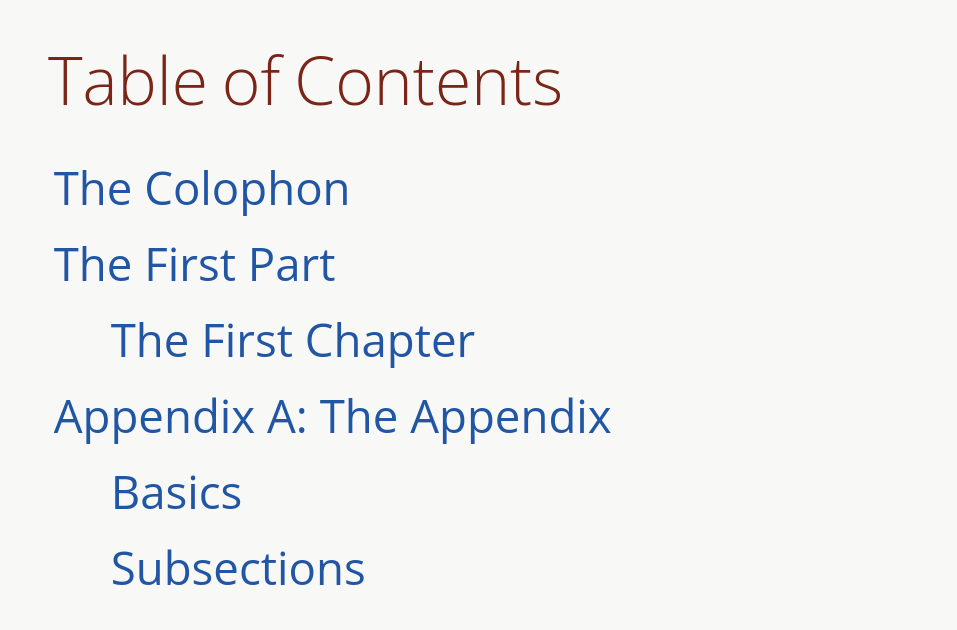

= AsciiDoc
:source-highlighter: highlightjs

== 개요
- AsciiDoc을 공부하기 위한 문서입니다.
- 번역은 GPT4o 및 Claude Sonet을 활용했으며, 어색한 부분은 직접 수정했습니다.

== 목차

- Introduction
  ** xref:document-structure[Document Structure]
  ** xref:key-concepts[Key Concepts]
  ** xref:document-processing[Document Processing]
  ** xref:normalization[Normalization]

- xref:blocks[Blocks]
  ** xref:delimited-blocks[Delimited Blocks]
  ** xref:basic-block[Build a Basic Block]
  ** xref:add-title[Add a Title to a Block]
  ** xref:assign-id[Assign an ID]
  ** xref:block-masquerading[Block Masquerading]
  ** xref:troubleshooting-blocks[Troubleshooting Blocks]

- xref:document-attributes[Document Attributes]
  ** xref:attribute-entries[Attribute Entries]
    *** xref:attribute-entry-names-and-values[Attribute Entry Names and Values]
    *** xref:wrap-attribute-entry-values[Wrap Attribute Entry Values]
    *** xref:attribute-entry-substitutions[Attribute Entry Substitutions]
    *** xref:inline-attribute-entries[Inline Attribute Entries]
  ** xref:declare-built-in-attributes[Declare Built-In Attributes]
    *** xref:set-boolean-attributes[Set Boolean Attributes]
  ** xref:declare-custom-attributes[Declare Custom Attributes]
  ** xref:unset-attributes[Unset Attributes]
  ** xref:reference-attributes[Reference Attributes]
    *** xref:handle-unresolved-references[Handle Unresolved References]
  ** xref:attribute-assignment-precedence[Attribute Assignment Precedence]
  ** xref:counters[Counters]

- xref:element-attributes[Element Attributes]
  ** xref:positional-and-named-attributes[Positional and Named Attributes]
  ** xref:id-attribute[ID Attribute]
  ** xref:role-attribute[Role Attribute]
  ** xref:options-attribute[Options Attribute]

- xref:document-header[Document Header]
  ** xref:document-title[Document Title]
    *** xref:subtitle[Subtitle]
  ** xref:author-information[Author Information]
    *** xref:using-the-author-line[Using the Author Line]
    *** xref:add-multiple-authors-to-a-document[Add Multiple Authors to a Document]
    *** xref:assign-author-and-email-with-attribute-entries[Assign Author and Email with Attribute Entries]
    *** xref:reference-the-author-information[Reference the Author Information]
    *** xref:compound-author-names[Compound Author Names]
  ** xref:revision-information[Revision Information]
    *** xref:using-the-revision-line[Using the Revision Line]
    *** xref:assign-revision-attributes-with-attribute-entries[Assign Revision Attributes with Attribute Entries]
    *** xref:version-label-attribute[Version Label Attribute]
    *** xref:reference-the-revision-attributes[Reference the Revision Attributes]
  ** xref:document-metadata[Document Metadata]
  ** xref:document-header-reference[Document Header Reference]

- xref:document-type[Document Type]

- xref:section[Sections]
  ** xref:section-titles-and-levels[Section Titles and Levels]
    *** xref:activate-section-title-links[Activate Section Title Links]

  ** xref:autogenerate-section-ids[Autogenerate Section IDs]
    *** xref:change-id-prefix-separator[Change the ID Prefix and Separator]

  ** xref:assign-custom-ids-reference-text[Assign Custom IDs and Reference Text]
  ** xref:section-numbers[Section Numbers]
  ** xref:section-styles-articles-books[Section Styles for Articles and Books]
    *** xref:hide-special-section-titles[Hide Special Section Titles]
    *** xref:number-special-sections[Number Special Sections]
    *** xref:colophon[Colophon]
    *** xref:dedication[Dedication]
    *** xref:abstract-section[Abstract (Section)]
    *** xref:abstract-block[Abstract (Block)]
    *** xref:preface[Preface]
    *** xref:book-parts[Book Parts]
      **** xref:part-numbers-signifier[Part Numbers and Signifier]
    *** xref:chapters[Chapters]
    *** xref:appendix[Appendix]
    *** xref:glossary[Glossary]
    *** xref:bibliography[Bibliography]
    *** xref:index[Index]

  ** xref:section-attributes-styles-reference[Section Attributes and Styles Reference]

- xref:paragraphs[Paragraphs]
  ** xref:hard-line-breaks[Hard Line Breaks]
  ** xref:preamble-lead-style[Preamble and Lead Style]
  ** xref:paragraph-alignment[Paragraph Alignment]

- xref:discrete-headings[Discrete Headings]

- xref:breaks[Breaks]

- xref:text-formatting-punctuation[Text Formatting and Punctuation]
  ** xref:bold[Bold]
  ** xref:italic[Italic]
  ** xref:monospace[Monospace]
  ** xref:literal-monospace[Literal Monospace]
  ** xref:text-span-built-in-roles[Text Span and Built-in Roles]
  ** xref:highlight[Highlight]
  ** xref:quotation-marks-apostrophes[Quotation Marks and Apostrophes]
  ** xref:subscript-superscript[Subscript and Superscript]
  ** xref:using-custom-inline-styles[Using Custom Inline Styles]
  ** xref:troubleshoot-unconstrained-formatting-pairs[Troubleshoot Unconstrained Formatting Pairs]

- xref:lists[Lists]
  ** xref:unordered-lists[Unordered Lists]
  ** xref:ordered-lists[Ordered Lists]
  ** xref:checklists[Checklists]
  ** xref:separating-lists[Separating Lists]
  ** xref:complex-list-items[Complex List Items]

- xref:description-lists[Description Lists]
  ** xref:horizontal-description-list[Horizontal Description List]
  ** xref:question-answer-lists[Question and Answer Lists]
  ** xref:description-lists-with-marker[Description Lists With Marker]

- xref:links[Links]
  ** xref:autolinks[Autolinks]
  ** xref:url-macro[URL Macro]
  ** xref:link-macro[Link Macro]
  ** xref:troubleshooting-complex-urls[Troubleshooting Complex URLs]
  ** xref:link-url-macro-attribute-parsing[Link & URL Macro Attribute Parsing]
  ** xref:mailto-macro[Mailto Macro]
  ** xref:link-url-mailto-macro-attributes-reference[Link, URL, and Mailto Macro Attributes Reference]

- xref:cross-references[Cross References]
  ** xref:document-to-document-cross-references[Document to Document Cross References]
  ** xref:cross-reference-text-styles[Cross Reference Text and Styles]
  ** xref:validate-cross-references[Validate Cross References]

- xref:footnotes[Footnotes]

- xref:images[Images]
  ** xref:set-the-images-directory[Set the Images Directory]
  ** xref:insert-images-from-a-url[Insert Images from a URL]
  ** xref:position-and-frame-images[Position and Frame Images]
  ** xref:add-link-to-image[Add Link to Image]
  ** xref:adjust-image-sizes[Adjust Image Sizes]
  ** xref:specify-image-format[Specify Image Format]
  ** xref:svg-images[SVG Images]
  ** xref:images-reference[Images Reference]

- xref:audio-and-video[Audio and Video]

- xref:icons[Icons]
  ** xref:image-icons-mode[Image Icons Mode]
  ** xref:font-icons-mode[Font Icons Mode]
  ** xref:icon-macro[Icon Macro]

- xref:keyboard-macro[Keyboard Macro]

- xref:button-menu-ui-macros[Button and Menu UI Macros]

- xref:admonitions[Admonitions]

- xref:sidebars[Sidebars]

- xref:example-blocks[Example Blocks]

- xref:blockquotes[Blockquotes]

- xref:verses[Verses]

- xref:verbatim-source-blocks[Verbatim and Source Blocks]
  ** xref:source-code-blocks[Source Code Blocks]
    *** xref:source-highlighting[Source Highlighting]
    *** xref:highlight-select-lines[Highlight Select Lines]
    *** xref:highlight-php-source-code[Highlight PHP Source Code]
  ** xref:listing-blocks[Listing Blocks]
  ** xref:literal-blocks[Literal Blocks]
  ** xref:callouts[Callouts]

- xref:tables[Tables]
  ** xref:build-basic-table[Build a Basic Table]
  ** xref:add-a-title[Add a Title]
    *** xref:customize-title-label[Customize the Title Label]
    *** xref:turn-off-title-label[Turn Off the Title Label]
  ** xref:add-columns-table[Add Columns to a Table]
    *** xref:adjust-column-widths[Adjust Column Widths]
    *** xref:align-content-column[Align Content by Column]
    *** xref:format-content-column[Format Content by Column]
  ** xref:add-cells-rows-table[Add Cells and Rows to a Table]
    *** xref:create-header-row[Create a Header Row]
    *** xref:create-footer-row[Create a Footer Row]
    *** xref:align-content-cell[Align Content by Cell]
    *** xref:format-content-cell[Format Content by Cell]
    *** xref:span-columns-rows[Span Columns and Rows]
    *** xref:duplicate-cells[Duplicate Cells]
  ** xref:table-width[Table Width]
  ** xref:table-borders[Table Borders]
  ** xref:table-striping[Table Striping]
  ** xref:table-orientation[Table Orientation]
  ** xref:assign-role-table[Assign a Role to a Table]
  ** xref:nesting-tables[Nesting Tables]
  ** xref:csv-tsv-dsv-data[CSV, TSV and DSV Data]
  ** xref:table-reference[Table Reference]

- xref:equations-formulas[Equations and Formulas (STEM)]

- xref:open-blocks[Open Blocks]

- xref:collapsible-blocks[Collapsible Blocks]

- xref:comments[Comments]

- xref:automatic-toc[Automatic Table of Contents]
  ** xref:customize-toc-title[Customize the TOC Title]
  ** xref:adjust-toc-depth[Adjust the TOC Depth]
  ** xref:position-toc[Position the TOC]
  ** xref:toc-attributes-reference[TOC Attributes Reference]

- xref:docinfo-files[Docinfo Files]

- xref:includes[Includes]
  ** xref:offset-section-levels[Offset Section Levels]
  ** xref:indent-included-content[Indent Included Content]
  ** xref:use-include-file-multiple-times[Use an Include File Multiple Times]
  ** xref:include-list-item-content[Include List Item Content]
  ** xref:include-content-tagged-regions[Include Content by Tagged Regions]
  ** xref:include-content-line-ranges[Include Content by Line Ranges]
  ** xref:include-content-uri[Include Content by URI]

- xref:conditionals[Conditionals]
  ** xref:ifdef-directives[ifdef and ifndef Directives]
  ** xref:ifeval-directive[ifeval Directive]

- xref:substitutions[Substitutions]
  ** xref:special-characters[Special Characters]
  ** xref:quotes[Quotes]
  ** xref:attribute-references[Attribute References]
  ** xref:character-replacements[Character Replacements]
  ** xref:macros[Macros]
  ** xref:post-replacements[Post Replacements]
  ** xref:customize-substitutions-blocks[Customize the Substitutions Applied to Blocks]
  ** xref:customize-substitutions-text[Customize the Substitutions Applied to Text]
  ** xref:escape-prevent-substitutions[Escape and Prevent Substitutions]

- xref:passthroughs[Passthroughs]
  ** xref:passthrough-blocks[Passthrough Blocks]
  ** xref:inline-passthroughs[Inline Passthroughs]

- xref:reference[Reference]
  ** xref:syntax-quick-reference[Syntax Quick Reference]
  ** xref:faq[Frequently Asked Questions (FAQ)]
  ** xref:compare-asciidoc-markdown[Compare AsciiDoc to Markdown]
  ** xref:document-attributes-reference[Document Attributes Reference]
  ** xref:character-replacement-attributes-reference[Character Replacement Attributes Reference]
  ** xref:reference-glossary-of-terms[Glossary of Terms]


[[document-structure]]
== Introduction - Document Structure

=== AsciiDoc 소개

AsciiDoc은 주로 기술 문서 작성을 위해 설계된 경량의 시맨틱 마크업 언어입니다. 간결하고 사람이 읽기 쉬운 일반 텍스트 형식으로 인코딩된 콘텐츠에서 다양한 프레젠테이션이 풍부한 출력 형식을 생성할 수 있습니다.

AsciiDoc 문법은 텍스트를 마크업하고 구조화하는 데 잘 확립된 일반 텍스트 규칙을 기반으로 하기 때문에 직관적입니다. AsciiDoc에 익숙하지 않은 사람도 아마도 구문 요소를 보기만 해도 그 목적을 추측할 수 있을 것입니다. 기술 업계에서 오랫동안 사용해 온 관행인, 구문 요소가 의미하는 바를 보이도록 신중하게 선택되었기 때문입니다.

AsciiDoc 언어는 생성하는 출력 형식에 결합되지 않습니다. AsciiDoc 프로세서는 AsciiDoc 소스 문서를 파싱하고 이해한 다음, 파싱된 문서 구조를 HTML, PDF, EPUB3, man(ual) 페이지 또는 DocBook과 같은 하나 이상의 출력 형식으로 변환할 수 있습니다. 여러 출력 형식을 생성할 수 있는 기능은 AsciiDoc의 주요 장점 중 하나입니다. 이 기능 덕분에 정적 사이트 생성기, IDE, Git 도구 및 서비스, CI/CD 시스템 및 기타 소프트웨어에서 사용할 수 있습니다.

AsciiDoc은 쉽게 작성할 수 있는 것과 기술 저작 및 출판의 엄격한 요구 사항 사이의 격차를 해소합니다. AsciiDoc은 읽거나 쓰는 데 텍스트 편집기만 필요하므로 시작하는 데 진입 장벽이 낮습니다.

=== 이 문서에 대하여

여러분은 Asciidoctor에서 구현된 대로 AsciiDoc 언어에 대한 사용자 중심 문서를 읽고 있습니다. 이 문서는 AsciiDoc 콘텐츠를 처리하기 위해 Asciidoctor를 설정하고 사용하는 방법을 다루지 않습니다. 해당 문서는 이 웹사이트의 Asciidoctor 섹션에서 찾을 수 있습니다.

이 문서는 Eclipse의 AsciiDoc Language 프로젝트에 대한 초기 기여로 제출되었습니다. 해당 프로젝트는 이 문서를 바탕으로 AsciiDoc 언어 사양을 작성할 것입니다. 또한 AsciiDoc Language에 대한 사용자 가이드 초안으로 사용될 것이며, 해당 프로젝트에서도 유지 관리될 예정입니다.

AsciiDoc Language 사양의 첫 번째 버전이 비준될 때까지 AsciiDoc은 Asciidoctor 구현에 의해 정의됩니다. 다른 공식적인 언어 정의는 없습니다.

AsciiDoc Language 프로젝트가 AsciiDoc Language에 대한 자체 문서를 게시하기 시작할 때까지 AsciiDoc 문서는 이 사이트에 남아 있을 것입니다.

그때까지, 시작해 보겠습니다!

[[key-concepts]]
== Introduction - Key Concepts

이 페이지에서는 AsciiDoc 문서의 전체 구조에 대해 배웁니다. 지금 당장은 구문의 세부 사항에 대해 걱정하지 마세요. 해당 주제는 이후 문서에서 철저히 다룰 것입니다. 지금은 AsciiDoc 문서를 구성하는 것이 무엇인지 감을 잡는 것을 목표로 합니다.

=== 문서

AsciiDoc은 상용구나 프롤로그가 없는 일반 텍스트 작성 형식입니다. AsciiDoc 문서는 단 하나의 문장(또는 학술적으로는 단 하나의 문자)으로만 구성될 수 있습니다.

다음 예는 하나의 문장을 포함하는 하나의 단락으로 구성된 유효한 AsciiDoc 문서입니다:

[source,asciidoc]
----
This is a basic AsciiDoc document.
----

물론 단일 문장 이상의 내용을 가질 수 있습니다. 여기서 강조하고 싶은 점은 시작하기가 쉽다는 것입니다.

AsciiDoc 문서는 서로 위에 쌓여 있는 일련의 블록(행 단위)입니다. 이러한 블록은 일반적으로 빈 행으로 서로 구분됩니다(특정 상황에서는 선택 사항일 수 있음).

이전 문서를 하나의 단락에서 두 개의 단락으로 확장하려면 빈 행으로 두 단락을 구분하면 됩니다:

[source,asciidoc]
----
This is a basic AsciiDoc document.

This document contains two paragraphs.
----

AsciiDoc 문서는 문서 헤더로 시작할 수 있습니다. 문서 헤더는 선택 사항이지만 문서 제목을 지정하고 문서 전체 구성과 문서 속성 형태의 재사용 가능한 텍스트를 설정할 수 있으므로 자주 사용됩니다.

[source,asciidoc]
----
= Document Title
:reproducible:

This is a basic AsciiDoc document by {author}.

This document contains two paragraphs.
It also has a header that specifies the document title.
----

거의 모든 블록의 조합이 유효한 AsciiDoc 문서를 구성합니다(문서 유형에 따라 일부 구조적 요구 사항이 있음). 문서는 단일 문장부터 여러 부분으로 구성된 책까지 다양할 수 있습니다.

=== 행

행은 AsciiDoc에서 중요한 구성 요소입니다. 행은 줄 바꿈 문자나 문서의 경계로 양쪽이 구분된 텍스트로 정의됩니다. 구문의 많은 측면이 전체 행을 차지해야 합니다. 그래서 AsciiDoc이 행 지향 언어라고 말하는 것입니다.

예를 들어, 섹션 제목은 그 자체로 한 행에 있어야 합니다. 속성 항목, 블록 제목, 블록 속성 목록, 블록 매크로, 목록 항목, 블록 구분 기호 등에도 동일하게 적용됩니다.

Example 1. 단일 행을 차지해야 하는 섹션 제목의 예
[source,asciidoc]
----
== Section Title
----

Example 2. 적어도 하나의 행을 차지해야 하는 속성 항목의 예
[source,asciidoc]
----
:name: value
----

Example 3. 두 행으로 확장되는 속성 항목의 예
[source,asciidoc]
----
:name: value \
more value
----

빈 행도 중요할 수 있습니다. 단일 빈 행은 헤더와 본문을 구분합니다. 앞서 두 단락 예제에서 보았듯이 많은 블록도 빈 행으로 구분됩니다.

반대로 단락 내용 내의 행은 중요하지 않습니다. AsciiDoc 구문을 배우면서 이러한 점을 염두에 두세요.

=== 블록

AsciiDoc 문서의 블록은 문서 구조를 형성합니다. 일부 블록은 다른 블록을 포함할 수 있으므로 문서 구조는 본질적으로 계층적입니다(즉, 트리 구조). 예를 들어, 자동 목차를 활성화하여 이 섹션 구조를 미리 볼 수 있습니다. 블록의 예로는 단락, 섹션, 목록, 구분 블록, 표 및 블록 매크로가 있습니다.

블록은 일반적으로 빈 행으로 다른 블록과 구분되기 때문에 식별하기 쉽습니다(항상 필요한 것은 아님). 블록은 항상 새 행에서 시작하고 행 끝에서 종료되며 왼쪽 여백에 맞춰집니다.

모든 블록에는 하나 이상의 블록 메타데이터 행이 있을 수 있습니다. 이 메타데이터는 블록 속성, 블록 앵커 또는 블록 제목의 형태일 수 있습니다. 이러한 메타데이터 행은 블록 자체 위에 직접 인접해야 합니다.

섹션, 비 verbatim 구분 블록 및 AsciiDoc 테이블 셀은 다른 블록을 포함할 수 있습니다. 블록이 계층을 형성함에도 불구하고 중첩된 블록조차도 왼쪽 여백에서 시작합니다. 블록이 왼쪽 여백에서 시작하도록 요구함으로써 들여쓰기 수준을 추적하고 유지 관리해야 하는 지루함을 피하고 내용을 더 재사용 가능하게 만듭니다.

=== 텍스트와 인라인 요소

마커, 구분 기호 및 메타데이터 행으로 둘러싸인 것은 텍스트입니다. 텍스트는 문서의 주요 초점이며 AsciiDoc 구문이 숨 쉴 공간을 많이 제공하는 이유입니다. 텍스트는 대부분 블록(예: 단락)의 행, 블록 제목(예: 섹션 제목) 및 목록 항목에서 찾을 수 있지만 다른 위치에도 존재할 수 있습니다.

텍스트는 치환의 대상이 됩니다. 치환은 마크업을 텍스트 서식으로 해석하고, 매크로를 텍스트 또는 비텍스트 요소로 대체하고, 속성 참조를 확장하고, 기타 유형의 텍스트 대체를 수행합니다.

달리 지정하지 않는 한 일반 텍스트는 모든 치환의 대상이 됩니다. verbatim 텍스트는 소스에 나타나는 대로 출력에 표시할 수 있도록 최소한의 치환 세트의 대상이 됩니다. 또한 모든 치환을 비활성화하여 텍스트를 수정하지 않고 출력에 전달할 수 있습니다(즉, raw). 텍스트 구문 분석은 인라인 요소와 기타 형태의 변환이 혼합된 것으로 끝납니다.

=== 인코딩과 AsciiDoc 파일

AsciiDoc 파일은 .adoc 파일 확장자를 가진 텍스트 파일입니다(예: document.adoc). 대부분의 AsciiDoc 프로세서는 파일의 텍스트가 UTF-8 인코딩을 사용한다고 가정합니다. UTF-16 인코딩은 파일이 BOM으로 시작하는 경우에만 지원됩니다.

AsciiDoc 프로세서는 문자열(즉, 문자 시퀀스)에서 AsciiDoc을 처리할 수 있습니다. 그러나 대부분의 경우 AsciiDoc 문서를 파일로 저장합니다.

[[document-processing]]
== Introduction - Document Processing

AsciiDoc은 특별히 출판 형식이 아닌 작성 형식입니다. 다시 말해, 워드 프로세서에서 작성할 때처럼 WYSIWYG 방식이 아닙니다. 대신 작성하는 것은 AsciiDoc 소스입니다. 그런 다음 Asciidoctor와 같은 AsciiDoc 프로세서를 사용하여 AsciiDoc 소스를 출판 가능한 형식으로 변환합니다. 출판하는 것은 이 출력물입니다.

AsciiDoc 소스를 변환하는 것은 입력한 것보다 더 많은 것을 얻기 위해 내용을 해석하고 꾸미는 기회입니다. AsciiDoc 소스를 다른 형식으로 변환하는 작업은 변환기에 의해 처리됩니다. 언어와 변환기 사이에는 강력한 관계가 있지만 이 두 측면은 명시적으로 결합되지 않습니다.

AsciiDoc 프로세서는 HTML 및 DocBook을 만드는 것을 포함하여 여러 내장 변환기를 제공합니다. 이러한 변환기 중 하나를 활성화하려면 문서에 백엔드를 설정합니다(기본값: html). 백엔드는 프로세서에게 원하는 출력 형식을 알려주는 키워드입니다. 그런 다음 프로세서는 해당 출력 형식을 만드는 변환기를 선택합니다. 예를 들어 HTML 변환기는 html 백엔드를 처리하여 HTML 출력을 만듭니다.

AsciiDoc 프로세서는 실제로 두 단계로 작동합니다. 첫째, AsciiDoc 문서를 파싱합니다. 이 파싱은 작성된 구조를 반영하고 모든 의미 있는 마크업을 해석하는 구조화된 문서를 생성합니다. 그런 다음 프로세서는 이 구조화된 문서를 변환기에 전달하여 출력 형식으로 변환합니다.

요약하면, 프로세서는 문자열(파일에서 읽을 수 있음)을 받아들이고, 이를 구조 문서로 파싱한 다음, 다른 문자열(파일에 쓸 수 있음)을 생성합니다.

[[normalization]]
== Introduction - Normalization

AsciiDoc 프로세서가 AsciiDoc 소스를 읽을 때, 가장 먼저 하는 일은 행을 정규화하는 것입니다. (이 작업은 미리 수행하거나 각 행을 방문할 때 수행할 수 있습니다).

정규화는 다음 작업으로 구성됩니다:

- 인코딩을 UTF-8로 강제 설정 (AsciiDoc 프로세서는 항상 내용이 UTF-8로 인코딩되어 있다고 가정함)
- 각 행에서 후행 공백 제거 (줄 바꿈 문자 포함)

이 정규화는 구조화된 컨텍스트와 관계없이 수행됩니다. 행이 리터럴 블록의 일부인지 일반 단락의 일부인지는 중요하지 않습니다. 모든 행이 정규화됩니다.

포함 파일의 행에는 특정 경우에만 정규화가 적용됩니다. 인식된 AsciiDoc 확장자를 가진 포함 파일만 위에서 설명한 대로 정규화됩니다. 다른 모든 파일의 경우 후행 줄 바꿈 문자만 제거됩니다. 포함 파일은 인코딩 속성을 사용하여 지정된 다른 인코딩을 가질 수도 있습니다. 인코딩 속성이 지정되지 않은 경우 UTF-8이 가정됩니다.

AsciiDoc 프로세서가 렌더링된 문서(HTML, DocBook 등)를 생성하기 위해 행을 다시 결합할 때, 줄 바꿈 문자(\n)에서 행을 연결합니다.


== Blocks
[[blocks]]

블록 요소는 AsciiDoc 문서의 기본 구조를 형성하며, 문서 자체에서 시작합니다.

=== 블록이란 무엇인가요?

블록 요소(블록이라고도 함)는 AsciiDoc 문서에서 개별적이고 행 지향적인 콘텐츠 덩어리입니다. 일단 파싱되면, 그 콘텐츠 덩어리는 파싱된 문서 모델의 블록 요소가 됩니다. 특정 블록은 다른 블록을 포함할 수 있으므로 블록이 중첩될 수 있다고 말합니다. 변환기는 문서 순서대로 각 블록을 차례로 방문하여 해당하는 출력 덩어리로 변환합니다.

=== 블록 형식

AsciiDoc 구문에서 블록의 경계가 정의되는 방식은 다양합니다. 목록, 단락, 블록 매크로와 같은 일부 블록의 경계는 암시적입니다. 다른 블록은 구분 기호를 사용하여 명시적으로 표시된 경계를 가집니다(즉, 구분된 블록). 주된 공통점은 블록이 항상 행 지향적이라는 것입니다.

단락 블록은 연속적인(비어 있지 않은) 행의 개별 집합으로 정의됩니다. 구분된 블록은 구분 기호 행으로 둘러싸여 있습니다. 섹션 블록(섹션이라고도 함)은 하나 이상의 등호로 시작하는 섹션 제목으로 정의됩니다. 섹션에는 섹션 제목 행 다음부터 다음 형제 또는 부모 섹션 제목이나 문서 경계까지의 모든 내용이 포함됩니다. 목록 블록은 마커로 표시된 형제 목록 항목 그룹으로 정의됩니다. 설명 목록 블록은 하나 이상의 용어로 표시된 형제 목록 항목 그룹으로 정의됩니다. 블록 매크로는 블록 매크로 구문과 일치하는 단일 행으로 정의됩니다. 그리고 문서 자체도 블록입니다.

블록(메타데이터 행 포함)은 항상 양쪽에 빈 행이나 문서 경계로 둘러싸여야 합니다.

블록이 중첩된 블록을 지원하는지 여부는 블록의 콘텐츠 모델(및 구문이 허용하는 내용)에 따라 달라집니다.

=== 콘텐츠 모델

블록의 콘텐츠 모델은 블록이 가질 수 있는 콘텐츠의 종류(있는 경우)와 해당 콘텐츠가 처리되는 방식을 결정합니다. AsciiDoc의 블록 콘텐츠 모델은 다음과 같습니다:

.복합(compound)
  다른 블록만 포함할 수 있는 블록(예: 섹션)

.단순(simple)
  단락 텍스트의 연속 행으로 처리되는 블록(및 일반 대체 적용)(예: 단락 블록)

.축어(verbatim)
  축어적 텍스트를 포함하는 블록("있는 그대로" 표시)(및 축어적 대체 적용)(예: 목록 블록)

.원시(raw)
  대체 없이 출력으로 직접 전달되는 처리되지 않은 콘텐츠를 포함하는 블록(예: 통과 블록)

.빈(empty)
  콘텐츠가 없는 블록(예: 이미지 블록)

.표(table)
  고정된 구조를 적용하는 표 전용 특수 콘텐츠 모델

콘텐츠 모델은 모든 기본 제공 구문에 대해 유추되지만(컨텍스트에 의해 결정됨), 사용자 정의 블록에 대해서는 구성할 수 있습니다. 블록은 다른 상황에서 다른 콘텐츠 모델을 지원할 수도 있습니다. 상황은 컨텍스트와 스타일에 의해 결정되며, 구분된 블록의 경우 구조적 컨테이너에 의해서도 결정됩니다.

=== 컨텍스트

블록을 예제 블록, 사이드바 블록, 권고 블록 또는 섹션과 같은 이름으로 참조하는 경우가 많을 것입니다. 그 이름은 블록의 컨텍스트입니다.

다음과 같은 일반 섹션을 고려해 보겠습니다:

[source,asciidoc]
----
== Section Title

Content of section.
----

이 블록의 컨텍스트는 섹션입니다. 우리는 종종 컨텍스트를 형용사로 사용하여 블록을 설명하는 섹션(또는 섹션 블록)이라고 말합니다. 이 경우 구문에 의해 컨텍스트가 암시되므로 작성자가 컨텍스트를 지정할 필요가 없습니다.

모든 블록에는 컨텍스트가 있습니다. 컨텍스트는 종종 구문에 의해 암시되지만 특정 경우에는 명시적으로 선언할 수 있습니다. 컨텍스트는 한 종류의 블록을 다른 블록과 구별하는 요소입니다. 컨텍스트를 블록의 유형으로 생각할 수 있습니다.

컨텍스트는 블록 스타일을 사용하여 공통 유형을 공유하는 블록 패밀리를 만들도록 추가로 수정할 수 있습니다. 이는 권고 블록 및 섹션의 경우와 같습니다. 우리는 곧 그 수정자에 대해 다룰 것입니다.

블록의 경우 컨텍스트를 블록 이름이라고 하기도 합니다. 이는 특히 사용자 정의 블록에 대해 이야기할 때 나옵니다. 블록 이름은 추상화의 또 다른 계층일 뿐입니다. 모든 기본 제공 블록 이름은 정확히 하나의 컨텍스트에 매핑됩니다. 그러나 블록 확장은 임의의 블록 이름을 하나 이상의 컨텍스트에 매핑할 수 있습니다. 궁극적으로 사용되는 컨텍스트는 확장의 프로세스 메서드에서 반환되는 내용에 따라 달라집니다. 결국 블록이 변환되는 방식을 결정하는 것은 컨텍스트입니다.

컨텍스트는 종종 콘텐츠 모델을 결정합니다. 예를 들어, 모든 섹션은 섹션이 다른 블록만 포함할 수 있기 때문에 암시적으로 복합 콘텐츠 모델을 가집니다. 모든 리터럴 블록은 이 블록의 목적이 축어적 출력을 제공하는 것이기 때문에 암시적으로 축어적 콘텐츠 모델을 가집니다.

==== 기본 제공 컨텍스트 요약

AsciiDoc에서 모든 기본 제공 블록의 컨텍스트 목록은 다음과 같습니다.

[NOTE]
====
Asciidoctor API에서 컨텍스트는 기호로 표현됩니다. Ruby에서 기호는 콜론 접두사가 붙은 이름입니다(예: :listing). 이 문서에서는 컨텍스트의 이름을 참조할 때 이 표기법을 사용하기도 합니다. 그러나 이 표기법은 보편적이지 않습니다. Asciidoctor.js와 같은 일부 프로세서는 대신 문자열로 컨텍스트를 저장합니다.
====

.기본 제공 컨텍스트

|===
| Name | Purpose

| admonition
| 다섯 가지 권고 블록 중 하나.

| audio
| 오디오 블록.

| colist
| 콜아웃 목록.

| dlist
| 설명 목록.

| document
| 최상위 문서 또는 AsciiDoc 표 셀의 문서

| example
| 예제 블록.

| floating_title
| 개별 제목.

| image
| 이미지 블록.

| list_item
| 정렬된 목록, 정렬되지 않은 목록 또는 설명 목록의 항목(목록 또는 설명 목록 블록 내에서만 관련됨). 설명 목록에서 이 블록은 용어와 설명을 나타내는 데 사용됩니다.

| listing
| 목록 블록.

| literal
| 리터럴 블록.

| olist
| 정렬된 목록.

| open
| 열린 블록.

| page_break
| 페이지 나누기.

| paragraph
| 단락.

| pass
| 통과 블록.

| preamble
| 문서의 서문.

| quote
| 인용 블록(blockquote라고도 함).

| section
| 섹션. 부분, 장 또는 특수 섹션일 수도 있습니다.

| sidebar
| 사이드바 블록.

| table
| 표 블록.

| table_cell
| 표 셀(표 블록 내에서만 관련됨).

| thematic_break
| 주제 구분선(수평 규칙이라고도 함).

| toc
| 사용자 정의 TOC 배치를 지정하기 위한 TOC 블록.

| ulist
| 정렬되지 않은 목록.

| verse
| 시 블록.

| video
| 비디오 블록.
|===

[NOTE]
====
각 인라인 요소에도 컨텍스트가 있지만 해당 요소는 (아직) 파싱된 문서 모델에서 접근할 수 없습니다.
====

block, block macro 또는 inline macro 확장 지점을 사용하여 추가 컨텍스트가 도입될 수 있습니다.

==== 변환기에서 사용되는 컨텍스트

컨텍스트는 변환기가 convert 메서드로 전달하는 데 사용하는 것입니다. 그런 다음 스타일은 변환기가 같은 패밀리의 블록에 특수 동작을 적용하는 데 사용됩니다.

두 가지 예외를 제외하고 컨텍스트와 변환기의 처리기 메서드 간에는 1대1 매핑이 있습니다. 이러한 예외는 list_item 및 table_cell 컨텍스트이며 처리기 메서드에 매핑되지 않습니다. 변환기에서 이러한 블록은 부모 블록에서 접근해야 합니다.


=== 블록 스타일

컨텍스트가 항상 블록의 정체성에 대한 전체 이야기를 전달하는 것은 아닙니다. 일부 블록에는 특수화가 필요합니다. 여기서 블록 스타일이 작용합니다.

일부 블록 위에서 블록 속성 목록의 시작 부분에 이름(예: `[source]` 또는 `[verse]`)을 볼 수 있습니다. 블록 속성 목록의 첫 번째 위치 기반(명명되지 않은) 속성은 블록 스타일을 선언하는 데 사용됩니다.

선언된 블록 스타일은 작성자가 제공하는 값입니다. 그런 다음 그 값은 해석되고 확인됩니다. 확인된 블록 스타일이 비어 있지 않으면 블록의 컨텍스트를 특수화합니다. (대신 또는 추가로 블록의 컨텍스트를 변경할 수도 있습니다).

다음 소스 블록의 예를 고려해 보겠습니다:
[source,asciidoc]
----
[source,ruby]
\----
puts "Hello, World!"
\----
----

소스 블록의 컨텍스트는 listing(블록 구분 기호에서 유추됨)이고 스타일은 source(작성자가 지정한 대로)입니다. 우리는 스타일이 블록을 소스 블록으로 특수화한다고 말합니다. (기술적으로 소스 언어가 있으면 소스 스타일이 이미 암시되지만 내부적으로 이렇게 처리됩니다). 블록의 컨텍스트는 여전히 동일하지만 특별한 처리가 필요함을 나타내는 추가 메타데이터가 있습니다.

우리는 또한 다른 목적으로 블록 스타일이 사용되는 것을 볼 수 있습니다. 섹션 제목 위의 appendix 블록 스타일(예: [appendix])은 섹션을 부록(특수 섹션)으로 특수화하므로 특별한 의미와 동작을 갖습니다. 모델에서 섹션의 스타일은 sectname으로 이중 저장됩니다. 예제 블록 위의 다섯 가지 권고 스타일(예: [TIP]) 중 하나는 예제 블록을 해당 이름(즉, 레이블)의 권고 블록으로 변환합니다. 모델에서 소문자로 된 권고 스타일은 name 속성에 저장됩니다. 정렬되지 않은 목록 또는 정렬된 목록 위의 블록 스타일(예: [circle] 또는 [loweralpha])은 표시될 때 목록 항목 앞에 사용되는 마커를 변경합니다. 설명 목록 위의 블록 스타일(예: [qanda] 및 [horizontal])은 의미 또는 레이아웃을 변경할 수 있습니다.

선언된 블록 스타일은 블록의 컨텍스트를 변경하는 데 사용될 수 있으며, 이를 블록 마스커레이딩이라고 합니다. 리터럴 블록 구분 기호를 사용하는 다음과 같은 목록 블록의 대체 구문을 고려해 보겠습니다.

[source,asciidoc]
----
[listing]
....
a > b
....
----

선언된 블록 스타일이 컨텍스트의 이름과 일치하므로 블록의 컨텍스트는 listing이 되고 확인된 블록 스타일은 설정되지 않은 상태로 유지됩니다. 즉, 확인된 블록 스타일은 선언된 블록 스타일과 다릅니다. 선언된 블록 스타일을 사용하여 블록의 컨텍스트를 변경하는 방법에 대한 자세한 내용은 Block Masquerading을 참조하세요.

블록의 정체성에 대한 완전한 그림을 얻으려면 컨텍스트와 스타일을 모두 고려해야 합니다. 확인된 스타일은 컨텍스트를 특수화하여 특별한 동작이나 의미를 부여합니다.


=== 블록의 공통점

블록은 행 지향 구문의 일부 형식을 사용하여 정의됩니다. 섹션 블록은 섹션 제목 행으로 시작합니다. 구분된 블록은 일치하는 구분 기호 행 쌍으로 둘러싸여 있습니다. 단락 블록은 연속된 행이어야 합니다.

모든 블록은 블록 바로 위에 행 방향으로 쌓인 0개 이상의 메타데이터 행을 수용합니다. 이러한 행은 ID, 제목, 옵션과 같은 블록의 속성을 채웁니다. 이러한 메타데이터 행은 다음과 같습니다:

- 0개 이상의 블록 속성 행(블록의 속성을 채움)
- 선택적 블록 앵커 행
- 선택적 블록 제목 행(많은 블록이 해당하는 캡션도 지원함)
- 선택적 ID
- 선택적 역할 집합
- 선택적 옵션 집합

예를 들어 제목과 ID가 있는 사이드바 블록을 고려해 보겠습니다:
[source,asciidoc]
----

[#music-styles]
****
Go off on a tangent to describe what a style of music is.
****
----

콘텐츠 처리와 관련하여 블록은 서로 다른 그룹으로 분리됩니다. 이러한 그룹은 주로 블록의 콘텐츠 모델과 연관되어 있습니다.

단락 블록과 축어적 블록에는 암시적이고 수정 가능한 대체 집합이 있습니다. 대체는 복합 블록(즉, 중첩된 블록을 포함할 수 있는 블록)에는 적용되지 않습니다.


[[delimited-blocks]]
== Blocks - Delimited Blocks

AsciiDoc에서 구분된 블록(Delimited Blocks)은 한 쌍의 일치하는 행 구분 기호에 의해 양쪽이 둘러싸인 콘텐츠 영역입니다. 구분된 블록은 다른 블록(예: 여러 단락)을 묶거나 콘텐츠의 콘텐츠 모델(예: 축어적)을 설정하는 데 사용됩니다. 구분된 블록은 AsciiDoc의 모든 블록 유형의 하위 집합입니다.

=== 개요

구분된 블록은 구조적 컨테이너를 사용하여 정의되며, 이는 AsciiDoc 구문에서 인식되는 고정된 블록 묶음 집합입니다. 다음은 리터럴 블록에 대한 구조적 컨테이너입니다:

[source,asciidoc]
====
\.... +
This text will be treated as verbatim content. +
\....
====

구조적 컨테이너에는 여는 구분 기호와 닫는 구분 기호가 있습니다. 여는 구분 기호는 블록 메타데이터 뒤에 옵니다(있는 경우). 구조 컨테이너의 앞뒤 빈 줄은 중요하지 않은 것으로 간주되며 자동으로 제거됩니다. 나머지 줄은 블록의 내용을 정의합니다.

이러한 묶음은 블록 내용의 경계를 정의할 뿐만 아니라 콘텐츠 모델(예: 축어적 콘텐츠 또는 하위 트리)을 암시합니다. 특정 경우에는 블록을 중첩하는 메커니즘을 제공합니다. 그러나 구분된 블록은 인터리브될 수 없습니다.

구분된 블록은 내장 매핑과 확장에 의해 정의된 사용자 지정 블록에 대한 매핑을 통해 AsciiDoc 구문에 의해 용도를 변경할 수 있는 고유한 기능을 가지고 있습니다. 구분된 블록이 어떻게 작동하는지 이해하려면 구조적 컨테이너, 행 구분 기호, 기본 컨텍스트, 예상 콘텐츠 모델뿐만 아니라 블록 중첩 및 가장에 대해 이해하는 것이 중요합니다.

=== 행 구분 기호

구분된 블록은 한 쌍의 일치하는 행 구분 기호로 특징 지어집니다. 여는 구분 기호와 닫는 구분 기호는 길이와 문자 순서 모두에서 정확히 일치해야 합니다. 때로는 울타리라고도 하는 이러한 구분 기호는 내용을 둘러싸고 명시적으로 경계를 표시합니다. 구분된 블록의 경계 내에서는 모든 내용이나 빈 줄을 입력할 수 있습니다. 종료 구분 기호가 발견될 때까지 블록이 종료되지 않습니다. 블록 메타데이터(블록 속성 및 앵커 라인)는 여는 구분 기호 위에 위치합니다(따라서 구분된 영역 외부에 있음).

다음은 구분된 예제 블록의 예입니다:

[source,asciidoc]
----
====
This is an example of an example block.
That's so meta.
====
----

일반적으로 구분 기호는 허용되는 최소 길이(현재 고정 길이가 2자인 열린 블록을 제외하고 4자)로 작성됩니다. 구분 기호 줄의 길이는 중첩된 블록을 수용하기 위해 다양하게 변경할 수 있습니다.

구분된 블록을 정의하는 데 사용되는 유효한 구분 기호 집합과 그 의미는 다음에 설명할 사용 가능한 구조적 컨테이너에 의해 정의됩니다.

=== 구조적 컨테이너

구조적 컨테이너는 AsciiDoc 언어에서 정의한 인식된 블록 묶음(구분된 영역)의 고정 집합입니다. 이러한 묶음은 AsciiDoc 구문에서 재사용 가능한 구성 요소를 제공합니다. 구조적 컨테이너와 블록 메타데이터를 평가하여 프로세서는 어떤 종류의 블록을 만들지 결정합니다.

각 구조적 컨테이너에는 예상되는 콘텐츠 모델이 있습니다. 내장 블록의 경우 대부분의 내장 블록이 예상 콘텐츠 모델을 준수하지만 블록의 컨텍스트가 콘텐츠 모델을 결정합니다. 사용자 지정 블록은 콘텐츠 모델을 지정할 수 있습니다. 그러나 이러한 경우에도 콘텐츠 모델은 구조적 컨테이너의 의미를 준수하도록 선택해야 합니다.

일부 구조적 컨테이너는 인용 블록에 대한 구조적 컨테이너가 구절 블록에 사용되는 것과 같이 다른 목적으로 재사용됩니다.

==== 구조적 컨테이너 요약

아래 표는 구조적 컨테이너를 나열하고 각각에 대한 이름, 기본 컨텍스트 및 구분 기호 줄을 기록합니다.

[cols="1,1,1,1", options="header"]
|===
|유형
|기본 컨텍스트
|내용 모델 (예상)
|최소 구분자

|주석
|적용되지 않음
|적용되지 않음
|////

|예제
|:example
|복합
|====

|목록
|:listing
|원문 그대로
|----

|리터럴
|:literal
|원문 그대로
|....

|열기
|:open
|복합
|--

|사이드바
|:sidebar
|복합
|\****

|테이블
|:table
|테이블
|=== +
,=== +
:=== +
!===

|패스
|:pass
|원시
|\++++++

|인용
|:quote
|복합
|\____
|===


소스 블록이 없다는 것을 알 수 있습니다. 그것은 소스가 컨테이너 유형이 아니기 때문입니다. 오히려 블록 스타일에 의해 지정된 대로 목록(또는 리터럴) 컨테이너의 특수화입니다. 구절 및 경고 블록도 눈에 띄게 없습니다. 그들은 각각 인용구 및 예제 블록에 대한 구조적 컨테이너의 용도를 변경하기 때문입니다.

명시적 블록 스타일이 없으면 기본 컨텍스트가 가정됩니다.

현재 테이블은 사용자 지정 블록으로 사용될 수 없는 특수 구조적 컨테이너입니다.

다른 구조적 컨테이너와 달리 주석 블록은 구문 분석된 문서에 보존되지 않으므로 컨텍스트나 콘텐츠 모델이 없습니다.

[TIP]
====
사용자 지정 블록을 만들 때는 올바른 콘텐츠 모델을 제공하는 구조적 컨테이너를 선택하는 것이 중요합니다. 이를 통해 텍스트 편집기는 블록을 구문 분석하는 방법을 이해하고 확장이 로드되지 않을 때 합리적인 대체 방법을 제공할 수 있습니다.
====

구조적 컨테이너는 구분된 블록을 정의하는 데 사용됩니다. 구조적 컨테이너는 기본 컨텍스트와 예상 콘텐츠 모델을 제공하지만 실제 컨텍스트와 콘텐츠 모델은 블록의 메타데이터(특히 선언된 블록 콘텐츠)를 고려한 후에 결정됩니다.

=== 블록 중첩

구분된 블록을 사용하면 블록을 서로 중첩할 수 있습니다. (블록은 섹션, 목록 항목 및 테이블 셀 내부에도 중첩될 수 있으며, 이는 별개의 주제입니다).

첫째, 부모 블록은 복합 콘텐츠 모델을 가져야 합니다. 복합 콘텐츠 모델은 블록의 콘텐츠가 0개 이상의 블록 시퀀스임을 의미합니다.

부모와 다른 구조적 컨테이너를 사용하는 블록을 중첩할 때는 자식 블록이 부모 블록 내부에 완전히 있는지 확인하는 것으로 충분합니다. 구분된 블록은 인터리브될 수 없습니다.

[source,asciidoc]
----
====
Here's a sample AsciiDoc document:

=== Document Title
Author Name
Content goes here.
The document header is useful, but not required.
====
----

동일한 구조적 컨테이너를 사용하는 구분된 블록을 중첩할 때는 구분 기호 줄의 길이를 다양하게 변경해야 합니다(즉, 자식 블록의 구분 기호 줄 길이를 부모 블록의 구분 기호 줄 길이와 다르게 만듭니다). 구분 기호 줄 길이를 다양하게 변경하면 파서가 한 블록을 다른 블록과 구별할 수 있습니다.

[source,asciidoc]
----
====
Here are your options:
.Red Pill
[%collapsible]
Escape into the real world.
.Blue Pill
[%collapsible]
Live within the simulated reality without want or fear.
====
----

중첩된 구조적 컨테이너의 구분 기호 길이는 부모보다 짧거나 길 수 있습니다. 그것은 개인적인 스타일 선택입니다.


[[basic-block]]
== Blocks - Build a Basic Block

=== 구분된 블록 만들기

이 섹션에서는 구분된 사이드바 블록을 만들 것입니다. 사이드바 스타일의 구분 기호는 네 개의 별표(\****)입니다.

[start=1]
. 새 줄의 시작 부분에 여는 구분 기호를 입력한 다음 Enter 키를 누릅니다.

[source,asciidoc]
----
Text in your document.

****
----

[start=2]
. 새 줄에 단락, 구분된 블록, 지시문 및 매크로와 같은 내용을 입력합니다. 닫는 구분 기호까지 구분된 블록의 스타일이 이 모든 내용에 적용됩니다.

[source,asciidoc]
----
Text in your document.

****
This is content in a sidebar block.

image::name.png[]

This is more content in the sidebar block.
----

[start=3]
. 구분된 블록을 종료하려면 마지막 내용 줄의 끝에서 Enter 키를 누릅니다. 새 줄에 닫는 구분 기호를 입력합니다.

[source,asciidoc]
----
Text in your document.

****
This is content in a sidebar block.

image::name.png[]

This is more content in the sidebar block.
****
----

이것으로 구분된 블록을 만들었습니다.

=== 단락에서 블록 만들기

경우에 따라 스타일의 이름을 사용하여 블록의 스타일을 지정할 수 있습니다. 내용이 연속적이라면(빈 줄이나 주석 줄로 인해 중단되지 않음) 내용 위에 있는 속성 목록에 블록 스타일의 이름을 할당할 수 있습니다. 이 형식은 종종 한 줄 목록에 사용됩니다:

[source,asciidoc]
----
[listing]
sudo dnf install asciidoc
----

또는 한 줄 인용구에 사용됩니다:

[source,asciidoc]
----
[quote]
Never do today what you can put off `'til tomorrow.
----

그러나 스타일이 지정된 단락의 줄은 먼저 단락처럼 구문 분석된 다음 지정된 블록 유형으로 승격된다는 점에 유의하세요. 즉, 줄 주석이 삭제되어 목록 블록과 같은 축어적 블록에 영향을 미칠 수 있습니다. 따라서 특히 축어적 블록을 만들 때는 구분된 블록 형식이 선호됩니다.

=== 내장 블록 요약

다음 표는 내장 블록 스타일, 해당 구분 기호 구문, 목적 및 내용에 대해 수행되는 대체를 식별합니다.

[cols="1,1,1,3,1", options="header"]
|===
|블록 |블록 이름 |구분자 |목적 |치환

|단락
|해당 없음
|해당 없음
|일반 단락 내용(즉, 산문), 양쪽에 빈 줄로 오프셋됩니다. 문서의 왼쪽 여백에 맞춰 시작해야 합니다. 블록 이름을 사용하여 단락을 대부분의 다른 블록으로 변환할 수 있습니다.
|일반

|리터럴 단락
|해당 없음
|해당 없음
|리터럴 내용(즉, 사전 형식이 지정된 텍스트)을 위한 특수한 유형의 단락 블록입니다. 문서의 왼쪽 여백에서 최소 한 칸 이상 들여쓰기해야 합니다. 내용에 빈 줄이 없을 때 리터럴 구분 블록의 약식으로 자주 사용됩니다.
|해당 없음

|경고
|[<LABEL>]
|====
|특별한 주의를 요구하는 부수 내용, 종종 태그나 아이콘으로 레이블이 지정됩니다.
|일반

|예제
|[example]
|====
|예제 내용을 지정하거나 경고 블록을 정의합니다.
|일반

|펜스
|해당 없음
|\```
|소스 코드 또는 키보드 입력이 입력한 대로 표시됩니다.
|원문 그대로

|목록
|[listing]
|----
|소스 코드 또는 키보드 입력이 입력한 대로 표시됩니다.
|원문 그대로

|리터럴
|[literal]
|....
|출력 텍스트가 입력한 대로 정확히 표시됩니다.
|원문 그대로

|열기
|대부분의 블록 이름
|--
|패스스루 또는 테이블 블록을 제외한 모든 블록 역할을 할 수 있는 익명 블록
|다양함

|패스스루
|[pass]
|\++++++
|출력으로 직접 전송되는 처리되지 않은 내용
|없음

|인용
|[quote]
|\____
|선택적 속성이 있는 인용구
|일반

|사이드바
|[sidebar]
|\****
|문서의 흐름 외부에 표시되는 부수 텍스트 및 내용
|일반

|소스
|[source]
|----
|입력한 대로 표시할 소스 코드 또는 키보드 입력. 문서에서 소스 하이라이터가 활성화되고 언어가 설정된 경우 색상이 지정됩니다.
|원문 그대로

|수식
|[stem]
|\++++++
|인터프리터(예: AsciiMath 또는 LaTeX 수학)로 직접 전송되는 처리되지 않은 내용
|없음

|테이블
|해당 없음
|\|===
|테이블 내용을 표시합니다.
|다양함

|시
|[verse]
|\____
|선택적 속성이 있는 시
|일반
|===


[[add-title]]
== Blocks - Add a Title to a Block

스타일 이름 또는 구분 기호를 사용하여 스타일을 지정하는 것과 관계없이 블록에 제목을 할당할 수 있습니다.

=== 블록 제목 구문

블록 제목은 블록의 속성 목록, 여는 구분 기호 또는 블록 내용 바로 위의 자체 줄에 정의됩니다. 예제 1에 표시된 대로 줄은 점(.)으로 시작하고 바로 뒤에 제목 텍스트가 와야 합니다. 블록 제목은 한 줄만 차지해야 하므로 줄 바꿈할 수 없습니다.

.예제 1. 블록 제목 구문
[source,asciidoc]
----
.This is the title of a sidebar block
****
This is the content of the sidebar block.
****
----

다음 섹션에서는 구분된 블록과 속성 목록이 있는 블록에 제목을 추가하는 방법을 보여줍니다.

=== 구분된 블록에 제목 추가

모든 구분된 블록에는 제목이 있을 수 있습니다. 블록에 속성 목록이 없는 경우 여는 구분 기호 바로 위의 새 줄에 제목을 입력합니다. 예제 2의 구분된 리터럴 블록의 제목은 Terminal Output입니다.

.예제 2. 구분된 블록에 제목 추가
[source,bash]
----
.Terminal Output [1]
.... [2]
From github.com:asciidoctor/asciidoctor
 * branch        main   -> FETCH_HEAD
Already up to date.
....
----

[1] 블록 제목은 새 줄에 입력됩니다. 제목은 점(.)으로 시작해야 합니다. 점과 제목의 첫 번째 문자 사이에 공백을 넣지 마세요.

[2] 블록에 속성을 적용하지 않는 경우 제목 바로 다음 줄에 여는 구분 기호를 입력합니다.

예제 2의 결과는 아래에 표시되어 있습니다.

.Terminal Output
....
From github.com:asciidoctor/asciidoctor
 * branch        main   -> FETCH_HEAD
Already up to date.
....

다음 섹션에서는 속성 목록이 있는 블록에 제목이 어떻게 배치되는지 볼 수 있습니다.

=== 속성이 있는 블록에 제목 추가

블록에 속성을 적용할 때 제목은 속성 목록 위의 줄에 배치됩니다. 예제 3은 Specify GitLab CI stages라는 제목의 구분된 소스 코드 블록을 보여줍니다.

.예제 3. 구분된 소스 코드 블록에 제목 추가
[source,asciidoc]
--
.Specify GitLab CI stages [1]
[source,yaml] [2]
----
image: node:16-buster
stages: [ init, verify, deploy ]
----
--

[1] 블록 제목은 새 줄에 입력됩니다.
[2] 블록의 속성 목록은 제목 바로 다음 줄에 입력됩니다.

예제 3의 결과는 아래에 표시되어 있습니다.

.Specify GitLab CI stages [1]
[source,yaml] [2]
----
image: node:16-buster
stages: [ init, verify, deploy ]
----

예제 4에 표시된 것처럼 블록이 구분되지 않은 경우 블록의 제목은 속성 목록 위에 배치됩니다.

.예제 4. 구분되지 않은 블록에 제목 추가
[source,asciidoc]
----
.Mint
[sidebar]
Mint has visions of global conquest.
If you don't plant it in a container, it will take over your garden.
----

예제 4의 결과는 아래에 표시되어 있습니다.

.Mint
[sidebar]
Mint has visions of global conquest.
If you don't plant it in a container, it will take over your garden.


이전의 렌더링된 목록 및 소스 블록 예제의 제목과 달리 사이드바의 제목은 가운데 정렬되어 사이드바의 배경 안에 표시된다는 것을 알 수 있습니다. 블록 제목의 표시 방식은 AsciiDoc 문서에 적용하는 변환기와 스타일시트에 따라 다릅니다.

=== 캡션 제목

몇 가지 블록 컨텍스트는 캡션 제목을 지원합니다. 캡션 제목은 캡션 레이블과 숫자 뒤에 점이 오는 제목입니다(예: Table 1. Properties).

캡션 제목은 해당 캡션 속성이 설정된 경우에만 사용됩니다. 그렇지 않으면 원래 제목이 표시됩니다.

다음 표는 캡션 제목을 지원하는 블록과 변환기가 이를 생성하고 제어하는 데 사용하는 속성을 나열합니다.

.캡션 제목을 지원하는 블록
[cols="1,1,1", options="header"]
|===
|블록 컨텍스트 |캡션 속성 |카운터 속성

|부록
|appendix-caption
|appendix-number

|예제
|example-caption
|example-number

|이미지
|figure-caption
|figure-number

|목록, 소스
|listing-caption
|listing-number

|테이블
|table-caption
|table-number
|===

목록 및 소스 블록(listing-caption)에 대한 속성을 제외하고 모든 캡션 속성이 기본적으로 설정됩니다. 번호는 순차적이며 자동으로 계산되어 해당 카운터 속성에 저장됩니다.

다음과 같이 예제 블록에 제목을 추가했다고 가정해 보겠습니다:

[source,asciidoc]
----
.Block that supports captioned title
====
Block content
====
----

블록 제목은 다음과 같이 캡션 레이블과 번호와 함께 표시됩니다:

.Block that supports captioned title
====
Block content
====

example-caption 속성을 해제하면 캡션이 제목 앞에 추가되지 않습니다.

_Block that supports captioned title_
====
Block content
====

카운터 속성(예: example-number)을 사용하여 해당 컨텍스트로 첫 번째 블록의 시작 번호 또는 후속 발생에 대해 시퀀스에서 선택한 다음 번호에 영향을 줄 수 있습니다. 그러나 이 방법은 신중하게 사용해야 합니다.

캡션은 블록의 caption 속성을 사용하여 재정의할 수 있습니다. caption 속성의 값은 제목 앞의 공백을 포함하여 전체 캡션을 대체합니다.

다음은 블록에서 사용자 지정 캡션을 정의하는 방법입니다:

[source,asciidoc]
----
.Block Title
[caption="Example {counter:my-example-number:A}: "]
====
Block content
====
----

다음은 사용자 지정 캡션이 있는 블록이 표시되는 방식입니다:

.Block Title
[caption="Example {counter:my-example-number:A}: "]
====
Block content
====

caption 속성의 값에 카운터 속성을 사용하여 사용자 지정 번호 시퀀스를 만들었습니다.

사용자 지정 캡션이 있는 블록을 xref를 사용하여 참조하는 경우 예상한 결과를 얻지 못할 수 있습니다. 따라서 사용자 지정 캡션을 정의할 때는 항상 사용자 지정 xreftext를 정의하는 것이 가장 좋습니다.


[[assign-id]]
== Blocks - Assign an ID

속성 목록을 사용하여 모든 블록에 ID를 할당할 수 있습니다. 블록에 ID를 할당하면 교차 참조를 사용하여 해당 ID를 사용해 링크할 수 있습니다.

=== 블록 ID 구문

ID 값 앞에 해시(#)를 접두사로 붙이고 블록의 속성 목록에 배치하여 블록에 ID가 할당됩니다.

[source,asciidoc]
----
[#the-id-of-this-block]
Content of delimited example block
----

여러 속성, 제목 및 구분 기호가 있는 블록에 ID를 할당하는 몇 가지 예를 살펴보겠습니다.

=== 속성이 있는 블록에 ID 할당

이 섹션에서는 다음 인용구에 ID를 할당하겠습니다:

[quote#roads,Dr. Emmett Brown,Back to the Future]
Roads? Where we're going, we don't need roads.

스타일 속성이 블록에 명시적으로 할당되면 스타일 이름은 항상 속성 목록의 첫 번째 위치에 배치됩니다. 그런 다음 ID는 스타일 이름의 끝에 직접 연결됩니다.

예제 1의 할당된 스타일과 ID가 있는 인용구는 이 속성 순서를 보여줍니다.

.예제 1. 블록에 스타일과 ID 할당
[source,asciidoc]
----
[quote#roads]
Roads? Where we're going, we don't need roads.
----

예제 1은 인용구이므로 화자와 원래 맥락에 대한 정보가 있어야 합니다. 예제 2에서는 quote 스타일에 내장된 위치 기반 속성을 사용하여 이 인용구를 화자와 원래 맥락에 속성을 부여해 보겠습니다.

.예제 2. 블록에 스타일, ID 및 위치 기반 속성 할당
[source,asciidoc]
----
[quote#roads,Dr. Emmett Brown,Back to the Future]
Roads? Where we're going, we don't need roads.
----

role과 options 속성에 각각 단축 구문(.과 %)을 사용하여 값을 할당하는 경우를 제외하고, 다른 모든 블록 속성은 일반적으로 쉼표(,)로 구분됩니다.


[[block-masquerading]]
== Blocks - Block Masquerading

선언된 블록 스타일(즉, 블록 속성 목록의 첫 번째 위치 기반 속성)은 모든 단락 및 대부분의 구조적 컨테이너의 컨텍스트를 수정하는 데 사용할 수 있습니다. 이 방법은 블록 마스커레이딩(한 블록을 다른 블록으로 위장하는 것을 의미)으로 알려져 있습니다.

선언된 블록 스타일을 사용하여 단락의 컨텍스트를 변경하면 블록은 단순한 콘텐츠 모델을 유지합니다. 구조적 컨테이너의 컨텍스트를 마스커레이딩할 때는 예상되는 콘텐츠 모델을 보존하는 컨텍스트만 허용됩니다.

=== 작동 방식

블록에 선언된 블록 스타일이 컨텍스트의 이름과 일치하면 블록의 컨텍스트를 해당 값으로 설정하고 해결된 블록 스타일은 설정되지 않은 상태로 남습니다. 선언된 블록 스타일이 컨텍스트의 이름과 일치하지 않으면 컨텍스트를 특수화하거나 컨텍스트를 암시적으로 설정하고 해당 컨텍스트도 특수화합니다. 사용자 지정 블록에 대해 선언된 블록 스타일이 처리되는 방식은 확장에 따라 다르지만 유사한 프로세스가 발생합니다.

선언된 블록 스타일을 사용하여 구조적 컨테이너의 컨텍스트를 변경하는 경우를 살펴보겠습니다. 이 경우 선언된 블록 스타일을 사용하여 리터럴 블록을 목록 블록으로 변경합니다.

[source,asciidoc]
----
[listing]
....
a > b
....
----

구조적 컨테이너의 기본 컨텍스트가 :literal이지만 선언된 블록 스타일은 이를 :listing으로 변경합니다. 블록의 해결된 블록 스타일은 설정되지 않은 상태로 유지됩니다.

선언된 블록 스타일은 단락을 다른 종류의 블록으로 변환하는 데에도 사용할 수 있습니다. 블록은 여전히 단순한 콘텐츠 모델을 유지합니다. 일반 단락을 사이드바로 바꾸는 경우를 살펴보겠습니다.

[source,asciidoc]
----
[sidebar]
This sidebar is short, so a styled paragraph will do.
----

마지막으로 경고 블록을 살펴보겠습니다. 예제 구조적 컨테이너에 NOTE 블록 스타일을 선언하면 경고 블록으로 변환되고 블록의 스타일도 NOTE로 설정됩니다.

[source,asciidoc]
----
[NOTE]
====
Remember the milk.
====
----

이 기술은 단락을 경고 블록으로 변환하는 데에도 사용할 수 있습니다.

[source,asciidoc]
----
[NOTE]
Remember the milk.
----

허용되는 경우 선언된 블록 스타일을 사용하여 블록의 컨텍스트를 특수화하거나 블록의 컨텍스트를 변경하거나 둘 다 수행할 수 있습니다.

=== 내장 순열

아래 표는 선언된 블록 스타일을 사용하여 컨텍스트를 변경할 수 있는 구조적 컨테이너와 유효한 컨텍스트를 나열합니다.

[cols="1,1,4", options="header"]
|===
|Type |Default context |Masquerading contexts

|예제
|:example
|경고 (NOTE, TIP, WARNING, CAUTION 또는 IMPORTANT 스타일로 지정)

|목록
|:listing
|리터럴

|리터럴
|:literal
|목록 (source 스타일을 사용하여 지정 가능)

|열기
|:open
|추상, 경고 (NOTE, TIP, WARNING, CAUTION 또는 IMPORTANT 스타일로 지정), 주석, 예제, 리터럴, 목록 (source 스타일을 사용하여 지정 가능), 파트 인트로, 패스, 인용, 사이드바, 시

|패스
|:pass
|stem, latexmath, asciimath

|사이드바
|:sidebar
|해당 없음

|인용
|:quote
|시
|===

열린 블록에 적용할 수 있는 모든 컨텍스트는 단락에도 적용할 수 있습니다. 단락은 normal 스타일에도 액세스할 수 있으며, 이는 리터럴 단락을 일반 단락으로 되돌리는 데 사용할 수 있습니다.


[[troubleshooting-blocks]]
== Blocks - Troubleshooting Blocks

=== 열고 닫는 구분 기호

+++
구분된 블록의 열고 닫는 구분 기호는 길이가 같아야 합니다. 예를 들어, 사이드바는 네 개의 별표(****)로 된 여는 구분 기호로 지정됩니다. 닫는 구분 기호도 네 개의 별표(****)여야 합니다.
+++

다음은 유효한 구분 기호 길이를 사용하는 사이드바입니다:

[source,asciidoc]
----
****
This is a valid delimited block.
It will be styled as a sidebar.
****
----

그러나 다음 구분된 블록의 구분 기호 길이는 같지 않으므로 유효하지 않습니다:

[source,asciidoc]
----
********
This is an invalid sidebar block because the delimiter lines are different lengths.
****
----

AsciiDoc 프로세서가 이전 예제를 만나면 문서의 나머지 내용을 구분된 블록 안에 넣습니다. 프로세서에 관한 한 닫는 구분 기호는 내용의 한 줄일 뿐입니다. 그러나 일치하는 닫는 구분 기호가 발견되지 않으면 프로세서가 경고를 발행합니다.

프로세서가 닫는 구분 기호를 인식하게 하려면 여는 구분 기호와 길이가 같아야 합니다.


[[document-attributes]]
== Document Attributes

각 문서에는 문서 속성이라고 하는 이름-값 쌍 집합이 있습니다. 이러한 속성은 AsciiDoc 프로세서를 구성하고, 문서 메타데이터를 선언하며, 재사용 가능한 내용을 정의하는 수단을 제공합니다. 이 페이지에서는 문서 속성을 소개하고 이를 참조할 때 사용되는 용어에 대한 몇 가지 질문에 답합니다.

=== 문서 속성이란 무엇인가요?
문서 속성은 AsciiDoc 언어에 대한 문서 범위의 변수입니다. AsciiDoc 언어는 기본 제공 속성 집합을 정의하고, 작성자(또는 확장)가 허용될 때 기본 제공 속성을 대체할 수 있는 추가 문서 속성을 정의할 수 있도록 합니다.

기본 제공 속성은 문서 및 환경에 대한 읽기 전용 정보에 대한 액세스를 제공하거나 작성자가 전체 문서 또는 선택한 영역에 대해 AsciiDoc 프로세서의 동작을 구성할 수 있도록 합니다. 기본 제공 속성은 효과적으로 정렬되지 않습니다. 사용자 정의 속성은 강력한 텍스트 대체 도구 역할을 합니다. 사용자 정의 속성은 정의된 순서대로 저장됩니다.

다음은 문서 속성이 사용되는 몇 가지 사항에 대한 요약입니다:

- 문서 정보에 대한 액세스 제공
- 문서 메타데이터 정의
- 기본 제공 기능 켜기 또는 끄기
- 기본 제공 기능 구성
- 이미지와 같은 자산의 위치 선언
- 문서 전체에서 재사용할 내용 저장

다양한 유형의 문서 속성을 자세히 살펴보겠습니다.

=== 문서 속성의 유형

문서 속성은 다음 그룹으로 분류됩니다.

==== 기본 제공 속성

기본 제공 속성은 문서에서 일반적인 기능을 추가, 구성 및 제어합니다. 많은 기본 제공 속성은 문서 헤더의 속성 항목으로 정의된 경우에만 적용됩니다.

부울 속성은 기본 제공 속성의 하위 그룹입니다. 부울 속성이 정의되었지만 값이 주어지지 않은 경우(즉, 설정된 경우), "on" 상태입니다. 속성이 정의되지 않은 경우(즉, 설정되지 않은 경우), "off" 상태입니다. 이러한 측면에서 이러한 속성은 스위치 역할을 합니다. 이들의 유일한 기능은 기능을 켜거나 끄는 것입니다.

==== 사용자 정의 속성

사용자 정의 속성은 AsciiDoc 언어나 확장에서 예약되지 않은 작성자가 설정하는 모든 속성입니다. 대부분의 경우 사용자 정의 속성은 텍스트 대체 도구로 사용됩니다. 이러한 속성을 사용하면 작성자가 명명된 재사용 가능한 내용을 정의할 수 있습니다. 따라서 제품 이름과 같은 텍스트를 문서 전체에서 반복하는 대신 해당 텍스트를 속성으로 정의하고 대신 이름으로 참조할 수 있습니다. 이 기법은 문서를 DRY(반복하지 마세요)하게 유지하는 데 도움이 됩니다.

=== 속성을 정의한다는 것은 무엇을 의미하나요?

- 기본 제공 속성의 경우 기본값을 가집니다.
- 부울 속성 및 기본값이 있는 기본 제공 속성의 경우 값이 없습니다.
- 단일 행 값을 가집니다.
- 여러 연속 행에 걸쳐 있는 값을 가집니다.
- 다음과 같은 기본 인라인 AsciiDoc 구문을 포함하는 값을 가집니다:
  ** 속성 참조
  ** 텍스트 서식(pass 매크로로 래핑된 경우)
  ** 인라인 매크로(pass 매크로로 래핑된 경우)

그러나 알아야 할 특정 제한 사항이 있습니다. 문서 속성은 다음과 같은 AsciiDoc 블록 내용을 포함하는 값을 가질 수 없습니다:

- 목록
- 여러 단락
- 블록(테이블, 사이드바, 예제 등)
- 기타 공백에 의존하는 마크업

=== 문서 속성을 설정한다는 것은 무엇을 의미하나요?

설정(켜짐)됩니다.

=== 문서 속성을 설정 해제한다는 것은 무엇을 의미하나요?

이름 앞에 선행(선호) 또는 후행 !를 추가하여 설정 해제(꺼짐)합니다.

=== 문서 속성은 어디에서 정의, 설정 및 설정 해제되나요?

문서 속성은 다음에서 선언할 수 있습니다:

- 문서 헤더의 속성 항목
- 문서 본문의 속성 항목
- :attributes 옵션을 통한 API
- -a 옵션을 통한 CLI
- 명령줄에서 할당된 잠긴 속성 재정의

=== 문서 속성을 참조한다는 것은 무엇을 의미하나요?

문서 속성을 참조한다는 것은 속성 이름을 해당 속성의 값으로 대체하는 것을 의미합니다. 문서 속성은 문서에서 {name} 구문을 사용하여 참조할 수 있습니다. 여기서 name은 속성의 이름입니다.

=== 문서 속성은 어디에서 참조될 수 있나요?

문서 속성은 속성 대체가 적용되는 문서의 어디에서나 참조될 수 있습니다. 일반적으로 속성 대체는 속성 항목의 값, 제목, 단락 텍스트, 목록 텍스트, 요소 속성의 값 및 매크로의 대상에 적용됩니다.
문서 속성은 정의된 후에만 참조할 수 있습니다.


[[attribute-entries]]
== Document Attributes - Attribute Entries

=== 속성 항목이란 무엇인가요?

문서에서 문서 속성을 사용하려면 먼저 선언해야 합니다. 속성 항목은 AsciiDoc 문서에서 문서 속성을 정의하는 주요 메커니즘입니다. 속성 항목을 AsciiDoc의 전역 변수 할당으로 생각할 수 있습니다. 생성된 문서 속성은 문서의 해당 지점부터 사용할 수 있게 됩니다. 속성 항목은 또한 기능을 토글하는 데 자주 사용됩니다.

속성 항목은 속성 이름과 속성 값의 두 부분으로 구성됩니다. 속성 이름이 먼저 나오고 그 다음에 선택적 값이 나옵니다. 각 속성 항목은 자체 행에 입력해야 합니다. 속성 항목은 여는 콜론(:)으로 시작하고, 바로 뒤에 속성의 이름이 오고, 그 다음에 닫는 콜론(:)이 옵니다. 이렇게 하면 문서 속성이 설정되어(즉, 켜져) 문서에서 사용할 수 있습니다.

[source,asciidoc]
----
:name-of-an-attribute: [1]
----
[1] 속성의 이름 바로 앞에는 여는 콜론(:)이, 바로 뒤에는 닫는 콜론(:)이 옵니다.

대부분의 경우, 속성 항목에서 이름 뒤에 정보를 입력하여 문서 속성에 값을 명시적으로 할당합니다. 값은 닫는 콜론(:)과 최소한 하나의 공백으로 구분되어야 합니다.

[source,asciidoc]
----
:name-of-an-attribute: value of the attribute [1]
----
[1] 명시적으로 할당된 값은 닫는 콜론(:)과 최소한 하나의 공백으로 구분됩니다. 값의 끝에서 Enter를 누릅니다.

기본적으로 헤더 대체가 값에 자동으로 적용된다는 점에 유의하세요. 즉, HTML 태그와 같은 특수 문자를 이스케이프할 필요가 없습니다. 또한 속성의 값을 정의할 때 이미 정의된 속성의 값을 참조할 수 있습니다. 속성 항목 값의 속성 참조는 즉시 해결됩니다.

[source,asciidoc]
----
:url-org: https://example.org/projects
:url-project: {url-org}/project-name [1]
----
[1] 속성 참조를 사용하여 값에서 이미 설정된 속성의 값을 재사용할 수 있습니다.

일부 기본 제공 속성은 부울 속성이거나 암시적 값을 가지므로 속성 항목에서 값을 명시적으로 할당할 필요가 없습니다.

[source,asciidoc]
----
:name-of-an-attribute: [1]
----

[1] 속성에 값을 명시적으로 할당하지 않으려면 닫는 콜론(:) 뒤에서 Enter를 누릅니다.

설정되면 기본 제공 부울 속성의 값은 항상 비어 있습니다(즉, 빈 문자열). 기본 제공 속성을 설정하고 값을 비워 두면 AsciiDoc 프로세서가 처리 시점에 값을 유추할 수 있습니다.

=== 속성 항목은 어디에서 선언할 수 있나요?

속성 항목은 대개 문서 헤더에 선언됩니다. 허용하는 속성의 경우(범용 속성 포함), 속성 항목은 대신 문서 본문(즉, 헤더 아래의 문서 부분)의 블록 사이에 선언할 수 있습니다.

[WARNING]
====
속성 항목은 구분된 블록의 경계 내에서 선언하지 않아야 합니다. 속성 항목이 구분된 블록 내에서 선언되면 동작이 정의되지 않습니다.
====

속성 항목을 사용하여 문서 헤더에서 속성이 정의되면 헤더 속성이라고 합니다. 헤더 속성은 설정 해제될 때까지 전체 문서에서 사용할 수 있습니다. 헤더 속성은 기본 제공 동작, 확장 및 값을 참조해야 하는 기타 애플리케이션(예: source-highlighter)에서 사용하기 위해 문서 메타데이터에서도 액세스할 수 있습니다.

속성 항목을 사용하여 문서 본문에서 속성이 정의되면 단순히 문서 속성이라고 합니다. 본문에 정의된 모든 속성의 경우, 속성은 설정된 시점부터 설정 해제될 때까지 사용할 수 있습니다. 본문에 정의된 속성은 문서 메타데이터를 통해 사용할 수 없습니다.

속성이 잠겨 있지 않으면 문서 헤더나 본문에서 설정을 해제하거나 새 값을 할당할 수 있습니다. 그러나 문서 본문의 동작을 제어하는 헤더 속성을 설정 해제하거나 재정의해도 보통 영향을 미치지 않습니다. 문서의 어느 위치에서 각 속성을 설정할 수 있는지는 문서 속성 참조를 참조하세요.

=== 속성 항목 없이 문서 속성 정의하기

문서 속성은 CLI 및 API를 통해 문서 외부에서 선언할 수도 있습니다(선택적 값으로 설정 또는 설정 해제). 이러한 경우에는 속성 항목 구문이 사용되지 않습니다. 오히려 제공된 옵션을 사용하여 선언됩니다. API의 경우 :attributes 옵션을 사용하여 속성이 선언됩니다(다양한 항목 형식 지원). CLI의 경우 -a 옵션을 사용하여 속성이 선언됩니다.

속성에 문서 외부에서 값이 할당되면 값이 있는 그대로 저장됩니다. 즉, 대체가 적용되지 않습니다. 또한 문서에서 해당 속성을 참조할 때 특수 문자 및 따옴표 대체가 해당 속성의 값에 적용되지 않습니다. 그러나 매크로 대체와 같은 후속 대체는 적용됩니다. 이 동작은 특수 문자 및 따옴표 대체 후에 속성 대체가 적용된다는 사실 때문입니다. 이러한 대체가 속성의 값에 적용되도록 하려면 참조 시점에 대체 순서를 변경해야 합니다. 다음은 인라인 pass 매크로를 사용한 예입니다.

[source,asciidoc]
----
pass:a,q[{attribute-with-formatted-text}]
----

속성이 명령줄이나 API에서 선언되면 암시적으로 문서 헤더 속성이 됩니다. 기본적으로 속성은 잠기게 되어(즉, 하드 설정 또는 설정 해제됨) 문서에 의해 변경될 수 없습니다. 이 동작은 속성 이름이나 값 끝에 @를 추가하여 변경할 수 있습니다(즉, 소프트 설정 수정자). 자세한 내용은 문서 속성 할당 우선순위를 참조하세요.

이 규칙의 유일한 예외는 항상 변경할 수 있는 sectnums 속성입니다.


[[attribute-entry-names-and-values]]
== Document Attributes - Reference Attributes - Attribute Entry Names and Values

=== 유효한 내장 이름

내장 속성 이름은 예약되어 있으며 사용자 정의 속성 이름으로 다시 사용할 수 없습니다. 내장 속성 이름은 문서 속성 참조 및 문자 대체 속성 참조에 나열되어 있습니다.

=== 유효한 사용자 정의 이름

사용자 정의 속성 이름은 다음과 같아야 합니다:

- 길이가 최소 한 글자 이상이어야 합니다.
- 단어 문자(a-z, 0-9 또는 _)로 시작해야 합니다.
- 단어 문자와 하이픈(-)만 포함해야 합니다.

사용자 정의 속성 이름에는 점(.)이나 공백이 포함될 수 없습니다. 속성 이름에 대문자를 사용할 수 있지만, 문서가 로드되거나 변환될 때 이름은 소문자로 변환된 후 저장됩니다. 예를 들어, URL-REPO와 URL-Repo는 문서가 로드되거나 변환될 때 url-repo로 처리됩니다. 모범 사례는 이름에 소문자만 사용하고 숫자로 시작하지 않는 것입니다.

=== 속성 값 유형 및 할당 방법

속성에 따라 값은 빈 문자열, 5나 2와 같은 정수 또는 이름이나 URL과 같은 문자열일 수 있습니다. 문자열 값을 허용하는 속성에는 다른 속성 및 인라인 매크로에 대한 참조가 포함될 수 있습니다. 값에는 표나 사이드바와 같은 복잡한 다중 행 블록 요소가 포함될 수 없습니다.

속성 값은 속성 항목에서 값을 비워 두거나 사용자가 명시적으로 값을 할당할 때 기본값으로 할당될 수 있습니다. 속성이 허용하는 값의 유형과 기본값을 사용하는지, 여러 내장 값을 가지는지, 사용자 정의 값을 허용하는지 또는 값을 명시적으로 할당해야 하는지는 속성에 따라 다릅니다.

==== 내장 값

많은 내장 속성에는 하나 이상의 내장 값이 있습니다. 이러한 값 중 하나는 속성의 기본값으로 지정될 수 있습니다. 속성을 설정하고 값을 비워 두면 AsciiDoc 프로세서가 이 기본값으로 대체합니다. 또한 프로세서는 처리 시 자동으로 수많은 내장 속성을 설정하고 속성을 명시적으로 해제하거나 다른 값을 할당하지 않는 한 기본값을 할당합니다. 예를 들어, 프로세서는 모든 문자 대체 속성을 자동으로 설정합니다.
내장 속성의 기본값이 아닌 값을 사용하려면 해당 값을 설정하고 대체 값을 할당해야 합니다.

==== 빈 문자열 값

내장 부울 속성의 값은 이러한 속성이 기능을 켜거나 끄는 데만 사용되므로 항상 속성 항목에서 비워 둡니다. 처리 중에 AsciiDoc 프로세서는 활성화된 모든 부울 속성에 빈 문자열 값을 할당합니다.

==== 명시적 값

다음과 같은 경우 속성에 값을 명시적으로 할당해야 합니다:

- 기본값이 없는 경우
- 기본값을 재정의하려는 경우
- 사용자 정의 속성인 경우

내장 속성이 허용하는 명시적 값의 유형은 속성에 따라 다릅니다. 사용자 정의 속성은 문자열 값을 허용합니다. 긴 명시적 값은 줄 바꿈할 수 있습니다.


[[wrap-attribute-entry-values]]
== Document Attributes - Reference Attributes - Wrap Attribute Entry Values

=== 속성 값 소프트 줄 바꿈

문서 속성의 값이 화면에 맞추기에 너무 길면 읽기 쉽도록 행 연속(line continuation)을 사용하여 값을 여러 줄로 나눌 수 있습니다.

행 연속은 줄 끝에 공백과 백슬래시 문자(\)로 구성됩니다. 행 연속은 마지막 줄을 제외한 다중 행 값의 모든 줄에 배치되어야 합니다. 행 연속 문자 뒤에 오는 줄은 들여쓰기할 수 있지만 해당 들여쓰기는 값에 포함되지 않습니다.

프로세서가 속성 값을 읽을 때 행 연속, 줄 바꿈 및 후속 들여쓰기를 단일 공백으로 접습니다. 이 경우 속성 값에 소프트 줄 바꿈이 있다고 말할 수 있습니다.

description이라는 이름의 속성을 정의하고 매우 긴 값을 가지고 있다고 가정해 보겠습니다. 마지막을 제외한 값의 각 줄 끝에 행 연속을 배치하여 이 속성을 여러 줄로 분할할 수 있습니다.

.예제 1. 소프트 줄 바꿈이 있는 다중 행 속성 값

[source,asciidoc]
----
:description: If you have a very long line of text \
that you need to substitute regularly in a document, \
you may find it easier to split the value neatly in the header \
so it remains readable to folks looking at the AsciiDoc source.
----

행 연속이 누락된 경우 프로세서는 값의 끝을 찾은 것으로 가정하고 후속 줄을 속성 값에 포함하지 않습니다.

=== 속성 값 하드 줄 바꿈

행 연속 앞에 하드 줄 바꿈 대체(hard line break replacement)를 삽입하여 속성 값을 강제로 하드 줄 바꿈할 수 있습니다. 하드 줄 바꿈 대체는 공백 뒤에 더하기 문자(+)가 옵니다.
이전 섹션에서 설명한 대로 행 연속, 줄 바꿈 및 후속 들여쓰기는 일반적으로 공백으로 대체됩니다. 이렇게 하면 하드 줄 바꿈 대체가 인식되지 않습니다. 그러나 프로세서는 이 시나리오를 고려하고 줄 바꿈을 그대로 유지합니다.

하드 줄 바꿈이 필요한 haiku라는 이름의 속성을 정의한다고 가정해 보겠습니다. 마지막을 제외한 값의 각 줄 끝에 하드 줄 바꿈 대체와 행 연속을 배치하여 이 속성을 여러 줄로 분할하고 해당 줄 바꿈을 유지할 수 있습니다.

.예제 2. 하드 줄 바꿈이 있는 다중 행 속성 값
[source,asciidoc]
----
:haiku: Write your docs in text, + 
AsciiDoc makes it easy, + 
Now get back to work!
----

이 구문은 출력에서 줄 바꿈이 하드 줄 바꿈으로 유지되도록 합니다.


[[attribute-entry-substitutions]]
== Document Attributes - Reference Attributes - Attribute Entry Substitutions

AsciiDoc 프로세서는 속성 항목의 값이 문서의 어디에 선언되어 있는지에 관계없이 할당 전에 헤더 치환 그룹의 치환을 자동으로 적용합니다. 속성 참조 뒤에 오는 특수 문자를 대체하는 헤더 치환 그룹은 속성 항목이 헤더에 정의되어 있는지 또는 문서 본문에 정의되어 있는지에 관계없이 속성 항목의 값에 적용됩니다. 이것은 문서 헤더의 메타데이터 줄(작성자 및 개정 정보)에 적용되는 것과 동일한 그룹입니다.
즉, 속성 값에 있는 모든 인라인 형식은 다음과 같은 이유로 해석되지 않습니다:

- AsciiDoc 프로세서가 속성을 설정할 때 인라인 형식이 적용되지 않습니다.
- 관련 치환이 속성이 해결되기 전에 발생하므로 속성이 참조될 때 인라인 형식이 적용되지 않습니다.

=== 값을 할당할 때 치환 변경

속성 항목의 값을 있는 그대로 사용하려는 경우(치환 대상이 아님) 또는 적용되는 치환을 변경하려는 경우 값을 인라인 pass 매크로(즉, `\pass:[]`)로 묶을 수 있습니다. 인라인 pass 매크로는 대상 슬롯에 0개 이상의 치환 목록을 허용하며, 이를 사용하여 값에 적용되는 치환을 제어할 수 있습니다. 치환을 지정하지 않으면 치환이 적용되지 않습니다.

이 컨텍스트에서 인라인 매크로가 작동하려면 속성 값을 완전히 둘러싸야 합니다. 값의 다른 곳에 사용되면 무시됩니다.

속성 항목의 값에 치환이 적용되지 않도록 하는 방법은 다음과 같습니다:
[source,asciidoc]
----
:cols: pass:[.>2,.>4]
----

이것은 cols 속성의 값과 같이 변경되지 않은 텍스트에 의존하는 곳에서 속성을 참조하는 경우에 유용할 수 있습니다.

속성 항목의 값에 인용 치환을 적용하는 방법은 다음과 같습니다:
[source,asciidoc]
----
:app-name: pass:quotes[MyApp^2^]
----

내부적으로 값은 MyApp<sup>2</sup>로 저장됩니다. 다음과 같은 방법으로 속성에 저장된 값을 검사할 수 있습니다:
[source,asciidoc]
----
[subs=attributes+]
------
{app-name}
------
----

단일 문자 별칭 q를 사용하여 치환을 지정할 수도 있습니다.
[source,asciidoc]
----
:app-name: pass:q[MyApp^2^]
----

인라인 pass 매크로는 일종의 속성 값 전처리기처럼 작동합니다. 프로세서가 인라인 pass 매크로가 속성 값을 완전히 둘러싸고 있음을 감지하면 다음을 수행합니다:

1. 매크로의 대상 슬롯에서 치환 목록을 읽습니다.
2. 매크로에서 값을 풉니다.
3. 값에 치환을 적용합니다.

매크로가 없으면 값은 헤더 치환 그룹으로 처리됩니다.

=== 문서 외부에서 정의된 속성에 대한 치환

속성 항목과 달리 AsciiDoc 프로세서에 전달된 속성의 값에는 치환이 적용되지 않습니다. -a CLI 옵션 또는 :attributes API 옵션을 사용하여 AsciiDoc 프로세서에 속성을 전달할 수 있습니다. 속성이 문서 외부에서 정의되면 값은 그대로 참조할 준비가 되어 있어야 합니다. 값에 XML 특수 문자가 포함된 경우 해당 문자를 미리 이스케이프해야 합니다. 값에 XML/HTML 태그를 보존하려는 경우는 예외입니다. 값이 다른 속성을 참조해야 하는 경우 해당 값을 미리 대체해야 합니다.

문서 외부에 정의된 속성의 값에 앰퍼샌드(&)가 포함된 경우를 고려해 보겠습니다. AsciiDoc 문서에서 이 속성을 안전하게 참조하려면 앰퍼샌드를 이스케이프해야 합니다:

[source,bash]
----
asciidoctor -a equipment="a bat &amp; ball" document.adoc
----

다음과 같이 속성을 참조할 수 있습니다:

[source,asciidoc]
----
To play, you'll need {equipment}.
----

속성이 문서에 정의되어 있는 경우 이러한 이스케이프는 필요하지 않습니다.

[source,asciidoc]
----
:equipment: a bat & ball
----

그 이유는 대조적으로 속성 항목의 값에는 치환이 적용되기 때문입니다.

=== 속성을 참조할 때 치환 변경

속성이 참조될 때 적용되는 치환을 변경할 수도 있습니다. 이는 참조되는 위치의 텍스트에 적용되는 치환을 조작하여 수행됩니다. 예를 들어, 다음은 프로세서가 속성 값에 인용 치환을 적용하도록 하는 방법입니다:
[source,asciidoc]
----
:app-name: MyApp^2^

[subs="specialchars,attributes,quotes,replacements,macros,post_replacements"]
The application is called {app-name}.
----

attributes와 quotes 치환의 순서를 바꾼 것에 주목하세요. 이 전략은 속성 값을 후처리하는 것과 유사합니다.


[[inline-attribute-entries]]
== Document Attributes - Reference Attributes - Inline Attribute Entries

=== 인라인 속성 항목
속성 참조는 전용 속성 항목 라인의 대안으로 속성을 인라인으로 설정하거나 해제하는 데 사용할 수 있습니다. 이 메커니즘을 사용하면 일반 테이블 셀이나 목록 항목과 같이 속성 항목 라인이 허용되지 않는 곳에서 속성을 설정하거나 해제할 수 있습니다.
속성은 다음 표기법을 사용하여 인라인으로 정의할 수 있습니다:
{set:name:value}
값 부분은 선택 사항입니다. 값이 없으면 기본값은 빈 문자열입니다. 이 경우 표기법은 다음과 같이 축소됩니다:
{set:name}
대신 속성을 해제하려면 이름 뒤에 ! 문자를 추가합니다:
{set:name!}
다음은 인라인 속성 항목을 사용하여 sourcedir 속성을 src/main/java 값으로 설정하는 예입니다.
{set:sourcedir:src/main/java}
이 할당은 다음과 효과적으로 동일합니다:
:sourcedir: src/main/java
그러나 인라인 속성 할당은 속성 항목 라인과 다른 단계에서 처리된다는 점을 이해하는 것이 중요합니다. 인라인 속성 항목은 속성 치환의 일부로 속성 참조가 대체될 때 처리됩니다. 따라서 할당 결과는 그 뒤에 오는 속성 참조에서만 사용할 수 있습니다. 이러한 할당은 문서가 로드된 후 문서 모델에서 보이지 않습니다.
인라인 속성 항목의 제한 사항을 이해하거나 사용 사례를 충족하기 위한 최후의 수단이 아닌 한 사용하지 않는 것이 좋습니다.


[[declare-built-in-attributes]]
== Document Attributes - Declare Built-In Attributes
AsciiDoc 프로세서에는 특별한 용도로 예약된 많은 속성이 있습니다. 내장 속성은 문서의 공통 기능을 추가, 구성 및 제어합니다. 많은 내장 속성은 문서 헤더에서 속성 항목으로 정의된 경우에만 적용됩니다.
=== 속성의 기본값 사용
많은 내장 속성에는 기본값이 있습니다. 내장 속성을 활성화하고 기본값을 할당하려면 속성 항목의 값을 비워 둘 수 있습니다.
예를 들어, 문서의 목차를 활성화하려면 문서 헤더에서 속성 항목을 사용하여 toc 속성을 설정합니다.
= Title of Document
:toc:
다음과 같은 경우 처리 시 활성화된 속성의 기본값이 할당됩니다:

기본값이 있고,
속성 항목의 값이 비어 있는 경우

위의 예에서 속성 항목의 값이 비어 있으므로 toc에 auto의 기본값이 할당됩니다.
=== 속성의 기본값 재정의
내장 속성의 기본값을 사용하지 않을 수 있습니다. 다음 예에서는 AsciiDoc 프로세서가 자동으로 설정하는 속성의 기본값을 재정의하겠습니다. 내장 속성 doctype은 처리 시 자동으로 설정되고 article 값이 할당됩니다. 그러나 AsciiDoc의 책 기능을 사용하려면 doctype 속성에 book 값을 할당해야 합니다.
= Title of My Document
:doctype: book
문서 헤더에서 doctype을 설정하고 book 값을 할당합니다. 명시적 값은 닫는 콜론(:)에서 최소한 한 칸 이상 떨어져 있어야 합니다.
속성의 기본값을 재정의하려면 속성을 설정할 때 명시적으로 값을 할당해야 합니다. 문서 헤더에서 속성에 할당된 값은 기본값을 대체합니다(속성이 CLI 또는 API를 통해 잠기지 않았다고 가정).
=== 기본 자산 디렉터리 값 재정의
내장 자산 디렉터리 속성을 사용하여 이미지(기본값: empty), 아이콘(기본값: ./images/icons), 스타일시트(기본값: ./stylesheets) 및 JavaScript 파일(기본값: ./javascripts)의 기본 경로를 사용자 정의할 수도 있습니다.
예제 1. 내장 자산 디렉터리 속성의 기본값 대체
= My Document
:imagesdir: ./images
:iconsdir: ./icons
:stylesdir: ./styles
:scriptsdir: ./js
위 예제의 네 가지 내장 속성에는 처리 시 자동으로 설정되는 기본값이 있습니다. 그러나 예제에서는 문서 헤더에서 설정되고 명시적 값이 할당됩니다. 이 명시적 사용자 정의 값은 기본값을 대체합니다(속성이 CLI 또는 API를 통해 잠기지 않았다고 가정).


[[set-boolean-attributes]]
== Document Attributes - Reference Attributes - Set Boolean Attributes

부울 속성은 토글과 같은 역할을 하는 내장 속성입니다. 그 유일한 기능은 기능이나 동작을 켜는 것입니다.
=== 부울 속성 항목 구문
부울 속성은 문서의 헤더나 본문에서 속성 항목을 사용하여 설정됩니다. 부울 값의 값은 AsciiDoc의 부울 속성이 빈 문자열 값만 허용하므로 항상 비어 있습니다. AsciiDoc에서 설정되었지만 값이 비어 있는 속성은 true 상태로 해석되고 설정되지 않은 속성은 false 상태로 해석됩니다. 그러나 프로세서는 true 값을 true 상태로 해석할 수도 있습니다.
:name-of-a-boolean-attribute:
새 줄에서 콜론(:)을 입력한 다음, 속성 이름과 또 다른 콜론(:)을 차례로 입력합니다. 닫는 콜론 뒤에 Enter 키를 누릅니다. 이제 속성이 설정되고 해당 동작이 문서에 적용됩니다.
=== 부울 속성 선언
속성 항목을 사용하여 sectanchors라는 내장 부울 속성을 켜보겠습니다. sectanchors가 설정되면 커서가 섹션 제목 위로 지나갈 때 섹션 제목 앞에 앵커가 활성화됩니다.
= Document Title
:sectanchors:
sectanchors는 부울 속성이므로 값은 항상 비워 둡니다.


[[declare-custom-attributes]]
== Document Attributes - Declare Custom Attributes
동일한 텍스트를 반복해서 입력하거나 자주 업데이트해야 하는 텍스트가 있는 경우 자신만의 속성을 만드는 것이 좋습니다.
=== 사용자 정의 속성 이름과 값
사용자 정의 속성에는 이름과 명시적으로 할당된 값이 있어야 합니다.
속성의 이름은 다음과 같아야 합니다:

길이가 최소 한 글자 이상이어야 합니다.
단어 문자(A-Z, a-z, 0-9 또는 _)로 시작해야 합니다.
단어 문자와 하이픈만 포함해야 합니다.

이름에는 점이나 공백이 포함될 수 없습니다.
속성 이름에 대문자를 사용할 수 있지만, 저장되기 전에 이름은 소문자로 변환됩니다. 예를 들어, URL과 Url은 url로 처리됩니다. 모범 사례는 이름에 소문자만 사용하고 숫자로 시작하지 않는 것입니다.
속성 값은 다음과 같습니다:

모든 인라인 콘텐츠가 될 수 있습니다.
명시적 행 연속(+)이 사용되는 경우에만 줄 바꿈을 포함할 수 있습니다.

=== 사용자 정의 속성과 값 만들기
속성 항목의 주요 사용 사례는 자주 사용되는 텍스트와 URL을 문서 상단으로 승격하는 것입니다.
예제 1. 사용자 정의 속성과 값 만들기
:disclaimer: Don't pet the wild Wolpertingers. If you let them into your system, we're 
not responsible for any loss of hair, chocolate, or purple socks.
:url-repo: https://github.com/asciidoctor/asciidoctor
백슬래시(\)를 사용하여 긴 값을 소프트 줄 바꿈할 수 있습니다.
이제 문서 전체에서 이러한 속성을 참조할 수 있습니다.


[[unset-attributes]]
== Document Attributes - Unset Attributes
문서 속성(내장, 부울 및 사용자 정의)은 문서 헤더와 문서 본문에서 해제할 수 있습니다.
=== 헤더에서 문서 속성 해제
문서 속성은 속성 이름 바로 앞(선호) 또는 뒤에 느낌표 기호(!)를 추가하여 해제합니다. 문서 헤더에서 속성을 설정할 때와 마찬가지로 속성 항목은 자체 줄에 있어야 합니다. 항목에 값을 추가하지 마세요.
= Title
:!name:
:name!:
속성 이름 앞에 !이 붙으면 속성이 해제됩니다(선호).
속성 이름 뒤에 !이 붙으면 속성이 해제됩니다.
속성 항목을 사용하여 sectids라는 내장 부울 속성을 끄겠습니다. AsciiDoc 프로세서는 사용자가 해제하지 않는 한 처리 시 sectids를 자동으로 설정합니다. sectids 속성은 섹션의 제목에서 각 섹션에 대한 ID를 생성합니다.
예제 1. 부울 속성 해제
= Document Title
:!sectids:
새 줄에서 콜론(:)을 입력한 다음, 느낌표 기호(!), 속성 이름, 그리고 또 다른 콜론(:)을 차례로 입력합니다. 닫는 콜론 뒤에 Enter 키를 누릅니다. 이제 속성이 해제되고 해당 동작이 문서에 적용되지 않습니다.
속성이 해제되면 해당 동작이 비활성화됩니다. sectids가 해제되면 AsciiDoc 프로세서는 처리 시 섹션 제목에서 ID를 생성하지 않습니다.
예제 블록을 사용할 때 AsciiDoc 프로세서에 의해 자동으로 설정되고 Example의 기본값이 할당되는 내장 속성 example-caption을 해제해 보겠습니다.
예제 2. 자동으로 선언된 속성 해제
= Title
:!example-caption:
예제 블록의 동작을 제어하는 속성이 선행 !로 해제되었기 때문에 예제 블록에는 Example 1과 같은 레이블이 붙거나 번호가 매겨지지 않습니다.
=== 본문에서 문서 속성 해제
사용자 정의 문서 속성과 일부 내장 문서 속성은 이전 섹션에서 설명한 대로 속성 항목과 느낌표 기호(!)를 사용하여 문서 본문에서 끌 수 있습니다. 예를 들어, 문서 헤더에 섹션 번호 매기기 속성을 설정했지만 문서 중간에 있는 두 섹션에는 번호를 매기고 싶지 않다고 가정해 보겠습니다. 이 두 섹션의 번호 매기기를 비활성화하려면 번호를 매기고 싶지 않은 첫 번째 섹션 앞에서 sectnums를 해제한 다음 번호 매기기를 다시 시작하려는 시점에 다시 설정하면 됩니다.
= Title
:sectnums:
== Section Title
:!sectnums:
== Section Title
=== Section Title
:sectnums:
== Section Title
sectnums 속성은 문서 전체에서 섹션 번호 매기기를 활성화하기 위해 헤더에 설정됩니다.
sectnums는 속성 이름에 !를 추가하여 해제됩니다. !는 속성 이름 앞이나 뒤에 배치할 수 있습니다. 속성 항목은 자체 줄에 배치해야 합니다. 속성이 해제된 아래의 모든 섹션에는 번호가 매겨지지 않습니다.
sectnums가 설정되면 이후의 모든 섹션에 번호가 매겨집니다.


[[reference-attributes]]
== Document Attributes - Reference Attributes
문서 전체에서 사용자 정의 또는 내장 문서 속성의 값을 다양한 위치에 삽입하려고 할 것입니다. 삽입할 문서 속성을 참조하려면 속성의 이름을 중괄호로 묶습니다(예: {name-of-attribute}). 이 인라인 요소를 속성 참조라고 합니다. AsciiDoc 프로세서는 속성 참조를 속성의 값으로 바꿉니다. 이 대체를 방지하려면 요소 앞에 백슬래시를 접두사로 붙일 수 있습니다(예: {name-of-attribute}).
=== 사용자 정의 속성 참조
문서에서 사용자 정의(즉, 사용자 정의) 속성을 참조하려면 먼저 문서 헤더의 속성 항목을 사용하여 선언해야 합니다. 예제 1에서는 나중에 참조할 수 있는 두 개의 사용자 정의 속성을 선언합니다.
예제 1. 문서 헤더에 설정된 사용자 정의 속성
= Ops Manual
:disclaimer: Don't pet the wild Wolpertingers. We're not responsible for any loss of hair, chocolate, or purple socks.
:url-repo: https://github.com/asciidoctor/asciidoctor
문서 속성을 설정하고 값을 할당하면 문서 전체에서 해당 속성을 참조할 수 있습니다. 예제 2에서는 url-repo 속성이 두 번 참조되고 disclaimer가 한 번 참조됩니다.
예제 2. 문서 본문에서 참조되는 사용자 정의 속성
Asciidoctor is {url-repo}[open source].
WARNING: {disclaimer}
If you're missing a lime colored sock, file a ticket in
the {url-repo}/issues[Asciidoctor issue tracker].
(Actually, please don't).
속성 참조는 매크로에서 사용할 수 있습니다.
속성 참조는 경고와 같은 블록과 인라인에서 사용할 수 있습니다. disclaimer 참조와 다음 문장 사이에 빈 줄이 없으므로 문서가 처리될 때 문장이 속성 값의 끝에 직접 추가됩니다.
url-repo 속성에 대한 참조는 전체 URL 주소를 작성하기 위해 삽입되며, 이는 URL 매크로로 해석됩니다.
아래에서 볼 수 있듯이 문서가 처리될 때 속성 참조는 해당 속성 값으로 대체됩니다.
Asciidoctor is open source.
Don't pet the wild Wolpertingers. We're not responsible for any loss of hair, chocolate, or purple socks. If you're missing a lime colored sock, file a ticket in the Asciidoctor issue tracker. Actually, please don't.
=== 내장 속성 참조
내장 문서 속성(즉, 프로세서에 의해 자동으로 설정되는 문서 속성)은 사용자 정의(즉, 사용자 정의) 문서 속성과 동일한 방식으로 참조됩니다. 예를 들어, AsciiDoc 프로세서는 지원되는 문자 대체 속성을 자동으로 설정합니다. 즉, 헤더에 속성 항목을 만들 필요 없이 문서 전체에서 이러한 속성을 참조할 수 있습니다.
TIP: Wolpertingers don't like temperatures above 100{deg}C.
Our servers don't like them either.
문자 대체 속성 deg를 참조하려면 속성 이름을 중괄호 한 쌍({ 및 })으로 묶습니다.
아래에서 볼 수 있듯이 문서가 처리될 때 속성 참조는 속성의 값으로 대체됩니다.
Wolpertingers don't like temperatures above 100°C. Our servers don't like them either.
=== 속성 참조 이스케이프
콘텐츠에서 AsciiDoc 속성 참조의 구문과 일치하지만 실제로는 AsciiDoc 속성 참조가 아닌 문자 시퀀스가 발생하는 상황이 있을 수 있습니다. 예를 들어, 경로 템플릿을 문서화하는 경우 중괄호로 묶인 URL 경로의 대체 가능한 섹션을 참조해야 할 수 있습니다(예: /items/{id}). 이 경우 AsciiDoc 프로세서가 속성 참조를 건너뛰도록 속성 참조를 이스케이프하는 방법이 필요합니다. 그렇지 않으면 프로세서가 누락된 속성 참조에 대해 경고하거나 예기치 않은 대체를 수행할 수 있습니다. AsciiDoc는 속성 참조를 이스케이프하는 여러 가지 방법을 제공합니다.
=== 백슬래시 접두사
백슬래시를 접두사로 붙여 속성 참조를 이스케이프할 수 있습니다. 프로세서가 이 구문을 만나면 백슬래시를 제거하고 작성된 대로 속성 참조처럼 보이는 나머지 부분을 전달합니다.
예제 3에서는 백슬래시를 사용하여 속성 참조를 이스케이프합니다.
예제 3. 백슬래시를 사용하여 이스케이프된 속성 참조
In the path /items/{id}, id is a path parameter.
예제 3의 출력에서 경로의 {id} 표현식이 보존되는 것을 볼 수 있습니다.
In the path /items/{id}, id is a path parameter.
백슬래시는 중괄호 사이의 텍스트가 유효한 속성 이름인 경우에만 인식된다는 점에 유의하세요. 백슬래시 뒤의 구문이 속성 참조와 일치하지 않으면 처리 중에 백슬래시가 제거되지 않습니다.
=== 패스스루에 묶기
인라인 패스스루에 묶어 속성 참조를 이스케이프할 수도 있습니다. 이 경우 프로세서는 선택한 패스스루 유형에 대한 일반적인 대체 규칙을 사용합니다.
예제 4에서는 인라인 패스스루에 묶어 속성 참조를 이스케이프합니다.
예제 4. 인라인 패스스루에 묶어 이스케이프된 속성 참조
In the path +/items/{id}+, id is a path parameter.
예제 4의 출력에서 경로의 {id} 표현식이 보존되는 것을 볼 수 있습니다.
In the path /items/{id}, id is a path parameter.
인라인 패스스루를 사용할 때는 중괄호가 속성 참조를 형성하는지 여부를 걱정할 필요가 없습니다. 패스스루 묶음 사이의 모든 텍스트는 출력으로 전달됩니다.
=== 대체 이스케이프 메커니즘
속성 참조는 속성 대체로 대체됩니다. 따라서 대체를 제어할 수 있는 곳이라면 어디서든 속성 참조가 대체되는 것을 방지할 수 있습니다. 여기에는 인라인 pass 매크로와 블록의 subs 속성이 포함됩니다. 자세한 내용은 대체를 방지하기 위해 패스스루 사용을 참조하세요.


[[handle-unresolved-references]]
== Document Attributes - Reference Attributes - Handle Unresolved References
누락된 속성(예: {does-not-exist})을 참조하면 AsciiDoc 프로세서가 속성 참조를 그대로 남겨둡니다. 다른 텍스트와 같은 줄에서 속성을 정의하지 않으면(예: {set:attribute-no-more!}) 프로세서가 전체 줄을 삭제합니다. attribute-missing 및 attribute-undefined 속성을 사용하여 이러한 동작을 조정할 수 있습니다. 프로세서가 이러한 상황을 처리하는 방법을 고려하고 그에 따라 프로세서를 구성해야 합니다.
=== 누락된 속성
attribute-missing 속성은 누락된 참조가 처리되는 방식을 제어합니다. 기본적으로 누락된 참조는 문서의 무결성이 유지되고 작성자가 쉽게 추적할 수 있도록 그대로 남겨둡니다.
이 속성에는 네 가지 가능한 값이 있습니다:

skip: 참조를 그대로 둡니다(기본 설정).
drop: 참조는 삭제하지만 줄은 삭제하지 않습니다.
drop-line: 참조가 발생하는 줄을 삭제합니다(AsciiDoc.py의 동작과 일치).
warn: 누락된 속성에 대한 경고를 출력합니다.

가장 관심이 있을 수 있는 설정은 warn입니다. 프로세서가 해결할 수 없는 속성 참조를 만날 때마다 경고를 제공하지만 줄은 그대로 둡니다.
다음 줄을 고려해 보세요:
Hello, {name}!
name 속성이 정의되지 않았다고 가정하면, 각 경우에 따라 줄이 처리되는 방식은 다음과 같습니다:
[cols="1,1"]
|===
|attribute-missing 값 |결과
|skip
|Hello, {name}!
|drop
|Hello, !
|drop-line
|
|warn
|asciidoctor: WARNING: skipping reference to missing attribute: XYZ
|===
=== 기록
AsciiDoc.py는 항상 누락된 속성에 대한 참조가 포함된 줄을 삭제합니다(attribute-missing=drop-line과 동일한 효과). 이 "기능"은 프로세서가 구현된 방식의 부작용이었으며 작성자를 고려하여 설계된 것이 아닙니다. 이 동작은 발생 위치를 감지하기 어렵고 중요한 내용이 손실될 수 있기 때문에 작성자에게 불편합니다. 그래서 Asciidoctor는 다른 기본 동작을 사용하고 더 나아가 동작을 사용자 정의할 수 있게 합니다.
attribute-missing 속성이 엄격하게 준수되지 않는 몇 가지 경우가 있습니다. 그 중 하나는 include 지시문입니다. include 지시문의 대상에서 누락된 속성이 발견되면 프로세서는 누락된 속성에 대한 경고를 발행하고 변환된 문서에 동일한 경고 메시지를 남깁니다.
또 다른 경우는 ifeval 지시문입니다. 누락된 속성 참조는 해당 문의 목적이 속성이 값으로 해결되는지 여부를 결정하는 것이므로 ifeval 지시문의 절에서 부작용 없이(즉, 삭제 없이) 안전하게 사용할 수 있습니다.
=== 실패 강제
문서에 누락된 속성이 포함된 경우 프로세서가 실패하도록 하려면 attribute-missing 속성을 warn으로 설정하고 CLI에 --failure-level=WARN 옵션을 전달합니다.
asciidoctor -a attribute-missing=warn --failure-level=WARN doc.adoc
프로세서는 전체 문서를 변환하지만 애플리케이션은 0이 아닌 종료 상태로 완료됩니다.
API를 사용할 때는 보고된 모든 메시지의 최대 심각도에 대해 로거를 참조하거나 스택에서 특정 메시지를 찾을 수 있습니다. 애플리케이션을 종료하는 방법과 시기는 애플리케이션 코드에 달려 있습니다.
=== 정의되지 않은 속성
attribute-undefined 속성은 속성을 정의하지 않는 표현식(예: {set:name!})이 처리되는 방식을 제어합니다. 기본적으로 표현식이 내용 참조가 아니라 문으로 의도되었기 때문에 표현식이 포함된 줄이 삭제됩니다.
이 속성에는 두 가지 가능한 값이 있습니다:

drop: 처리 후 빈 문자열로 표현식을 대체합니다.
drop-line: 이 표현식이 포함된 줄을 삭제합니다(기본 설정, AsciiDoc.py의 동작과 일치).

여기서는 skip 옵션이 의미가 없습니다. 문이 내용을 생성하기 위한 것이 아니기 때문입니다.
다음 선언을 고려해 보세요:
{set:name!}
attribute-undefined가 drop인지 drop-line인지에 따라 문 또는 문이 포함된 줄이 삭제됩니다. 이 경우에는 호환되는 동작인 drop-line을 고수하는 것이 합리적입니다.
속성을 정의하지 않는 문은 별도의 줄에 두는 것이 좋습니다.


[[attribute-assignment-precedence]]
== Document Attributes - Attribute Assignment Precedence
=== 기본 속성 값 우선 순위
속성 할당 우선 순위는 높은 순서에서 낮은 순서로 나열하면 다음과 같습니다:

API 또는 CLI를 사용하여 정의된 속성
문서에 정의된 속성
해당되는 경우 속성의 기본값

imagesdir 속성을 사용하여 우선 순위가 어떻게 작동하는지 살펴보겠습니다.
imagesdir 속성의 기본값은 빈 문자열입니다. 따라서 imagesdir 속성에 값이 할당되지 않으면(문서, API 또는 CLI에서) 프로세서가 빈 문자열의 기본값을 할당합니다. 문서에서 imagesdir 속성이 설정되면(즉, images와 같은 새 값이 할당되면) 해당 값이 기본값을 재정의합니다. 마지막으로, API 또는 CLI를 통해 imagesdir 속성에 값이 할당되면 해당 값이 기본값과 문서에 할당된 값을 모두 재정의합니다.
다음 섹션에서 다룰 수정자를 사용하여 이 우선 순위 순서를 변경할 수 있습니다.
=== 할당 우선 순위 변경
속성 값의 끝 또는 속성 이름의 끝에 @ 우선 순위 수정자를 추가하여 API 또는 CLI를 통해 정의된 속성을 문서에서 재할당할 수 있습니다. 이 수정자를 추가하면 우선 순위가 낮아져 문서의 할당이 여전히 우선합니다. 이를 때때로 속성을 "소프트 설정"한다고 합니다. 이 기능은 속성에 대한 기본값을 할당하면서도 문서가 자신의 운명을 제어할 수 있도록 하는 데 유용할 수 있습니다.
@ 수정자는 할당이 이루어지기 전에 제거됩니다.
다음은 CLI에서 imagesdir을 낮은 우선 순위로 설정하는 방법을 보여주는 예입니다:
$ asciidoctor -a imagesdir=images@ doc.adoc
또는 속성 이름의 끝에 수정자를 배치할 수 있습니다:
$ asciidoctor -a imagesdir@=images doc.adoc
이제 문서 내에서 imagesdir 속성의 값을 재정의할 수 있습니다:
= Document Title
:imagesdir: new/path/to/images
CLI 또는 API에서 속성을 소프트 해제하려면 다음 구문을 사용할 수 있습니다:
!name=@
선행 !는 속성을 해제하고 @는 할당의 우선 순위를 낮춥니다. 이 할당은 거의 항상 기본값을 해제하면서도 문서가 새 값을 할당할 수 있도록 하는 데 사용됩니다. 그 중 하나의 예는 기본적으로 활성화되는 sectids입니다. !sectids=@는 설정을 끕니다.
이 추가 규칙을 반영하기 위해 앞에서 정의한 속성 할당 우선 순위 목록을 업데이트해 보겠습니다:

값이 @로 끝나지 않는 API 또는 CLI에 전달된 속성
문서에 정의된 속성
값 또는 이름이 @로 끝나는 API 또는 CLI에 전달된 속성
해당되는 경우 속성의 기본값

우선 순위 수정자가 적용되었는지 여부에 관계없이 속성 할당은 항상 기본값을 재정의합니다.


[[counters]]
== Document Attributes - Counters
카운터는 숫자 또는 라틴 문자의 임시 시퀀스를 저장하고 표시하는 데 사용됩니다.
카운터는 AsciiDoc에서 명확하게 정의되지 않은 기능이며 가능하면 사용을 피해야 합니다. 카운터를 사용하는 경우 목록, 테이블 열 또는 산문에서 시퀀스를 만드는 것과 같은 가장 기본적인 사용 사례에만 사용해야 합니다. ID(즉, 참조) 또는 참조 텍스트를 작성하는 데 카운터를 사용해서는 안 됩니다. 참조의 경계를 넘어 카운터를 사용하면 예기치 않은 동작이 발생할 가능성이 매우 높습니다.
카운터는 특수한 문서 속성으로 구현됩니다. 속성 이름 앞에 counter:가 붙은 속성 참조를 사용하여 카운터를 선언하고 표시합니다(예: {counter:name}). 카운터는 속성이므로 카운터 이름은 속성 이름과 동일한 규칙을 따릅니다. 가장 중요한 규칙은 카운터 이름의 문자는 소문자여야 한다는 것입니다.
counter: 속성 참조가 해결될 때마다 카운터 값이 증가하고 표시됩니다. 증가라는 용어는 속성 값을 시퀀스의 다음 값으로 전진시키는 것을 의미합니다. 카운터 값이 정수이면 1을 더합니다. 카운터 값이 문자이면 라틴 알파벳의 다음 문자로 이동합니다(예: a → b). 카운터의 기본 시작 값은 1입니다.
1부터 시작하는 시퀀스를 만들려면 여기에 표시된 대로 간단한 형식 {counter:name}을 사용합니다:
The salad calls for {counter:seq1}) apples, {counter:seq1}) oranges and {counter:seq1}) pears.
결과 출력은 다음과 같습니다:
The salad calls for 1) apples, 2) oranges and 3) pears.
섹션 제목에 카운터 값을 사용하려면 먼저 속성 참조를 사용하여 정의해야 합니다.
:seq1: {counter:seq1}
== Section {seq1}
The sequence in this section is {seq1}.
:seq1: {counter:seq1}
== Section {seq1}
The sequence in this section is {seq1}.
결과 출력은 다음과 같습니다:
Section 1
The sequence in this section is 1.
Section 2
The sequence in this section is 2.
표시하지 않고 카운터를 증가시키려면(즉, 시퀀스에서 항목을 건너뛰려면) 대신 counter2 접두사를 사용합니다:
{counter2:seq1}
counter2 속성 참조가 그 자체로 한 줄에 있으면 빈 단락이 생성됩니다. 이 부작용을 피하려면 가장 가까운 내용에 첨부해야 합니다.
증가시키지 않고 카운터의 현재 값을 표시하려면 다른 속성과 마찬가지로 카운터 이름을 참조합니다:
{counter2:pnum}This is paragraph {pnum}.
문자 시퀀스를 만들거나 1 이외의 값으로 숫자 시퀀스를 시작하려면 카운터를 처음 사용할 때 시작 값을 추가하여 지정합니다:
Dessert calls for {counter:seq1:A}) mangoes, {counter:seq1}) grapes and {counter:seq1}) cherries.
문자 시퀀스는 시작 값에 따라 a,b,c,…x,y,z,{,|…​ 또는 A,B,C,…​,X,Y,Z,[,…​ 중 하나로 실행됩니다. 따라서 26개 이상의 항목에는 실제로 유용하지 않습니다.
카운터의 시작 값은 문서의 해당 지점에서 카운터가 설정되지 않은 경우에만 인식됩니다. 그렇지 않으면 시작 값은 무시됩니다.
카운터 속성을 재설정하려면 속성 항목을 사용하여 해당 속성을 해제합니다. 속성 항목은 블록에 인접해야 합니다. 그렇지 않으면 무시됩니다.
The salad calls for {counter:seq1:1}) apples, {counter:seq1}) oranges and {counter:seq1}) pears.
:!seq1:
Dessert calls for {counter:seq1:A}) mangoes, {counter:seq1}) grapes and {counter:seq1}) cherries.
결과는 다음과 같습니다:
The salad calls for 1) apples, 2) oranges and 3) pears.
Dessert calls for A) mangoes, B) grapes and C) cherries.
다음은 테이블에서 부품 번호에 카운터를 사용하는 방법을 보여주는 전체 예입니다.
.Parts{counter2:index:0}
|===
|Part Id |Description
|PX-{counter:index}
|Description of PX-{index}
|PX-{counter:index}
|Description of PX-{index}
|===
해당 테이블의 출력은 다음과 같습니다:
[cols="1,1"]
|===
|Part Id |Description
|PX-1
|Description of PX-1
|PX-2
|Description of PX-2
|===


[[element-attributes]]
== Element Attributes
요소 속성은 AsciiDoc 구문에서 개별 블록 및 인라인 요소의 내장 설정을 제어하는 강력한 수단입니다. 또한 특정 요소에 인용 메타데이터 및 폴백 콘텐츠와 같은 추가 정보를 추가하는 데 사용할 수도 있습니다.
=== 요소 속성이란?
요소 속성은 문서의 개별 블록 요소 또는 인라인 요소(매크로 포함)에 적용할 수 있는 내장 및 사용자 정의 설정과 메타데이터를 정의합니다. include 지시문은 기술적으로 요소가 아니지만 include 지시문에도 요소 속성을 정의할 수 있습니다.
요소 속성은 위치 기반(값만) 또는 이름 기반(키/값 쌍)일 수 있습니다. 일부 내장 및 확장 요소는 위치 기반 속성을 이름 기반 속성에 매핑합니다. 각 요소는 미리 정의된 위치 기반 및/또는 이름 기반 요소 속성 집합을 인식합니다. 작성자는 확장 또는 문서 분석기에 정보를 전달하기 위해 원하는 수의 사용자 정의 요소 속성을 정의할 수 있습니다.
문서 속성과 마찬가지로 요소 속성에 대한 엄격한 스키마나 options 요소 속성의 값에 대한 엄격한 스키마는 없습니다. id, role, opts 및 title을 포함하여 모든 블록 요소와 대부분의 인라인 요소에서 공유하는 예약된 핵심 속성 집합이 있습니다. 특정 요소는 추가 속성과 옵션 값을 예약할 수 있습니다. 예를 들어, source 블록은 소스 언어를 설정하기 위해 lang 속성을 예약하고 행 번호를 활성화하기 위해 linenums 옵션을 예약합니다. 링크 매크로는 링크의 대상 창을 변경하기 위해 window 속성을 예약하고 크롤러가 링크를 따르지 않도록 하기 위해 nofollow 옵션을 예약합니다. 그렇지 않으면 요소 속성에 대한 스키마는 개방형이므로 확장에서 자체 목적으로 사용할 수 있습니다.
요소 속성은 일반적으로 다음 목적으로 사용됩니다:

요소의 ID 선언
개별 요소의 내장 기능 켜기 또는 끄기
개별 요소의 내장 기능 구성
인용 메타데이터, 폴백 텍스트, 링크 텍스트 및 대상 콘텐츠와 같은 사용자 정의 정보를 개별 요소에 적용
사용자 정의 역할과 동작을 개별 요소에 적용

문서 속성과 달리 요소 속성은 속성 목록을 사용하여 적용되는 요소에 직접 정의됩니다.
=== 속성 목록
속성 목록(종종 attrlist로 축약됨)을 사용하여 블록 및 인라인 요소에 속성을 할당할 수 있습니다.
예제 1. 속성 목록의 해부학
first-positional,second-positional,named="value of named"
속성 목록의 항목은 따옴표 안의 쉼표를 제외하고 쉼표로 구분됩니다. 속성 목록 항목에 사용되는 구문은 위치 기반 또는 이름 기반 속성인지 여부를 결정합니다. 항목을 구분하는 쉼표 뒤의 공백은 선택 사항입니다. 속성 목록이 구문 분석되는 방법에 대한 자세한 내용은 위치 기반 및 이름 기반 속성을 참조하세요.
블록 요소의 경우 속성 목록은 하나 이상의 블록 속성 라인 내에 배치됩니다. 블록 속성 라인은 블록의 시작(예: 여는 구분 기호 또는 단순 내용) 위에 있는 [로 시작하고 ]로 끝나는 텍스트 라인입니다. 이 라인은 블록 제목과 같은 다른 블록 메타데이터 라인과 교차될 수 있습니다. [ 및 ] 경계 안에 묶인 텍스트는 유효한 속성 목록으로 간주되며 해당 라인은 자동으로 소비됩니다. 텍스트를 구문 분석할 수 없는 경우 오류 메시지가 로그에 기록됩니다.
예제 2. 블록 속성 라인
[style,second-positional,named="value of named"]
단락의 시작 줄이 블록 속성 라인의 구문과 우연히 일치할 수 있습니다. 이 경우 {empty}를 라인 끝에 추가하여 구문 일치를 방해하세요.
블록 및 인라인 매크로의 경우 속성 목록은 매크로의 대괄호 사이에 배치됩니다. 블록 매크로의 속성 목록에 있는 텍스트는 이스케이프할 필요가 없습니다. 인라인 매크로의 경우 매크로를 일찍 끝내거나 원치 않는 대체를 방지하기 위해 속성 목록의 텍스트를 이스케이프해야 할 수 있습니다.
예제 3. 속성 목록이 있는 블록 매크로
name::target[first-positional,second-positional,named="value of named"]
서식 있는 텍스트의 경우 속성 목록은 텍스트 묶음 앞의 대괄호 안에 배치됩니다. 그러나 서식 있는 텍스트는 속성 목록의 제한된 형식만 지원합니다. 특히 이름 기반 속성이 아닌 속성 단축 구문만 지원합니다.
예제 4. 속성 목록이 있는 서식 있는 텍스트
[#idname.rolename]id와 role이 있는 텍스트
속성 목록은:

블록, 매크로 및 인라인 요소에 적용되며,
위치 기반 및 이름 기반 속성을 포함할 수 있으며,
요소가 재정의를 지원하는 경우 문서 속성보다 우선합니다.

이전 섹션에서 언급했듯이 요소 속성에 대한 스키마는 개방형입니다. 인식되지 않는 위치 기반 또는 이름 기반 속성은 요소에 저장되지만 동작이나 출력에 영향을 미치지 않습니다. 확장은 이 보조 정보를 사용하여 동작에 영향을 미치거나 출력을 사용자 정의할 수 있습니다.


[[positional-and-named-attributes]]
=== Element Attributes - Positional and Named Attributes

이 페이지에서는 요소의 위치 기반 속성과 이름 기반 속성의 차이점과 속성 목록을 구문 분석하는 규칙에 대해 설명합니다.
=== 위치 기반 속성
값으로만 구성된 속성 목록의 항목을 위치 기반 속성이라고 합니다. 위치는 모든 이름 기반 속성이 제거된 후 항목의 1부터 시작하는 인덱스입니다(따라서 서로 섞여 있을 수 있음).
블록 또는 매크로가 위치 기반 속성에 대한 매핑을 정의하면 위치 기반 속성이 암시적 속성 이름에 이중으로 할당될 수 있습니다. 다음은 이러한 매핑의 몇 가지 예입니다:

icon: 1 ⇒ size
image: 및 image:: 1 ⇒ alt (text), 2 ⇒ width, 3 ⇒ height
구분된 블록: 1 ⇒ 블록 스타일 및 속성 단축 구문
기타 인라인 인용된 텍스트: 1 ⇒ 속성 단축 구문
link: 및 xref: 1 ⇒ text
사용자 정의 블록 및 매크로도 위치 기반 속성을 지정할 수 있습니다.

예를 들어, 다음 두 개의 이미지 매크로는 동일합니다.
image::sunset.jpg[Sunset,300,400]
image::sunset.jpg[alt=Sunset,width=300,height=400]
두 번째 매크로는 첫 번째 매크로와 동일하지만 긴 형식으로 작성되었습니다.
==== 블록 스타일 및 속성 단축 구문
모든 블록(섹션 포함)의 첫 번째 위치 기반 속성은 특별합니다. 블록 스타일을 정의하는 데 사용됩니다. 또한 ID, 역할 및 옵션 속성을 정의하기 위한 단축 구문을 지원합니다. 이 단축 구문은 서식 있는 텍스트에도 사용할 수 있지만, 서식 있는 텍스트는 기술적으로 속성을 지원하지 않습니다.
속성 단축 구문은 HAML 및 Slim 템플릿 언어에서 영감을 받아 작성자가 일부 입력을 저장할 수 있는 방법으로 고안되었습니다. 이름 속성의 긴 형식을 사용하는 대신 특수 마커가 접두사로 붙은 값으로 할당을 압축할 수 있습니다. 마커는 다음과 같이 매핑됩니다:

`# - ID`
. - 역할
% - 옵션

각 단축 항목은 이전 항목에 직접 인접하여 배치되며, 선택적 블록 스타일 바로 뒤에서 시작됩니다. 스타일을 제외하고는 항목의 순서는 중요하지 않습니다. 스타일은 첫 번째로 와야 합니다.
다음은 이 단축 구문을 사용하여 섹션에 ID를 설정하는 방법을 보여주는 예입니다:
[#custom-id]
== Section with Custom ID
단축 항목은 블록 스타일 뒤에 와야 합니다(있는 경우). 다음은 이 단축 구문을 사용하여 부록 섹션에 ID를 설정하는 방법을 보여주는 예입니다:
[appendix#custom-id1]

== Appendix with Custom ID
다음은 단축 구문을 사용하여 목록의 ID, 역할 및 옵션을 설정하는 블록의 예입니다. 구체적으로 이 구문은 ID를 rules로 설정하고, prominent 역할을 추가하고, incremental 옵션을 설정합니다.
[#rules.prominent%incremental]

Work hard
Play hard
Be happy

블록에는 여러 역할과 옵션이 있을 수 있으므로 이러한 단축 항목이 반복될 수 있습니다. 다음은 테이블에 여러 옵션을 설정하는 방법을 보여주는 예입니다. 구체적으로 이 구문은 header, footer 및 autowidth 옵션을 설정합니다.
[%header%footer%autowidth]
|===
|Header A |Header B
|Footer A |Footer B
|===
이 단축 구문은 서식 있는 텍스트에도 나타납니다. 다음은 ID를 설정하고 강조 구문에 역할을 추가하는 방법을 보여주는 예입니다. 구체적으로 이 구문은 ID를 free-world로 설정하고 goals 역할을 추가합니다.
[#free-world.goals]free the world
서식 있는 텍스트는 스타일을 지원하지 않으므로 첫 번째이자 유일한 위치 기반 속성은 항상 단축 구문입니다.
=== 이름 기반 속성
이름 기반 속성은 = 문자로 구분된 이름과 값으로 구성됩니다(예: name=value).
값에 공백, 쉼표 또는 따옴표 문자가 포함된 경우 값을 큰따옴표나 작은따옴표로 묶어야 합니다(예: name="value with space"). 다른 모든 경우에는 주변 따옴표가 선택 사항입니다.
값에 값을 묶는 데 사용된 것과 동일한 따옴표 문자가 포함된 경우 값의 따옴표 문자 앞에 백슬래시를 붙여 이스케이프해야 합니다(예: `value="the song "Dark Horse""").
묶는 따옴표를 사용하면 구문 분석된 값에서 삭제되고 이스케이프된 따옴표에서 앞의 백슬래시가 삭제됩니다.
==== 이름 기반 속성 해제
이름 기반 속성을 정의하지 않으려면 값을 None으로 설정합니다(대소문자 구분).
=== 속성 목록 구문 분석
요소의 속성을 정의하는 데 사용되는 소스 텍스트를 attrlist라고 합니다. attrlist는 항상 한 쌍의 대괄호로 묶입니다. 이는 블록 속성과 블록 또는 인라인 매크로의 속성에 모두 적용됩니다. 프로세서는 attrlist를 개별 속성 항목으로 분할하고, 각 항목이 위치 기반 속성인지 이름 기반 속성인지 확인하고, 그에 따라 항목을 구문 분석하고, 결과를 노드의 속성으로 할당합니다.
개별 속성의 경계를 정의하는 규칙과 속성이 위치 기반인지 이름 기반인지는 아래에 정의되어 있습니다. 이 규칙에서 name은 단어 문자(문자 또는 숫자) 뒤에 임의 개수의 단어 또는 - 문자로 구성됩니다(예: see-also).
attrlist가 구문 분석되기 전에 속성 참조가 확장됩니다(즉, 속성 대체가 적용됨).
속성 구문 분석은 속성 목록 문자열의 시작 부분 또는 이전에 식별된 구분 기호(,) 뒤에서 진행됩니다.
속성 목록의 첫 번째 문자는 탭이나 공백일 수 없습니다. 후속 속성의 경우 선행 공백 또는 탭 문자는 건너뜁니다.
유효한 속성 이름이 발견되고 그 뒤에 등호(=)가 오는 경우 파서는 이를 이름 기반 속성으로 인식합니다. 등호(=) 다음의 텍스트와 다음 쉼표 또는 목록의 끝까지가 속성 값으로 간주됩니다. 등호(=) 주위와 값 끝의 공백 및 탭 문자는 무시됩니다.
그렇지 않으면 다음 구분 기호 또는 목록의 끝에서 끝나는 값을 가진 위치 기반 속성입니다. 값의 경계에 있는 공백 또는 탭 문자는 무시됩니다.
속성 값을 구문 분석하려면:

첫 번째 문자가 따옴표가 아닌 경우 다음 구분 기호 또는 문자열의 끝까지 문자열을 읽습니다.
첫 번째 문자가 큰따옴표(즉, ")인 경우 다음 이스케이프되지 않은 큰따옴표까지 또는 닫는 큰따옴표가 없는 경우 다음 구분 기호까지 문자열을 읽습니다. 닫는 큰따옴표가 있으면 묶는 큰따옴표 문자가 제거되고 이스케이프된 큰따옴표 문자는 이스케이프되지 않습니다. 그렇지 않으면 초기 큰따옴표가 유지됩니다.
다음 문자가 작은따옴표(즉, ')인 경우 다음 이스케이프되지 않은 작은따옴표까지 또는 닫는 작은따옴표가 없는 경우 다음 구분 기호까지 문자열을 읽습니다. 닫는 작은따옴표가 있으면 묶는 작은따옴표 문자가 제거되고 이스케이프된 작은따옴표 문자는 이스케이프되지 않습니다. 그렇지 않으면 초기 작은따옴표가 유지됩니다. 닫는 작은따옴표가 있고 첫 번째 문자가 이스케이프된 작은따옴표가 아닌 경우 대체에 설명된 대로 값에 대체가 수행됩니다.

=== 닫는 대괄호를 이스케이프해야 하는 경우
attrlist의 끝 기호가 닫는 대괄호이므로 속성의 값에 닫는 대괄호가 나타나면 때로는 이스케이프해야 합니다.
블록 속성 목록, 블록 매크로 및 include 지시문과 같은 줄 지향 구문에서는 attrlist 자체에 나타나는 닫는 대괄호를 이스케이프할 필요가 없습니다. 파서는 이미 줄 끝에서 닫는 대괄호를 찾아야 한다는 것을 알고 있기 때문입니다.
인라인 매크로와 같은 인라인 요소의 attrlist에 닫는 대괄호가 나타나면 백슬래시를 사용하거나 문자 참조 &#93;을 사용하여 이스케이프해야 합니다. 각주의 링크 매크로와 같이 대체 순서에 영향을 받는 몇 가지 예외가 있습니다.
=== 대체
속성 참조는 attrlist가 구문 분석되기 전에 확장된다는 점을 기억하세요. 따라서 속성 대체만 적용하는 데 관심이 있는 경우 값에 대체를 강제로 적용할 필요가 없습니다. 속성 대체는 이 시점에서 이미 적용되었습니다.
속성 이름(위치 기반 속성의 경우) 또는 값(이름 기반 속성의 경우)이 작은따옴표로 묶여 있고(예: citetitle='Processed by https://asciidoctor.org'), 속성이 블록의 attrlist에 정의되어 있는 경우 할당 시 정상적인 대체 그룹이 값에 적용됩니다. 값이 따옴표로 묶여 있지 않거나 큰따옴표로 묶여 있는 경우 속성 참조 확장을 제외하고는 특별한 처리가 수행되지 않습니다.
값에 값을 묶는 데 사용된 것과 동일한 따옴표 문자가 포함된 경우 값의 따옴표 문자 앞에 백슬래시를 붙여 이스케이프합니다(예: `citetitle='A 'use case' diagram, generated by https://plantuml.com'`).


[[id-attribute]]
=== Element Attributes - ID Attribute
=== ID 할당
블록 또는 인라인 요소에 id 속성을 사용하여 식별자(즉, 고유한 이름)를 할당할 수 있습니다. id 속성은 명명된 속성입니다. 그 목적은 링크, 스크립팅 또는 스타일링할 때 요소를 식별하는 것입니다. 따라서 식별자는 문서에서 한 번만 사용할 수 있습니다.
ID는:

요소에 대한 내부 링크 또는 상호 참조 앵커를 제공합니다
특정 요소에 추가 스타일링을 추가하는 데 사용할 수 있습니다(예: CSS ID 선택기를 통해).

단축 해시(#) 구문, 긴 형식(id=) 구문 또는 앵커([[]]) 구문을 사용하여 블록에 ID를 할당할 수 있습니다. 단축 해시(#) 구문을 사용하거나 앵커([[]]) 구문을 사용하여 인라인 요소 옆에 앵커를 추가하여 인라인 요소에 ID를 할당할 수 있습니다. 셀 시작 부분에 앵커([[]]) 구문을 사용하여 테이블 셀에 ID를 할당할 수 있습니다. 마찬가지로, 주요 텍스트 시작 부분에 앵커([[]]) 구문을 사용하여 목록 항목에 ID를 할당할 수 있습니다.
=== 유효한 ID 문자
AsciiDoc은 ID가 명명된 id 속성을 사용하여 정의될 때 ID에 사용할 수 있는 문자 집합을 제한하지 않습니다. 이 경우 언어에서 요구하는 것은 값이 비어 있지 않아야 한다는 것뿐입니다. ID가 단축 해시 구문 또는 앵커 구문을 사용하여 정의되면 허용되는 문자가 더 제한됩니다(예: 공백은 허용되지 않음). 그럼에도 불구하고 AsciiDoc 구문이 허용하는 모든 문자를 사용하는 기능을 활용하는 것은 바람직하지 않습니다. 주의해야 하는 이유는 ID가 출력으로 전달되고 모든 출력 형식이 동일한 자유를 제공하는 것은 아니기 때문입니다. 예를 들어, XML은 ID 값에 허용되는 문자에 대해 훨씬 더 제한적입니다.
ID의 이식성을 보장하기 위해서는 보편적인 표준을 준수하는 것이 가장 좋습니다. 우리가 따르기를 권장하는 표준은 XML 사양에 의해 정의된 Name 값입니다. 높은 수준에서 Name의 첫 번째 문자는 문자, 콜론 또는 밑줄이어야 하며 선택적 후속 문자는 문자, 콜론, 밑줄, 하이픈, 마침표 또는 숫자여야 합니다. ID에 공백 문자를 사용하지 않는 것이 좋습니다. 숫자로 ID를 시작하는 것은 문제가 될 가능성이 적지만 여전히 피하는 것이 가장 좋습니다. 가능한 한 소문자를 사용하는 것이 가장 좋습니다. 이렇게 하면 대소문자를 구분하지 않는 플랫폼을 사용할 때 이식성 문제가 해결됩니다.
AsciiDoc 프로세서가 섹션 제목 및 개별 제목에 대해 ID를 자동 생성할 때 이 표준을 준수합니다.
다음은 유효한 ID의 예입니다(위의 권장 사항에 따라):

install
data-structures
error-handling
subject-and-body
unset_an_attribute

다음은 유효하지 않은 ID의 예입니다:

install the gem
3 blind mice
-about-the-author

=== 블록 할당
단축 구문, 긴 형식 구문 또는 블록 앵커를 사용하여 블록에 ID를 할당할 수 있습니다.
단축 구문에서는 첫 번째 위치 속성에서 이름 앞에 해시(#)를 붙입니다.
[source,adoc]
[#goals]

Goal 1
Goal 2


긴 형식 구문에서는 표준 명명된 속성을 사용합니다.
[source,adoc]
[id=goals2]

Goal 1
Goal 2


블록 앵커 구문에서는 이름을 이중 대괄호로 묶습니다:
[source,adoc]
[[goals1]]

Goal 1
Goal 2


열린 블록에서 블록 인용문을 생성하고 ID와 역할을 할당한다고 가정해 보겠습니다. 이 예제에서 보여주는 것처럼 첫 번째 속성 위치에 있는 # (ID) 앞에 quote (블록 스타일)를 추가합니다:
[source,adoc]
[quote.movie#roads12,Dr. Emmett Brown]

Roads? Where we're going, we don't need roads.

단축 구문에서 ID 및 역할 값의 순서는 중요하지 않습니다.
ID에 .이 포함된 경우 긴 형식 할당(예: id=classname.propertyname) 또는 앵커 단축 형식(예: [[classname.propertyname]])을 사용하여 정의해야 합니다. 단축 구문의 . 문자는 역할의 구분 기호이므로 이렇게 해석될 수 있기 때문에 이것이 필요합니다.
=== 인라인 할당
id (#) 단축키는 인라인 따옴표 붙은 텍스트에 사용할 수 있습니다.
.Example 1. 단축 구문을 사용한 ID 할당이 있는 따옴표 붙은 텍스트
[source,adoc]
[#free_the_world]#free the world#
.Example 2. 인라인 앵커 구문을 사용하여 앞에 ID 할당이 있는 일반 텍스트
[source,adoc]
[[free_the_world]]free the world
=== ID를 앵커로 사용
앵커(즉, ID)는 섹션 제목, 개별 제목, 단락, 이미지, 구분된 블록, 인라인 구문 등 문서의 거의 모든 곳에 정의할 수 있습니다. 앵커는 유효한 XML Name을 이중 대괄호(예: [[idname]]) 안에 묶거나 속성 목록의 시작 부분에 단축 ID 구문(예: [#idname])을 사용하여 선언됩니다. 단축 형식이 선호되는 구문입니다.
이중 대괄호 형식에서는 ID가 문자, 밑줄 또는 콜론으로 시작해야 하므로 ID의 이식성이 보장됩니다. XML Name 규칙에 따르면 이식 가능한 ID는 이름의 다른 곳에서는 허용되더라도 숫자로 시작할 수 없습니다. 속성 목록의 단축 형식은 이 제한을 부과하지 않습니다.
==== 블록 요소에서
블록 요소를 참조하려면 해당 블록에 ID를 할당해야 합니다. 단축 구문을 사용하여 ID를 정의할 수 있습니다:
.Example 3. 단축 구문을 사용하여 단락에 ID 할당
[source,adoc]
[#notice]
This paragraph gets a lot of attention.
또는 블록 앵커 구문을 사용하여 정의할 수 있습니다:
.Example 4. 블록 앵커 구문을 사용하여 단락에 ID 할당
[source,adoc]
[[notice]]
This paragraph gets a lot of attention.
==== 인라인 앵커로
일반 대체가 적용되는 콘텐츠(특히 매크로 대체) 내 어디에서나 앵커를 정의할 수 있습니다. ID를 이중 대괄호로 묶을 수 있습니다:
.Example 5. 인라인 앵커 정의
[source,adoc]
[[bookmark-a]]Inline anchors make arbitrary content referenceable.
또는 단축 ID 구문을 사용합니다.
.Example 6. 단축 구문을 사용하여 인라인 앵커 정의
[source,adoc]
[#bookmark-b]#Inline anchors can be applied to a phrase like this one.#
==== 목록 항목에서
섹션 및 블록에 앵커를 정의할 수 있는 것 외에도 일반 텍스트를 입력할 수 있는 모든 곳에 인라인으로 앵커를 정의할 수 있습니다(앵커는 매크로 대체임). 텍스트의 앵커는 출력의 보이지 않는 앵커 포인트로 대체됩니다.
예를 들어, 목록 항목 앞에 앵커를 넣지 않습니다:
.Example 7. 목록 항목 앞에 앵커 ID의 잘못된 위치
[source,adoc]
[[anchor-point]]* list item with invalid anchor
대신 목록 항목 텍스트의 시작 부분에 앵커를 넣습니다:
.Example 8. 목록 항목에 인라인 앵커 정의
[source,adoc]

First item
[[step2]]Second item
Third item


설명 목록의 경우 앵커를 용어의 시작 부분에 배치해야 합니다:
.Example 9. 설명 목록 항목에 인라인 앵커 정의
[source,adoc]
[[cpu,CPU]]Central Processing Unit (CPU)::
The brain of the computer.
[[hard-drive]]Hard drive::
Permanent storage for operating system and/or user files.
목록 항목 또는 설명 목록 용어에 여러 앵커를 추가할 수 있습니다. 그러나 문서 내에서 xref로 사용하기 위해 등록되는 것은 첫 번째 앵커뿐입니다. 나머지 앵커는 보조적이며 딥 링크(즉, URL 조각에서 액세스 가능)를 만드는 데 사용됩니다.
==== 테이블 셀에서
인라인 앵커를 셀 시작 부분에 배치하여 테이블 셀에 ID를 할당할 수 있습니다.
.Example 10. 인라인 앵커를 사용하여 테이블 셀에 ID 할당
[source,adoc]
|===
|[[my_cell]]The table cell I want to jump to.
|===
==== 인라인 이미지에서
현재 인라인 이미지에 ID를 정의할 수 없습니다. 대신 인라인 앵커를 인라인 이미지 옆에 배치해야 합니다.
.Example 11. 단축 형식을 사용하여 인라인 이미지 옆에 인라인 앵커 배치
[source,adoc]
[[tiger-image]]image:tiger.png[Image of a tiger]
단축 형식 대신 매크로 앵커를 사용하여 동일한 목표를 달성할 수 있습니다.
.Example 12. 매크로를 사용하여 인라인 이미지 옆에 인라인 앵커 배치
[source,adoc]
anchor:tiger-image[]image:tiger.png[Image of a tiger]
=== 섹션에 추가 앵커 추가
(자동 생성된 ID가 있거나 없는) 섹션에 추가 앵커를 추가하려면 제목 앞에 앵커를 배치하십시오(공백 없이).
.Example 13. 인라인 앵커를 사용하여 섹션에 추가 앵커 추가
[source,adoc]
[#version-4_9]
=== [[current]][[latest]]Version 4.9
섹션 제목의 인라인 앵커를 사용하여 해당 섹션에 대한 내부 참조를 만들 수 없습니다. 프로세서는 이를 잘못된 참조일 가능성이 있는 것으로 플래그 지정합니다. 이러한 추가 앵커는 대체 ID를 사용하여 딥 링크를 만드는 데만 사용됩니다.
텍스트 콘텐츠가 어딘가에 속하지 않는다면 인라인 앵커 포인트도 마찬가지입니다.
인라인 앵커는 매크로 대체가 적용되는 곳(예: 단락 텍스트)에서 발견된다는 점을 기억하십시오.
=== 자동 xreftext 사용자 정의
상호 참조 링크(xreflabel이라고 함)에 사용될 텍스트를 사용자 정의할 수 있습니다. 정의되지 않은 경우 AsciiDoc 프로세서는 적합한 텍스트를 찾기 위해 최선을 다합니다(솔루션은 경우에 따라 다름). 이미지의 경우 이미지 캡션이 사용됩니다. 섹션 헤더의 경우 섹션 제목의 텍스트가 사용됩니다.
xreflabel을 정의하려면 ID 바로 뒤에 앵커 정의에 추가하십시오(쉼표로 구분).
.Example 14. xreflabel이 정의된 앵커 ID. 캡션은 링크 텍스트로 사용되지 않습니다.
[source,adoc]
[[tiger-image,Image of a tiger]]
.This image represents a Bengal tiger also called the Indian tiger
image::tiger.png[]


[[role-attribute]]
=== Element Attributes - Role Attribute
=== 블록 및 인라인 요소에 역할 할당
role 속성을 사용하여 블록 및 대부분의 인라인 요소에 하나 이상의 역할을 할당할 수 있습니다. role 속성은 명명된 속성입니다. 속성 이름이 단수이더라도 여러 개의(공백으로 구분된) 역할을 포함할 수 있습니다. 역할은 단축(점 접두사) 구문을 사용하여 정의할 수도 있습니다.
역할:

요소에 추가 의미론을 추가합니다
요소 그룹에 추가 스타일을 적용하는 데 사용할 수 있습니다(예: CSS 클래스 선택기를 통해).
변환기에서 인식하는 경우 추가 동작을 활성화할 수 있습니다

AsciiDoc의 role 속성은 항상 HTML 출력의 class 속성에 매핑됩니다. 즉, 역할 이름은 HTML 클래스 이름과 동의어이므로 출력 요소를 CSS 클래스 선택기(예: sidebarblock.role1)를 사용하여 식별하고 스타일을 지정할 수 있습니다.
=== 블록에 역할 할당
단축 점(.) 구문 또는 긴 형식(role=) 구문을 사용하여 블록에 역할을 할당할 수 있습니다.
==== 블록에 대한 단축 역할 구문
블록에 역할을 할당하려면 속성 목록의 스타일 위치에 점(.)으로 값을 접두사로 붙입니다. 점은 role 속성을 암시적으로 설정합니다.
.Example 1. 단축 점을 사용하여 역할이 할당된 사이드바 블록
[source,asciidoc]
[.rolename]

This is a sidebar with a role assigned to it, rolename.


점(.)을 각 값 앞에 붙여 블록에 여러 역할을 할당할 수 있습니다.
.Example 2. 단축 점을 사용하여 두 가지 역할이 할당된 사이드바
[source,asciidoc]
[.role1.role2]

This is a sidebar with two roles assigned to it, role1 and role2.


역할 값은 공백으로 구분된 값 목록(role1 role2)으로 변환됩니다.
==== 블록에 대한 공식 역할 구문
명명된 속성을 대신 사용하여 역할을 정의할 수 있습니다. 이는 요소에 역할을 추가하는 긴 형식 구문입니다. 이 구문을 사용할 때 블록 속성 목록의 모든 위치에 속성 이름 role과 등호(=), 그 뒤에 역할 이름을 추가합니다.
.Example 3. 공식 구문을 사용하여 역할이 할당된 사이드바 블록
[source,asciidoc]
[role=rolename]

This is a sidebar with one role assigned to it, rolename.


공백을 사용하여 여러 역할 값을 구분합니다. 값에 공백이 있으므로 따옴표로 묶으면 읽기가 더 쉽지만 따옴표는 엄격히 필요하지는 않습니다.
.Example 4. 공식 구문을 사용하여 두 가지 역할이 할당된 사이드바
[source,asciidoc]
[role="role1 role2"]

This is a sidebar with two roles assigned to it, role1 and role2.


이 형식에서 role 속성의 값은 이미 출력으로 전달하기 위한 올바른 형식으로 되어 있습니다. 추가 처리는 수행되지 않습니다.
이 긴 형식 구문은 인라인 매크로에서도 사용할 수 있지만 포맷된(따옴표 붙은) 텍스트에서는 사용할 수 없습니다.
=== 포맷된 인라인 요소에 역할 할당
굵게(*), 기울임꼴(_) 및 고정 폭(```)과 같은 포맷 구문으로 묶인 인라인 요소에 역할을 할당할 수 있습니다. 포맷 구문 블록으로 묶인 인라인 요소에 역할을 할당하려면 속성 목록에서 점(.)으로 값을 접두사로 붙입니다.
.Example 5. 단축 구문을 사용한 인라인 역할 할당
[source,asciidoc]
This sentence contains [.application]bold inline content that's assigned a role.
This sentence contains [.varname]monospace text that's assigned a role.
예제 5에서 출력된 HTML 소스 코드는 아래와 같습니다.
.Example 6. 예제 5에서 생성된 HTML 소스 코드
[source,html]
<p>This sentence contains <strong class="application">bold inline content</strong> that&#8217;s assigned a role.</p>
<p>This sentence contains <code class="varname">monospace text</code> that&#8217;s assigned a role.</p>

이 출력에서 알 수 있듯이 AsciiDoc의 역할은 HTML의 CSS 클래스 이름으로 변환됩니다. 따라서 역할은 문서의 요소에 주석을 달아 CSS를 사용하여 고유하게 스타일을 지정하는 이상적인 방법입니다.
역할은 종종 DocBook 또는 DITA의 전용 요소를 사용하여 표현했을 수 있는 의미론을 나타내기 위해 구문에 사용됩니다.


[[options-attribute]]
=== Element Attributes - Options Attribute
=== 블록에 옵션 할당
options 속성(종종 opts로 약칭)은 하나 이상의 값을 할당할 수 있는 다재다능한 명명된 속성입니다. 문서 속성으로 전역적으로 정의할 수도 있고 개별 블록에 블록 속성으로 정의할 수도 있습니다.
옵션에 대한 엄격한 스키마는 없습니다. 인식되지 않는 옵션은 무시됩니다.
블록에 옵션 할당::
options 속성에 대한 단축 구문 또는 공식 구문을 사용하여 블록에 하나 이상의 옵션을 할당할 수 있습니다.
==== 블록에 대한 단축 옵션 구문
블록에 옵션을 할당하려면 속성 목록에서 퍼센트 기호(%)로 값을 접두사로 붙입니다. 퍼센트 기호는 options 속성을 암시적으로 설정합니다.
.Example 1. 단축 점을 사용하여 옵션이 할당된 사이드바 블록
[source,asciidoc]
[%option]

This is a sidebar with an option assigned to it, named option.


각 값 앞에 퍼센트 기호(%)를 붙여 블록에 여러 옵션을 할당할 수 있습니다.
.Example 2. 단축 점을 사용하여 두 가지 옵션이 할당된 사이드바
[source,asciidoc]
[%option1%option2]

This is a sidebar with two options assigned to it, named option1 and option2.


예를 들어, header, footer 및 autowidth라는 세 가지 내장 옵션 값이 할당된 표를 고려해 보겠습니다. 예제 3은 단축 표기법을 사용하여 값을 할당하는 방법을 보여줍니다.
.Example 3. 단축 구문을 사용하여 세 가지 옵션이 할당된 표
[source,asciidoc]
[%header%footer%autowidth,cols=2*~]
|===
|Cell A1 |Cell B1
|Cell A2 |Cell B2
|Cell A3 |Cell B3
|===
==== 블록에 대한 공식 옵션 구문
속성 목록에서 options 또는 opts를 명시적으로 설정한 다음 등호(=)와 값을 차례로 입력합니다.
.Example 4. 공식 구문을 사용하여 옵션이 할당된 사이드바 블록
[source,asciidoc]
[opts=option]

This is a sidebar with an option assigned to it, named option.


쉼표(,)로 여러 옵션 값을 구분합니다.
.Example 5. 공식 구문을 사용하여 세 가지 옵션이 할당된 사이드바
[source,asciidoc]
[opts="option1,option2"]

This is a sidebar with two options assigned to it, option1 and option2.


단축 표기법(%)을 사용하여 header, footer 및 autowidth라는 세 가지 내장 옵션 값이 할당된 예제 3의 표로 다시 돌아가 보겠습니다. 단축 표기법 대신 예제 6은 공식 구문을 사용하여 값을 할당하는 방법을 보여줍니다.
.Example 6. 공식 구문을 사용하여 세 가지 옵션이 할당된 표
[source,asciidoc]
[cols=2*~,opts="header,footer,autowidth"]
|===
|Cell A1 |Cell B1
|Cell A2 |Cell B2
|Cell A3 |Cell B3
|===
=== 다른 속성과 함께 옵션 사용
다른 속성과 결합할 때 options를 고려해 보겠습니다. 다음 예제는 스타일, 역할 및 옵션 속성이 있을 때 속성 목록을 구성하는 방법을 보여줍니다.
.Example 7. 단축 구문
[source,asciidoc]
[horizontal.properties%step]
property 1:: does stuff
property 2:: does different stuff
이 예제에서 horizontal로 선언된 블록 스타일 속성은 위치 속성입니다. 블록 스타일 값은 항상 속성 목록의 시작 부분에 배치됩니다.properties는 점(.)으로 시작하여 role 속성에 할당된다는 것을 의미합니다. 역할 및 옵션 속성은 [horizontal%step.properties]와 같이 어떤 순서로든 설정할 수 있습니다.퍼센트 기호(%)는 options 속성을 설정하고 step 값을 할당합니다.
공식 구문을 사용할 때 위치 속성과 명명된 속성은 쉼표(,)로 구분됩니다.
.Example 8. 공식 구문
[source,asciidoc]
[horizontal,role=properties,opts=step]
property 1:: does stuff
property 2:: does different stuff
단축 예제와 마찬가지로 role 및 options와 같은 명명된 속성은 위치 속성이 설정되면 속성 목록에서 어떤 순서로든 설정할 수 있습니다.


[[document-header]]
== Document Header
AsciiDoc 문서는 문서 헤더로 시작할 수 있습니다. 문서 헤더는 문서 제목, 작성자 및 개정 정보, 문서 전체 속성 및 기타 문서 메타데이터를 캡슐화합니다.

=== 문서 헤더 구조

선택적 문서 헤더는 빈 줄이나 주석 줄을 건너뛴 후 AsciiDoc 소스의 시작 부분에 있는 일련의 연속 줄입니다. 문서에 헤더가 있는 경우 헤더 위에는 콘텐츠 블록이 허용되지 않습니다. 즉, 문서에 헤더가 있는 경우 문서는 문서 헤더로 시작해야 합니다.

[IMPORTANT]
====
문서 헤더에는 빈 줄이 포함될 수 없습니다. 문서 헤더가 시작된 후 프로세서가 만나는 첫 번째 빈 줄은 문서 헤더의 끝과 문서 본문의 시작을 나타냅니다.
====

헤더는 일반적으로 문서 제목으로 시작합니다. 문서 제목을 지정하면 바로 뒤에 하나 또는 두 개의 지정된 내용 줄이 올 수 있습니다. 이러한 암시적 내용 줄은 문서에 작성자 정보 및 개정 정보를 할당하는 데 사용됩니다.

헤더에는 다음 요소가 포함될 수 있습니다(요소 사이에 빈 줄이 없는 경우):

- 선택적 문서 제목(레벨-0 제목)
- 문서 제목이 있는 경우 선택적 작성자 줄 또는 작성자 및 개정 줄(문서 제목 바로 뒤에 와야 함)
- 속성 항목을 사용하여 선언된 선택적 문서 전체 속성(기본 제공 및 사용자 정의),
  ** 설명 또는 키워드와 같은 선택적 메타데이터 포함
- 선택적 주석 줄

예제 1에서 항목 사이에 빈 줄이 없음을 확인하세요. 즉, 줄은 연속적입니다.
.Example 1. 헤더의 일반적인 요소
====
[source,asciidoc]
// this comment line is ignored [1]
==== Document Title [2]
Kismet R. Lee kismet@asciidoctor.org [3]
:description: The document's description. [4]
:sectanchors: [5]
:url-repo: https://my-git-repo.com [6]
The document body starts here.
====

예제 1에는 몇 가지 속성 항목이 있습니다. 기본 제공 또는 사용자 정의 여부에 관계없이 각 속성 항목은 자체 줄에 입력해야 합니다. 속성 항목은 문서 제목 위를 포함하여 헤더의 어디에나 배치할 수 있지만 제목 아래에 배치하는 것이 좋습니다(있는 경우). 문서 제목은 선택 사항이므로 헤더는 속성 항목으로만 구성될 수 있습니다.

=== 문서 헤더는 언제 끝나나요?

문서의 첫 번째 빈 줄은 헤더의 끝을 나타냅니다. 첫 번째 빈 줄 다음에 내용이 포함된 다음 줄은 문서 본문의 시작으로 해석됩니다.

.Example 2. 문서 헤더 종료
====
[source,asciidoc]
==== Document Title
Kismet R. Lee kismet@asciidoctor.org
:url-repo: https://my-git-repo.com
This is the first line of content in the document body.
====
문서 본문의 첫 번째 줄은 섹션 제목, 단락, 표, include 지시문, 이미지 등과 같은 유효한 AsciiDoc 콘텐츠일 수 있습니다. 첫 번째 빈 줄 아래에 정의된 속성은 문서 헤더의 일부가 아니며 전체 문서에 적용되지 않습니다.
=== doctype별 헤더 요구 사항
doctype이 article 또는 book일 때 헤더는 선택 사항입니다. 문서 유형이 manpage일 때는 헤더가 필요합니다. 매뉴얼 페이지(man 페이지) 요구 사항은 manpage doctype 섹션을 참조하십시오.
기본 article doctype을 사용할 때 문서 헤더 위에 콘텐츠 블록을 넣으면 다음 경고가 표시됩니다:
doctype이 book일 때만 level 0 섹션을 사용할 수 있습니다.
이 경고는 doctype을 book으로 변경하여 완화할 수 있지만 잘못된 부분에 대한 보조 경고가 발생할 수 있습니다. 문서 제목이 파트 제목으로 용도 변경되고 그 뒤에 나오는 모든 줄이 콘텐츠 블록으로 용도 변경되기 때문입니다. book doctype을 사용하려면 문서를 구조화하여 Book Parts를 사용해야 합니다.
=== 헤더 처리
문서 헤더의 정보는 기본적으로 독립 실행형 문서로 변환할 때 표시됩니다. 문서의 헤더를 표시하지 않으려면 문서의 헤더 또는 CLI를 통해 noheader 속성을 설정하십시오.
=== Front matter
Jekyll 및 Middleman과 같은 많은 정적 사이트 생성기는 콘텐츠를 변환하는 방법을 결정하기 위해 문서 상단에 추가된 front matter에 의존합니다. Asciidoctor에는 front matter를 올바르게 처리하기 위해 사용할 수 있는 많은 속성이 있습니다. 자세한 내용은 Skip Front Matter를 참조하십시오.


[[document-title]]
== Document Header - Document Title
문서 제목은 선택 사항이지만 일반적으로 문서 헤더의 첫 번째 요소입니다.

=== 제목 구문

문서 제목은 등호 기호(=) 하나, 공백, 제목 텍스트를 차례로 사용하여 지정합니다.

.Example 1. 제목이 있는 문서
[source, asciidoc]
----
= The Intrepid Chronicles
This adventure begins on a frigid morning.
----

예제 1에서 문서 제목과 첫 번째 문장 사이의 빈 줄을 확인하세요. 그 빈 줄은 문서 헤더와 문서 본문을 구분하는 역할을 합니다.


=== Doctype과 제목

기술적으로 문서 제목은 레벨 0 섹션 제목(=)입니다. article과 manpage 문서 유형(doctype)은 레벨 0 섹션을 하나만 가질 수 있습니다.
book 문서 유형은 여러 개의 레벨 0 섹션 제목을 허용합니다. doctype이 book일 때, 헤더의 레벨 0 섹션 제목은 문서의 제목으로 사용됩니다. 문서 본문의 후속 레벨 0 섹션 제목은 스타일로 레이블이 지정되지 않는 한 파트 제목으로 해석됩니다.

=== 문서 제목 숨기기 또는 표시하기
독립형 문서로 변환할 때 문서 제목은 기본적으로 표시됩니다. showtitle 속성을 사용하여 문서 제목이 나타나는지 여부를 제어할 수 있습니다. 제목을 표시하지 않으려면 문서 헤더 또는 CLI나 API를 통해 showtitle!을 사용하여 showtitle 속성을 해제하세요.
임베디드 문서로 변환할 때 문서 제목은 기본적으로 표시되지 않습니다. 임베디드 문서에 제목을 표시하려면 문서 헤더 또는 CLI나 API를 통해 showtitle을 설정하세요. 독립형 문서와 달리 showtitle이 설정되어 있더라도 임베디드 버전의 문서에서는 작성자 및 개정 정보가 문서 제목 아래에 표시되지 않습니다.
=== 문서 제목 참조하기
문서 헤더의 레벨 0 섹션 제목, 즉 문서의 제목은 문서 속성 doctitle에 자동으로 할당됩니다. 문서의 어디에서나 doctitle 속성을 참조할 수 있으며 문서의 제목이 표시됩니다.
.Example 2. doctitle 속성 참조하기
[source, asciidoc]
----
= The Intrepid Chronicles
{doctitle} begin on a frigid morning.
----
doctitle 속성은 헤더의 속성 항목을 사용하여 명시적으로 설정하고 값을 할당할 수도 있습니다.
=== title 속성
기본적으로 문서 제목의 텍스트는 HTML <title> 요소와 기본 DocBook <info> 요소의 값으로 사용됩니다. 헤더에서 속성 항목으로 title 속성을 설정하여 이 동작을 재정의할 수 있습니다. 헤더에 레벨 0 섹션 제목이나 doctitle이 지정되지 않고 title만 지정된 경우, 그 값은 대체 문서 제목으로 사용됩니다.


[[subtitle]]
== Document Header - Document Title - Subtitle

문서 제목에는 선택적으로 부제목을 덧붙일 수 있습니다.

[NOTE]
====
HTML 5 변환기는 현재 AsciiDoc에서 HTML을 생성할 때 문서 제목에서 부제목을 분리하지 않습니다. 문서 제목은 DocBook, EPUB 3 및 PDF 변환기의 출력에서만 주제목과 부제목으로 분할됩니다. 그러나 부제목은 여전히 API를 통해 사용할 수 있으므로 HTML 5 변환기를 확장하여 지원을 추가할 수 있습니다.
====

문서 제목에 콜론과 공백(즉, : )이 포함되어 있으면 마지막 콜론-공백 시퀀스 뒤의 텍스트는 부제목으로 처리됩니다.
.Example 1. 제목과 부제목
[source,asciidoc]
----
= Main Title: Subtitle
----
구분 기호는 텍스트의 끝에서부터 검색됩니다. 따라서 구분 기호(즉, : )의 마지막 항목만 제목 분할에 사용됩니다.
.Example 2. 둘 이상의 콜론-공백 시퀀스를 포함하는 문서 제목
[source,asciidoc]
----
= Main Title: Main Title Continued: Subtitle
----
=== 제목 구분 기호 수정
문서 제목 위에 명시적으로 separator 블록 속성을 지정하여 제목 구분 기호를 변경할 수 있습니다. 공백은 구분 기호 값에 자동으로 추가됩니다.
.Example 3. 문서 제목에 separator 할당
[source,asciidoc]
----
[separator=::]
= Main Title:: Subtitle
----
또한 헤더의 문서 속성 title-separator를 사용하여 구분 기호를 할당할 수도 있습니다.
.Example 4. 문서 제목에 title-separator 할당
[source,asciidoc]
----
= Main Title:: Subtitle
:title-separator: ::
----
title-separator는 CLI를 통해서도 할당할 수 있습니다.
[source,console]
----
$ asciidoctor -a title-separator=:: document.adoc
----
=== API를 사용하여 제목 분할
Document의 doctitle 메서드를 호출할 때 API에서 제목을 분할할 수 있습니다.
.Example 5. 분할된 문서 제목 검색
[source,ruby]
----
title_parts = document.doctitle partition: true
puts title_parts.title
puts title_parts.subtitle
----
partition 옵션에 구분 기호를 값으로 전달하여 제목을 임의로 분할할 수 있습니다. 이 경우 partition 옵션은 부제목 분할을 활성화하고 사용자 정의 구분 기호를 전달합니다.
.Example 6. 사용자 정의 구분 기호로 분할된 문서 제목 검색
[source,ruby]
----
title_parts = document.doctitle partition: '::'
puts title_parts.title
puts title_parts.subtitle
----


[[author-information]]
== Document Header - Author Information
문서에 작성자 정보를 추가하는 것은 선택 사항입니다. 문서의 작성자 정보는 여러 내장 속성에 할당됩니다. 이러한 선택적 속성은 작성자 행 또는 문서 헤더의 속성 항목을 사용하여 설정하고 값을 할당할 수 있습니다.

=== author 및 email 속성
author::
author 속성은 단독 또는 첫 번째 작성자의 전체 이름을 나타냅니다. firstname, middlename, lastname 및 authorinitials 속성은 author 속성의 값에서 자동으로 파생됩니다. 작성자 행을 통해 암시적으로 할당될 때 값에는 세미콜론(;), 꺾쇠 괄호(<) 또는 행의 끝 앞에 있는 모든 문자와 단어가 포함됩니다.
email::
email 속성은 첫 번째 작성자(author)와 연결된 이메일 주소 또는 URL을 나타냅니다. 작성자 행을 통해 할당되면 한 쌍의 꺾쇠 괄호(< >)로 묶입니다.

=== 이름 및 이니셜 속성
firstname::
firstname 속성은 작성자의 이름, 이름 또는 이름을 나타냅니다. author 속성 값의 첫 번째 단어가 자동으로 firstname에 할당됩니다.
lastname::
lastname 속성은 작성자의 성, 성 또는 성을 나타냅니다. author 속성 값의 마지막 단어가 자동으로 lastname에 할당됩니다.
middlename::
author에 firstname 및 lastname에 대한 값이 포함되어 있으면 이러한 값 사이에서 발견되는 나머지 단어 또는 문자는 middlename 속성에 할당됩니다.
authorinitials::
firstname, middlename 및 lastname 속성 값의 첫 번째 문자가 authorinitials 속성에 할당됩니다.

=== 여러 작성자 속성
author_<n>::
author_<n> 속성은 추가 작성자의 전체 이름을 나타내며, 여기서 <n>은 작성자 행에 나열된 모든 작성자의 1부터 시작하는 인덱스입니다(예: author_2, author_3). 추가 작성자는 작성자 행을 통해서만 할당할 수 있습니다. 각 작성자의 전체 이름에는 세미콜론(;) 바로 뒤에 있지만 꺾쇠 괄호(<), 다음 세미콜론(;) 또는 행의 끝 앞에 있는 모든 문자와 단어가 포함됩니다. firstname_<n>, middlename_<n>, lastname_<n> 및 authorinitials_<n> 속성은 author_<n>에서 자동으로 파생됩니다.
email_<n>::
email_<n> 속성은 각 추가 작성자(author_<n>)와 연결된 이메일 주소 또는 URL을 나타냅니다. 작성자 행에서 한 쌍의 꺾쇠 괄호(< >)로 묶입니다.
firstname_<n>::
author_<n> 속성 값의 첫 번째 단어가 자동으로 firstname_<n>에 할당됩니다.
lastname_<n>::
author_<n> 속성 값의 마지막 단어가 자동으로 lastname_<n>에 할당됩니다.
middlename_<n>::
author_<n>에 firstname_<n> 및 lastname_<n>이 포함되어 있으면 이 두 속성 사이에서 발견되는 나머지 단어 또는 문자는 middlename_<n> 속성에 할당됩니다.
authorinitials_<n>::
firstname_<n>, middlename_<n> 및 lastname_<n> 속성 값의 첫 번째 문자입니다.


[[using-the-author-line]]
== Document Header - Author Information - Using the Author Line

작성자 속성은 작성자 행을 사용하여 암시적으로 설정하고 값을 할당할 수 있습니다.

=== 작성자 행이란?

작성자 행은 문서 헤더의 문서 제목 행 바로 아래에 있습니다. 이 행의 내용이 올바르게 구성되면 프로세서는 내용을 내장된 author 및 email 속성에 할당합니다.

=== 언제 작성자 행을 사용할 수 있나요?

프로세서가 작성자 행을 제대로 감지하고 내용을 올바른 속성에 할당하려면 다음 기준을 모두 충족해야 합니다:

1. 헤더에 문서 제목이 포함되어 있어야 합니다.
2. 작성자 정보는 문서 제목 바로 아래 행에 입력해야 합니다.
3. 작성자 행은 작성자 이름으로 시작해야 합니다.
4. 작성자 행의 내용은 특정 순서로 배치하고 올바른 구문으로 구분해야 합니다.

.Example 1. 단일 작성자에 대한 작성자 행 구조
[source,asciidoc]
----
= Document Title
firstname middlename lastname <email>
----

작성자의 중간 이름은 선택 사항입니다. 작성자의 성 뒤에 오는 이메일 또는 URL도 선택 사항입니다. 포함된 경우 이메일 주소는 한 쌍의 꺾쇠 괄호(< >)로 묶어야 합니다.

작성자 행은 여러 작성자도 허용합니다.

=== 작성자 및 이메일 할당

예제 2에서는 작성자 행을 사용하여 작성자와 이메일 주소를 추가해 보겠습니다. 작성자 행은 문서 제목 바로 아래 행에 배치하고 작성자 이름으로 시작해야 합니다.

.Example 2. 작성자 행을 사용하여 작성자 및 이메일 추가

[source,asciidoc]
----
= The Intrepid Chronicles [1]
Kismet R. Lee kismet@asciidoctor.org [2]
----
[1] 문서 제목 아래 행에 작성자의 이름을 입력합니다.
[2] 한 쌍의 꺾쇠 괄호(< >)에 작성자의 이메일 또는 URL을 입력합니다.

중간 이름과 이메일은 선택 사항임을 기억하세요. 프로세서는 단어 위치, 단어 수 및 구문을 사용하여 작성자 행의 내용을 내장 속성에 할당합니다.

기본 스타일시트를 적용하면 작성자 정보가 byline에 표시됩니다. byline은 문서 제목 바로 아래에 작성자 정보와 개정 정보를 표시합니다.


====
[.text-center]
*작성자 행에서 속성 참조 사용*

작성자 행은 속성 참조의 임의 배치를 지원하기 위한 것이 아닙니다. 속성 참조는 작성자 행에서 대체되지만(헤더 대체 그룹의 일부로), 행이 구문 분석된 후에는 대체되지 않습니다. 이 순서는 때때로 바람직하지 않은 결과를 낳을 수 있습니다. 작성자 행은 정적 작성자 및 이메일 정보를 정의하기 위한 단순한 단축키로 사용하는 것이 가장 좋습니다.

작성자 또는 이메일 값에 속성 참조를 사용해야 하는 경우 속성 항목을 사용하여 속성을 명시적으로 정의해야 합니다.
====


[[add-multiple-authors-to-a-document]]
== Document Header - Author Information - Add Multiple Authors to a Document
=== 여러 작성자 구문
작성자 행은 byline에 표시할 문서에 둘 이상의 작성자를 할당하는 유일한 방법입니다. 또한 HTML 5 및 Docbook 변환기만 여러 작성자가 있는 문서를 변환할 수 있습니다.
각 작성자의 정보는 세미콜론(;)으로 결론 지어집니다.
.Example 1. 여러 작성자에 대한 작성자 행 구조
[source,asciidoc]
----
= Document Title
firstname middlename lastname <email>; firstname middlename lastname <email>
----
각 작성자의 성 또는 선택적 이메일 바로 뒤에 세미콜론(;)을 입력하고 공백을 입력한 다음 다음 작성자의 정보를 입력합니다.
=== 후행 문자 참조 이스케이프
작성자 이름 세그먼트가 문자 참조(예: &#174;)로 끝나는 경우 처리에서 이스케이프해야 합니다. 이스케이프하는 한 가지 방법은 후행 속성 참조(예: {empty})를 추가하는 것입니다. 문자 참조가 마지막 작성자 이름 세그먼트 끝에 나타나면 두 번째 세미콜론을 대신 사용할 수 있습니다.
문자 참조를 이스케이프하는 더 좋은 방법은 속성 참조(예: {reg})로 바꾸는 것입니다.
문자 참조가 이스케이프되더라도 작성자 이름의 세그먼트는 처리되지 않습니다. 대신 전체 이름이 author 및 firstname 속성에 할당됩니다. 이 제한 사항은 향후 해제될 수 있습니다.
=== 작성자 행에 여러 작성자 나열
예제 2의 작성자 행에는 세 명의 작성자에 대한 정보가 나열되어 있습니다. 각 작성자의 정보는 세미콜론(;)으로 구분됩니다. B. Steppenwolf 작성자에게는 이메일이 없으므로 세미콜론이 이름 끝에 배치됩니다.
.Example 2. 세 명의 작성자와 두 개의 이메일 주소가 있는 작성자 행
[source,asciidoc]
----
= The Intrepid Chronicles
Kismet R. Lee kismet@asciidoctor.org; B. Steppenwolf; Pax Draeke pax@asciidoctor.org
----
예제 2의 결과는 아래에 표시됩니다.
각 작성자의 정보는 해당 내장 속성을 사용하여 문서에서 참조할 수도 있습니다.
작성자 이름이 문자 참조로 끝나는 경우 후행 속성 참조를 추가하여 문자 참조에서 세미콜론을 보존할 수 있습니다:
[source,asciidoc]
AsciiDoc®{empty} WG; Another Author
또 다른 솔루션은 문자 참조를 속성으로 이동하고 속성 참조를 사용하여 삽입하는 것을 포함합니다:
[source,asciidoc]
:reg: ®
AsciiDoc{reg} WG; Another Author
문자 참조가 이스케이프되더라도 작성자 이름의 세그먼트는 처리되지 않습니다.


[[assign-author-and-email-with-attribute-entries]]
== Document Header - Author Information - Assign Author and Email with Attribute Entries
작성자 행을 사용하는 대신 문서 헤더의 속성 항목으로 단일 작성자의 정보를 설정하고 할당할 수 있습니다.
=== author 및 email 속성 구문
내장 속성 author 및 email은 속성 항목을 사용하여 문서 헤더에서 명시적으로 설정하고 값을 할당할 수 있습니다.
.Example 1. author 및 email 속성 설정
[source,asciidoc]
----
= The Intrepid Chronicles
:author: Kismet R. Lee
:email: kismet@asciidoctor.org
----

작성자의 이름은 내장 속성 author에 할당됩니다
작성자의 이메일은 내장 속성 email에 할당됩니다

기본 스타일시트를 적용하면 이러한 속성에 할당된 작성자 정보가 byline에 표시됩니다. 예제 1의 결과는 아래에 표시됩니다.
속성 항목을 사용하여 여러 작성자(예: author_2, email_3)에 대한 내장 속성을 설정할 수 없습니다. 여러 작성자는 작성자 행을 사용해서만 설정할 수 있습니다.
이러한 속성은 문서에서도 참조할 수 있습니다.
=== 문서에 여러 작성자 추가


[[reference-the-author-information]]
== Document Header - Author Information - Reference the Author Information

=== 작성자 속성 참조

작성자 속성은 작성자 행이나 속성 항목을 통해 설정되었는지 여부에 관계없이 문서에서 내장 작성자 속성을 참조할 수 있습니다. 예제 1에서는 속성 항목을 사용하여 author 및 email 속성이 할당됩니다.

.Example 1. 작성자 속성 참조
[source,asciidoc]
----
= The Intrepid Chronicles
:author: Kismet R. Lee
:email: kismet@asciidoctor.org
== About {author}
You can contact {firstname} at {email}.
P.S. Don't ask what the {middlename} stands for; it's a secret.
{authorinitials}
----

예제 1의 결과는 아래에 표시됩니다.

=== 여러 작성자에 대한 정보 참조

작성자 행의 첫 번째 작성자는 내장 속성 author, email, firstname 등에 할당됩니다. 후속 작성자는 내장 작성자 속성에 할당되지만, 속성 이름에는 밑줄(_)과 작성자 행에서 작성자의 숫자 위치가 추가됩니다. 예를 들어, 예제 2의 작성자 B. Steppenwolf는 작성자 행의 두 번째 작성자입니다. 정보를 참조하는 데 사용되는 내장 속성에는 숫자 2가 추가됩니다(예: author_2, email_2, lastname_2 등).

.Example 2. 여러 작성자에 대한 내장 속성 참조
[source,asciidoc]
----
= The Intrepid Chronicles
Kismet R. Lee kismet@asciidoctor.org; B. Steppenwolf; Pax Draeke pax@asciidoctor.org
.About {author_2}
Mr. {lastname_2} lives in the Rocky Mountains.
.About {author_3}
{firstname_3}, also known as {authorinitials_3}, loves to surf.
.About {author}
You can contact {firstname} at {email}.
----

예제 2의 결과는 아래에 표시됩니다.

[[compound-author-names]]
== Document Header - Author Information - Compound Author Names

이름이 복합 성 또는 합성 성, 이중 중간 이름 등 여러 부분으로 구성된 경우 프로세서는 어떤 단어를 특정 속성에 할당해야 하는지 명시적으로 알려줘야 합니다.
=== 복합 작성자 이름 연결
작성자 이름의 부분이 올바른 내장 속성에 할당되지 않으면 문서 본문에서 참조되는 경우 잘못된 정보를 출력할 수 있습니다. 예를 들어, 이름 Ann Marie Jenson이 작성자 행에 입력되거나 author 속성에 할당된 경우 프로세서는 각 단어의 위치와 순서에 따라 Ann을 firstname에, Marie를 middlename에, Jenson을 lastname에 할당합니다. 작성자의 이름이 Ann Marie이기 때문에 이 할당은 잘못된 것입니다.
작성자 이름의 일부가 둘 이상의 단어로 구성된 경우 단어 사이에 밑줄(_)을 사용하여 연결합니다.
.Example 1. 복합 이름 구문
[source,asciidoc]
----
= Document Title
firstname_firstname lastname; firstname middlename_middlename lastname
----

=== 작성자 행의 복합 이름
예제 2에서 첫 번째 작성자는 복합 이름을 가지고 있고 두 번째 작성자는 복합 성을 가지고 있습니다.
.Example 2. 작성자 행에 복합 이름 할당
[source,asciidoc]
----
= Drum and Bass Breakbeats
Ann_Marie Jenson; Tomás López_del_Toro
----

Ann Marie가 작성자의 이름(첫 번째 이름과 중간 이름이 아님)임을 프로세서에 알리려면 작성자 이름의 각 부분 사이에 밑줄(_)을 입력합니다.
두 번째 작성자의 성은 세 단어로 구성됩니다. 작성자 성의 각 단어 사이에 밑줄(_)을 입력합니다.

예제 2의 결과는 아래에 표시됩니다. 문서가 렌더링될 때 밑줄(_)이 표시되지 않습니다.
복합 이름의 각 단어 사이에 있는 밑줄은 작성자 이름의 부분이 해당하는 내장 속성에 올바르게 할당되도록 합니다. 예제 3과 같이 문서 본문에서 첫 번째 작성자의 이름 또는 두 번째 작성자의 성을 참조하면 올바른 값이 표시됩니다.
.Example 3. 복합 이름이 있는 작성자 참조
[source,asciidoc]
----
= Drum and Bass Breakbeats
Ann_Marie Jenson; Tomás López_del_Toro
The first author's first name is {firstname}.
The second author's last name is {lastname_2}.
----
byline과 마찬가지로 문서가 렌더링될 때 밑줄(_)이 표시되지 않습니다.
=== author 속성의 복합 이름
author 속성을 사용하여 작성자를 할당할 때에도 복합 이름의 각 부분 사이에 밑줄(_)을 배치해야 합니다.
.Example 4. author 속성을 사용하여 복합 이름 할당
[source,asciidoc]
----
= Quantum Networks
:author: Mara_Moss Wirribi
== About {author}
{firstname} lives on the Bellarine Peninsula near Geelong, Australia.
----

작성자의 이름을 author 속성에 할당합니다. 작성자 이름의 각 부분 사이에 밑줄(_)을 입력합니다. 이렇게 하면 프로세서에 의해 firstname에 자동으로 할당될 때 전체 이름이 올바르게 됩니다.
내장 속성 firstname은 문서 본문에서 참조됩니다. 작성자의 이름은 author의 값에서 자동으로 추출되어 firstname에 할당됩니다.

아래에 표시된 예제 4의 결과는 작성자의 전체 이름인 Mara Moss가 firstname이 참조된 위치에 표시되므로 프로세서가 올바른 단어를 내장 속성 firstname에 할당했음을 보여줍니다.


[[revision-information]]
== Document Header - Revision Information

문서의 개정 정보는 revnumber, revdate 및 revremark의 세 가지 내장 속성에 할당됩니다. 이러한 선택적 속성은 개정 행 또는 문서 헤더의 속성 항목을 사용하여 설정하고 값을 할당할 수 있습니다.

=== 개정 속성

revnumber::
문서의 개정 번호 또는 버전은 내장된 revnumber 속성에 할당됩니다. 개정 행을 사용하여 할당할 때 버전은 하나 이상의 숫자를 포함해야 하며, 날짜 또는 설명이 뒤따르지 않는 경우 문자 v로 시작해야 합니다(예: v7.0.6). 문서가 렌더링될 때 v를 포함하여 숫자 앞에 오는 모든 문자나 기호는 삭제됩니다. revnumber가 속성 항목으로 설정된 경우 숫자를 포함할 필요가 없으며 전체 값이 렌더링된 문서에 표시됩니다.

revdate::
개정이 완료된 날짜는 내장된 revdate 속성에 할당됩니다. 날짜가 개정 행을 사용하여 할당되면 쉼표로 버전과 구분해야 합니다(예: 78.1, 2020-10-10). 날짜에는 문자, 숫자, 기호 및 속성 참조가 포함될 수 있습니다.

revremark::
문서 개정에 대한 설명은 내장된 revremark 속성에 할당됩니다. 개정 행을 사용하여 할당할 때 설명은 버전 또는 개정 날짜와 콜론(:)으로 구분해야 합니다.


[[using-the-revision-line]]
== Document Header - Revision Information - Using the Revision Line
개정 속성은 개정 행을 사용하여 설정하고 값을 할당할 수 있습니다.
=== 개정 행이란?
개정 행은 문서 헤더의 작성자 행 바로 뒤에 있는 행입니다. 이 행의 내용이 올바르게 구조화되면 프로세서는 내용을 내장된 revnumber, revdate 및 revremark 속성에 할당합니다.
=== 언제 개정 행을 사용할 수 있나요?
프로세서가 개정 행을 제대로 감지하고 내용을 올바른 속성에 할당하려면 다음 기준을 모두 충족해야 합니다:

문서 헤더에는 문서 제목과 작성자 행이 포함되어야 합니다.
개정 정보는 작성자 행 바로 아래 행에 입력해야 합니다.
개정 행은 개정 번호로 시작해야 합니다.
개정 번호에는 하나 이상의 숫자가 포함되어야 하지만 버전의 첫 번째 문자가 숫자일 필요는 없습니다.
개정 행의 값은 특정 순서로 배치하고 올바른 구문으로 구분해야 합니다.

.Example 1. 개정 행 구조
[source,asciidoc]
----
= Document Title
author <email>
revision number, revision date: revision remark
----

개정 행을 사용할 때 개정 날짜와 설명은 선택 사항입니다.

v7.5 개정 행에 개정 번호만 포함된 경우 번호 앞에 v를 붙입니다.
7.5, 1-29-2020 개정 행에 버전과 날짜가 포함된 경우 버전 번호와 날짜를 쉼표(,)로 구분합니다. 버전 번호 앞에 v 접두사는 선택 사항입니다.
7.5: A new analysis 개정 행에 버전과 설명이 포함된 경우 버전 번호와 설명을 콜론(:)으로 구분합니다. 버전 번호 앞에 v 접두사는 선택 사항입니다.
7.5, 1-29-2020: A new analysis 개정 행에 버전, 날짜 및 설명이 포함된 경우 버전 번호와 날짜를 쉼표(,)로 구분하고 날짜와 설명을 콜론(:)으로 구분합니다. 버전 번호 앞에 v 접두사는 선택 사항입니다.

=== 개정 행을 사용하여 개정 정보 할당
예제 2의 개정 행에는 개정 번호, 날짜 및 설명이 포함되어 있습니다.
.Example 2. 버전, 날짜 및 설명이 있는 개정 행
[source,asciidoc]
----
= The Intrepid Chronicles
Kismet Lee
2.9, October 31, 2021: Fall incarnation
----

작성자 행은 개정 행 바로 위에 있어야 합니다.
개정 행은 개정 번호로 시작해야 합니다.
날짜는 쉼표(,)로 버전과 구분됩니다. 날짜에는 문자, 숫자, 기호 및 속성 참조가 포함될 수 있습니다.
설명은 콜론(:)으로 날짜와 구분됩니다.

기본 스타일시트를 적용하면 개정 정보가 작성자 정보와 동일한 행에 표시됩니다. 개정 번호 앞에는 Version이라는 단어가 붙습니다. 이 레이블은 프로세서에 의해 자동으로 추가됩니다. version-label 속성으로 변경하거나 끌 수 있습니다.
다른 개정 행을 살펴보겠습니다. 예제 3에서는 버전이 문자로 시작하고, 날짜는 속성 docdate에 대한 참조이며, 설명에는 유니코드 글리프가 있습니다.
.Example 3. 버전 접두사, 속성 참조 및 유니코드 글리프가 있는 개정 행
[source,asciidoc]
----
= The Intrepid Chronicles
Kismet Lee
LPR55, {docdate}: A Special ⚄ Edition
----
예제 3의 결과는 아래에 표시됩니다.
개정 행에서 개정 번호 앞에 오는 문자나 기호는 모두 삭제되므로 LPR이 버전에서 제거되었습니다. 개정 번호 앞에 문자나 기호를 표시하려면 속성 항목을 사용하여 revnumber를 설정하십시오.


[[assign-revision-attributes-with-attribute-entries]]
== Document Header - Revision Information - Assign Revision Attributes with Attribute Entries
개정 정보 속성은 속성 항목으로 설정하고 값을 할당할 수 있습니다.
=== 언제 개정 속성을 명시적으로 설정해야 하나요?
다음 중 하나라도 해당되면 개정 속성을 명시적으로 설정해야 합니다:

문서에 작성자 행이 없는 경우,
문서에 개정 번호가 없는 경우,
문자와 기호 접두사를 포함한 개정 번호의 전체 값을 표시하려는 경우, 또는
개정 속성의 값에 개정 행 구문과 충돌하는 문자나 요소가 포함된 경우.

=== 개정 속성 설정
예제 1에서는 revdate, revnumber 및 revremark 속성이 설정되고 값이 할당됩니다. 속성 항목의 순서는 렌더링된 문서의 byline에서 순서에 영향을 주지 않습니다.
.Example 1. 문서 헤더에서 개정 속성 설정
[source,asciidoc]
----
= The Intrepid Chronicles
:revdate: April 4, 2022
:revnumber: LPR55
:revremark: The spring incarnation of {doctitle}
:version-label!:
----

속성 항목을 사용하여 revnumber를 설정할 때 버전 번호 앞에 오는 비숫자 문자는 삭제되지 않습니다.
revremark의 값에는 속성 참조가 포함될 수 있습니다.
version-label 속성은 설정되지 않아 byline에 Version이라는 단어가 표시되지 않습니다.

예제 1의 결과는 아래에 표시됩니다.
version-label 속성이 설정되지 않았기 때문에 렌더링된 문서의 byline에는 Version이라는 단어가 없습니다.


[[version-label-attribute]]
== Document Header - Revision Information - Version Label Attribute

version-label 속성은 byline에서 개정 번호 앞에 표시되는 버전 레이블을 제어합니다.

=== byline의 버전 레이블 변경

기본적으로 version-label에는 Version이라는 값이 할당됩니다. 이 레이블은 문서 헤더에서 version-label을 설정하고 새 값을 할당하여 변경할 수 있습니다.

.Example 1. version-label에 새 레이블 할당
[source,asciidoc]
----
= The Intrepid Chronicles
Kismet Lee
v3: An icy winter incarnation
:version-label: Edition
----

예제 1의 결과는 아래에 표시됩니다.
version-label에 명시적으로 값이 할당되더라도 개정 행을 사용하여 revnumber가 암시적으로 설정되면 앞에 오는 문자는 여전히 제거됩니다.

=== 버전 레이블 제거

version-label 속성을 제거하여 byline에서 기본 버전 레이블을 제거할 수 있습니다. 속성 항목에서 속성 이름에 느낌표(!)를 추가하세요.

.Example 2. version-label 제거
[source,asciidoc]
----
= The Intrepid Chronicles
Kismet Lee
v3: An icy winter incarnation
:!version-label:
----
예제 2의 결과는 아래에 표시됩니다.


[[reference-the-revision-attributes]]
== Document Header - Revision Information - Reference the Revision Attributes
=== revnumber 참조
개정 정보 속성은 개정 행이나 속성 항목을 통해 설정되었는지 여부에 관계없이 문서에서 참조할 수 있습니다.

revnumber가 개정 행을 통해 할당되면 버전 번호 앞에 오는 모든 문자는 삭제된다는 점을 기억하세요. 예를 들어 예제 1의 개정 번호에는 v 접두사가 붙습니다.

.Example 1. 개정 행 및 개정 속성 참조
[source,asciidoc]
----
= The Intrepid Chronicles
Kismet Lee
v8.3, July 29, 2025: Summertime!
----
== Colophon

[%hardbreaks] Revision number: {revnumber} Revision date: {revdate} Revision notes: {revremark}
아래 예제 1의 결과는 byline에서 렌더링되고 문서에서 참조될 때 버전 번호의 v가 제거되었음을 보여줍니다.
문서에서 참조될 때 revnumber의 전체 값을 표시하려면 속성 항목을 사용하여 값을 설정하고 할당해야 합니다.

.Example 2. 개정 속성 항목 및 참조
[source,asciidoc]
----
= The Intrepid Chronicles
Kismet Lee
:revnumber: v8.3
:revdate: July 29, 2025
:revremark: Summertime!
----

== Colophon

[%hardbreaks] Revision number: {revnumber} Revision date: {revdate} Revision notes: {revremark}
예제 2의 revnumber 전체 값은 기본 version-label 값 Version을 포함하여 byline에 표시됩니다. 속성 항목으로 설정되었기 때문에 문서에서 참조될 때 revnumber의 전체 값이 표시됩니다.
byline에 기본 버전 레이블이 표시되지 않도록 하려면 version-label 속성을 제거하세요.


[[document-metadata]]
== Document Header - Document Metadata
문서 설명, 키워드 및 사용자 정의 정보와 같은 문서 메타데이터는 헤더의 속성에 할당할 수 있습니다. HTML로 변환되면 이러한 속성의 값은 HTML 문서의 <head> 섹션에 포함된 요소에 해당합니다.
=== 설명
description 속성을 사용하여 문서에 대한 설명을 포함할 수 있습니다.
[source,asciidoc]
----
= The Intrepid Chronicles
Kismet Lee; Lazarus Draeke
:description: A story chronicling the inexplicable 
hazards and unique challenges a team must vanquish 
on their journey to finding an open source 
project's true power.
This journey begins on a bleary Monday morning.
----

문서 설명이 길면 각 줄의 끝에 공백 뒤에 백슬래시 \를 추가하여 속성 값을 여러 줄로 나눌 수 있습니다.
HTML로 변환되면 문서 설명 값은 HTML <meta> 요소에 할당됩니다.
.Example 1. HTML 출력
[source,xml]
----
<!DOCTYPE html>
<html lang="en">
<head>
<meta http-equiv="Content-Type" content="text/html; charset=UTF-8">
<meta name="generator" content="Asciidoctor 2.0.11">
<meta name="viewport" content="width=device-width, initial-scale=1.0">
<meta name="description" content="A story chronicling the inexplicable
hazards and unique challenges a team must vanquish on their journey
to finding an open source project's true power.">
<title>The Intrepid Chronicles</title>
<style>
----

=== 키워드
keywords 속성에는 HTML <meta> 요소에 할당되는 쉼표로 구분된 값 목록이 포함되어 있습니다.
[source,asciidoc]
----
= The Intrepid Chronicles
Kismet Lee; Lazarus Draeke
:keywords: team, obstacles, journey, victory
This journey begins on a bleary Monday morning.
----

.Example 2. HTML 출력
[source,xml]
----
<!DOCTYPE html>
<html lang="en">
<head>
<meta http-equiv="Content-Type" content="text/html; charset=UTF-8">
<meta name="generator" content="Asciidoctor 2.0.11">
<meta name="viewport" content="width=device-width, initial-scale=1.0">
<meta name="keywords" content="team, obstacles, journey, victory">
<title>The Intrepid Chronicles</title>
<style>
----

=== 사용자 정의 메타데이터, 스타일 및 함수
docinfo(문서 정보) 파일을 사용하여 출력 문서의 헤더에 사용자 정의 메타데이터, 스타일시트 및 스크립트 정보와 같은 내용을 추가할 수 있습니다. docinfo 파일 섹션에는 이러한 파일에 포함될 수 있는 내용과 사용 방법이 자세히 설명되어 있습니다.


[[document-header-reference]]
== Document Header - Document Header Reference
[cols="1,2,1", options="header"]
|===
|Attribute
|Values
|Converters
|author, author_<n>
|user-defined
|all
|authorinitials, authorinitials_<n>
|**Derived from **author, user-defined
|all
|description
|user-defined
|html
|docinfo
|
|html, docbook
|doctitle
|Derived from level 0 section title, user-defined
|all
|email, email_<n>
|user-defined
|all
|firstname, firstname_<n>
|**Derived from **author, user-defined
|all
|keywords
|user-defined
|html
|lastname, lastname_<n>
|**Derived from **author, user-defined
|all
|middlename, middlename_<n>
|**Derived from **author, user-defined
|all
|no-header-footer, -s
|empty
|all
|noheader
|empty
|all
|nofooter
|empty
|all
|notitle
|empty
|all
|revdate
|user-defined
|all
|revnumber
|user-defined
|all
|revremark
|user-defined
|all
|showtitle
|empty
|all
|title
|**Derived from level 0 section title or **doctitle, user-defined
|html, docbook
|version-label
|Version, user-defined
|html
|===


---


[[document-type]]
== Document Type

문서 유형(doctype이라고도 함)은 AsciiDoc 문서의 예상 구조를 선언합니다. AsciiDoc은 고정된 문서 유형 집합을 정의합니다. 각 문서 유형은 서로 다른 사용 사례에 맞게 AsciiDoc 문서의 허용된 구조에 약간의 변형을 제공합니다.

기본 doctype은 article이며, 다른 doctype이 구축되는 기본 구조를 제공합니다. book doctype은 부분 섹션 역할을 하는 여러 레벨-0 섹션을 허용합니다. manpage doctype은 볼륨 번호, 매뉴얼, 용도와 같은 manpage의 표준 메타데이터를 정의하기 위한 확장된 헤더를 제공합니다. inline doctype은 임베디드 시나리오를 위한 것입니다.

=== 문서 유형

*Article (article)* 
....
기본 doctype입니다. DocBook에서 이는 부록, 초록, 참고 문헌, 용어집 및 색인 섹션을 포함합니다. 책이나 매뉴얼 페이지를 만들지 않는 한 doctype에 대해 걱정할 필요가 없습니다. 기본값으로 충분합니다.
....

*Book (book)*
....
최상위 제목을 부제로 사용하는 추가 기능과 함께 article doctype을 기반으로 하며, 부록, 헌사, 서문, 참고 문헌, 용어집, 색인 및 colophon을 포함합니다. 또한 여러 부분으로 구성된 책의 개념이 있지만, 일반 책과의 구별은 내용에 의해 결정됩니다. 책에는 장과 특수 섹션만 있는 반면, 여러 부분으로 구성된 책은 각각 하나 이상의 장 또는 특수 섹션을 포함하는 부분으로 나뉩니다.
....

*Man page*
....
(manpage) Unix 및 Unix 계열 운영 체제용 roff 또는 HTML 형식의 매뉴얼 페이지(man page)를 생성하는 데 사용됩니다. 이 doctype은 파서에게 AsciiDoc 내용을 man page로 구성하기 위한 특수 문서 헤더와 섹션 이름 지정 규칙을 인식하도록 지시합니다. AsciiDoc을 사용하여 man page를 구조화하고 Asciidoctor를 사용하여 생성하는 방법에 대한 자세한 내용은 AsciiDoc에서 매뉴얼 페이지 생성을 참조하세요.
....

*Inline (inline)*
....
입력 텍스트에 인라인 AsciiDoc 서식을 적용하되 블록 요소로 감싸지 않으려는 경우가 있을 수 있습니다. 예를 들어 Asciidoclet 프로젝트(Javadoc의 AsciiDoc)에서는 Javadoc 태그의 텍스트에 대해 인라인 서식만 필요합니다.
....

=== 인라인 doctype 규칙

인라인 doctype에 대한 규칙은 다음과 같습니다:

- AsciiDoc 소스에서 단일 단락만 읽습니다.
- 인라인 서식이 적용됩니다.
- 출력이 일반 단락 태그로 감싸지지 않습니다.

다음과 같은 입력이 주어졌을 때:
[source,asciidoc]
----
https://asciidoctor.org[AsciiDoc] is a lightweight markup language...
----
doctype=inline과 backend=html5 옵션으로 처리하면 다음과 같이 생성됩니다:

[source,html]
----
<a href="https://asciidoctor.org">AsciiDoc</a> is a <em>lightweight</em> markup language…
----
인라인 doctype을 사용하면 AsciiDoc 프로세서가 비구조화된(인라인) 텍스트부터 완전한 독립 문서까지 전체 범위의 애플리케이션을 다룰 수 있습니다!


[[section]]
=== Sections


[[section-titles-and-levels]]
=== Section Titles and Levels

섹션은 문서를 콘텐츠 계층 구조로 분할합니다. 섹션은 암시적 인클로저입니다. 각 섹션은 제목으로 시작하여 다음 형제 섹션, 조상 섹션 또는 문서 끝에서 끝납니다. 중첩된 섹션 레벨은 순차적이어야 합니다.

=== 섹션 레벨 구문
섹션 제목은 섹션의 시작을 표시하며 해당 섹션의 제목 역할도 합니다. 섹션 제목 앞에는 섹션 레벨을 나타내는 섹션 마커를 접두사로 붙여야 합니다. 마커의 등호 개수는 0부터 시작하는 색인을 사용하여 섹션 레벨을 나타냅니다(예: 등호 두 개는 레벨 1을 나타냄). 섹션 마커는 등호 두 개에서 여섯 개까지 가능하며 뒤에 공백이 있어야 합니다.
HTML 출력에서 섹션 제목은 제목 태그로 표현됩니다. 제목 태그의 숫자는 섹션 레벨보다 하나 더 큽니다(예: 섹션 레벨 1은 h2 태그가 됨). 섹션 레벨의 범위는 0-5입니다. 이 제한은 주로 HTML에서 h1부터 h6까지의 제목 태그만 제공하기 때문에 설정되었습니다(레벨 5가 상한).
.Example 1. article 문서 유형에서 사용 가능한 섹션 제목
[source,asciidoc]
----
= Document Title (Level 0)
== Level 1 Section Title
=== Level 2 Section Title
==== Level 3 Section Title
===== Level 4 Section Title
====== Level 5 Section Title
== Another Level 1 Section Title
----

섹션 제목은 다음과 같이 렌더링됩니다:

Document Title (Level 0)
Level 1 Section Title

Level 2 Section Title

Level 3 Section Title

Level 4 Section Title

Level 5 Section Title


Another Level 1 Section Title

섹션 레벨은 논리적으로 중첩되어야 합니다. 따라야 할 두 가지 규칙이 있습니다:

doctype이 book으로 설정된 경우에만 문서에 여러 레벨 0 섹션이 있을 수 있습니다.

첫 번째 레벨 0 섹션은 문서 제목이고 후속 레벨 0 섹션은 부분을 나타냅니다.


섹션을 중첩할 때 섹션 레벨을 건너뛸 수 없습니다(예: 레벨 3 섹션 내부에 레벨 5 섹션을 직접 중첩할 수 없음; 중간에 레벨 4 섹션이 필요함).

예를 들어, 다음 구문은 잘못되었습니다:
[source,asciidoc]
----
= Document Title
= Illegal Level 0 Section (violates rule #1)
== First Section
==== Illegal Nested Section (violates rule #2)
----
첫 번째 섹션 제목 위의 콘텐츠는 문서의 서문으로 지정됩니다. 첫 번째 섹션 제목에 도달하면 콘텐츠는 중첩된 섹션과 연결됩니다.
[source,asciidoc]
----
== First Section
Content of first section
=== Nested Section
Content of nested section
== Second Section
Content of second section
----
섹션 제목을 정의하는 데 사용되는 등호 마커 외에도 Asciidoctor는 Markdown의 해시 기호(#)를 인식합니다. 즉, Markdown 문서의 개요는 AsciiDoc 문서로 잘 변환됩니다.
=== HTML 제목으로서의 제목
문서가 HTML 5로 변환되면(내장 html5 백엔드 사용) 각 섹션 제목은 제목 레벨이 등호 개수와 일치하는 제목 요소가 됩니다. 예를 들어 레벨 1 섹션(==)은 <h2> 요소에 매핑됩니다.


[[activate-section-title-links]]
==== Activate Section Title Links

===== 섹션 제목을 링크로 변환
섹션 제목을 링크로 변환하려면 sectlinks 속성을 활성화하세요. 기본 Asciidoctor 스타일시트는 링크된 섹션 제목을 링크되지 않은 섹션 제목과 동일한 색상과 스타일로 표시합니다.

===== 섹션 제목에 § 추가
문서에서 sectanchors 속성이 활성화되면 섹션 제목 앞에 앵커(빈 링크)가 추가됩니다. 기본 Asciidoctor 스타일시트는 앵커를 섹션 제목의 왼쪽에 떠 있는 섹션 엔티티(§)로 렌더링합니다.


[[autogenerate-section-ids]]
=== Autogenerate Section IDs
섹션과 개별 제목은 자동 ID 생성을 지원합니다. 이러한 블록 중 하나에 사용자 정의 ID를 할당하지 않았거나 sectids 문서 속성을 설정 해제하지 않은 경우 AsciiDoc 프로세서는 제목을 사용하여 해당 블록에 대한 ID를 자동으로 생성하고 할당합니다. 이 페이지에서는 ID가 파생되는 방식과 이 동작을 제어하는 방법을 설명합니다.
=== 섹션 ID 계산 방법
AsciiDoc 프로세서는 다음 순서의 이벤트와 규칙을 사용하여 제목에서 ID를 작성합니다:

인라인 서식이 적용됩니다(제목 대체 순서).
모든 문자가 소문자로 변환됩니다.
idprefix 속성의 값(_가 기본값)이 앞에 추가됩니다.
문자 참조, HTML/XML 태그(내용은 제외) 및 잘못된 ID 문자가 제거됩니다.

유효한 ID 문자 목록은 XML 사양의 NT-Name 섹션을 참조하세요.


공백, 하이픈 및 마침표는 idseparator 속성의 값(_가 기본값)으로 대체됩니다.
반복되는 구분 문자가 축약됩니다.
필요한 경우 ID가 문서 내에서 고유할 때까지 시퀀스 번호가 추가됩니다.

다음 섹션 제목이 주어졌을 때:
[source,asciidoc]
----
== Wiley & Sons, Inc.
----
프로세서는 다음 ID를 생성합니다:
[source]
----
_wiley_sons_inc
----
sectids를 사용하여 ID 자동 생성을 켜고 끌 수 있으며 ID 접두사와 단어 구분자를 사용자 정의할 수 있습니다.
제목에 전방 참조 xref(즉, 문서 순서에서 나중에 나오는 요소에 대한 xref)가 포함된 경우 블록에 사용자 정의 ID를 할당하거나 제목 주위에서 ID 생성을 비활성화해야 합니다. 그렇지 않으면 AsciiDoc 프로세서가 참조가 잘못되었다고 경고할 수 있습니다. 이는 ID를 생성하기 위해 프로세서가 제목을 변환해야 하기 때문에 발생합니다. 이 변환은 프로세서가 대상 요소를 방문하기 전에 발생합니다. 그 결과 프로세서는 참조를 조회할 수 없으므로 잘못된 것으로 간주해야 합니다.
=== 자동 섹션 ID 생성 비활성화
섹션 및 개별 제목 ID의 자동 생성을 비활성화하려면 sectids 속성을 설정 해제하세요.
[source,asciidoc]
----
:!sectids:
----
자동 섹션 ID가 비활성화된 경우에도 사용자 정의 ID는 계속 사용됩니다.
이 속성은 문서에서 속성 항목이 허용되는 어디에서나 설정 해제할 수 있습니다. 그렇게 하면 특정 섹션 및 개별 제목에 대해서만 ID 생성을 비활성화할 수 있습니다.
[source,asciidoc]
----
== ID generation on
:!sectids:
== ID generation off
:sectids:
== ID generation on again
----

자동 생성된 섹션 ID를 비활성화하고 섹션 또는 개별 제목에 사용자 정의 ID를 할당하지 않으면 해당 요소에 대한 상호 참조를 만들 수 없습니다.


[[change-id-prefix-separator]]
==== Change the ID Prefix and Separator
AsciiDoc 프로세서가 섹션 ID를 자동 생성할 때 값을 밑줄로 시작하고 각 단어 사이에 하이픈을 사용합니다. 이러한 문자는 idprefix 및 idseparator 속성으로 사용자 정의할 수 있습니다.
=== ID 접두사 변경
기본적으로 AsciiDoc 프로세서는 자동 생성된 섹션 ID를 밑줄(_)로 시작합니다. 이 기본값은 xref에서 ID를 참조할 때(동일한 파일 내에서든 다른 파일에 대한 딥 링크든) 문제를 일으킬 수 있습니다. 선행 밑줄이 단락의 다른 곳에 있는 밑줄과 쌍을 이룰 수 있으므로 예기치 않은 텍스트 서식이 발생할 수 있습니다. 한 가지 해결 방법은 ID 앞에 {empty}를 접두사로 추가하거나(예: {empty}_section_title) 속성을 사용하여 대상을 참조하여 일치를 방해하는 것입니다. 대신 ID 접두사를 사용자 정의하는 것이 좋습니다.
idprefix 속성을 설정하고 새 값을 할당하여 이 접두사를 변경할 수 있습니다. idprefix의 값은 유효한 ID 시작 문자로 시작해야 하며 추가로 원하는 수의 유효한 ID 문자를 가질 수 있습니다.
[source,asciidoc]
----
:idprefix: id_
----
접두사를 제거하려면 속성을 빈 값으로 설정하세요.
[source,asciidoc]
----
:idprefix:
----
idprefix를 비워 놓으면 DocBook 출력에서 잘못된 ID(예: 숫자로 시작하는 ID) 또는 HTML 출력의 기본 제공 ID(예: header)와 일치하는 ID를 생성할 수 있습니다. 이 경우 idprefix의 비어 있지 않은 값을 사용하거나 섹션에 명시적 ID를 할당하는 것이 좋습니다.
=== ID 단어 구분자 변경
기본 섹션 ID 단어 구분자는 밑줄(_)입니다. idseparator 속성으로 구분자를 변경할 수 있습니다. 비어 있지 않은 경우 idseparator의 값은 정확히 하나의 유효한 ID 문자여야 합니다.
[source,asciidoc]
----
:idseparator: -
----
구분자를 사용하지 않으려면 속성을 빈 값으로 설정하세요.
[source,asciidoc]
----
:idseparator:
----
문서가 GitHub에서 렌더링될 때 idprefix는 빈 값으로 설정되고 idseparator는 -로 설정됩니다. 이러한 설정은 GitHub에서 생성한 ID가 Asciidoctor에서 생성한 ID와 일치하도록 하는 데 사용됩니다.


[[assign-custom-ids-reference-text]]
=== Assign Custom IDs and Reference Text
섹션에 사용자 정의 ID와 선택적 참조 텍스트(즉, 레이블)를 할당할 수 있습니다(앵커 참조). 사용자 정의 ID는 자동 생성된 ID 대신 사용됩니다. 이는 상호 참조를 사용하여 섹션에 연결할 수 있는 안정적인 앵커를 정의하려는 경우에 유용할 수 있습니다. 명시적 텍스트를 지정하지 않고 ID를 참조할 때 참조 텍스트가 사용됩니다. 이는 섹션을 참조하는 데 사용되는 자동 참조 텍스트를 중앙에서 관리하는 좋은 방법입니다.
사용자 정의 ID를 가진 섹션의 예는 다음과 같습니다:
[source,asciidoc]
----
[#tigers-subspecies]
=== Subspecies of Tiger
----
사용자 정의 ID와 참조 텍스트를 가진 섹션의 예는 다음과 같습니다:
[source,asciidoc]
----
[#tigers-subspecies,reftext=Subspecies]
=== Subspecies of Tiger
----
reftext 속성의 값에 공백이나 쉼표가 포함된 경우 따옴표로 묶어야 합니다.
ID와 참조 텍스트는 레거시 블록 앵커 구문을 사용하여 정의할 수도 있습니다:
[source,asciidoc]
----
[[tigers-subspecies,Subspecies]]
=== Subspecies of Tiger
----
블록 앵커 구문을 사용할 때 ID는 XML Name 규칙을 준수해야 합니다. 즉, ID는 문자, 밑줄 또는 콜론으로 시작해야 합니다.
=== 보조 ID 할당
섹션 제목은 하나의 기본 ID만 가질 수 있습니다. 그러나 인라인 앵커를 사용하여 URL에서 참조할 수 있도록 섹션 제목에 보조 ID를 등록할 수 있습니다. 이 기능은 명시적(기본) ID를 할당하는지 여부에 관계없이 작동합니다.
가능하면 섹션 제목에 인라인 앵커를 추가하지 않는 것이 좋습니다. 그러나 대체 조각 식별자를 사용하여 URL에서 해당 섹션에 연결할 수 있어야 하는 경우 이것을 사용해야 합니다.
자동 생성된 ID를 사용할 때 인라인 앵커를 사용하여 보조 ID를 등록하는 방법은 다음과 같습니다:
.Example 1. 섹션 제목 시작 부분에 보조 ID 등록
[source,asciidoc]
----
== [[secondary-id]][[tertiary-id]]Section Title
----
.Example 2. 섹션 제목 끝 부분에 보조 ID 등록
[source,asciidoc]
----
== Section Title[[secondary-id]][[tertiary-id]]
----
인라인 앵커를 배치하는 위치에 앵커가 출력에 배치됩니다. 시작 부분이 선호되는 위치입니다.
이러한 추가 앵커 지점은 다음 예제에 나와 있는 것처럼 기본 ID의 선언을 방해하지 않습니다.
.Example 3. 명시적 ID를 가진 섹션 제목에 보조 ID 등록
[source,asciidoc]
----
[#primary-id]
== [[secondary-id]][[tertiary-id]]Section Title
----
이러한 보조 ID는 참조 시스템에 등록되지 않습니다. 즉, 문서 내에서 섹션 제목을 참조하는 데 사용할 수 없습니다. 이들은 URL 조각(별칭 딥 링킹)을 사용하여 URL에서 참조할 수 있도록 섹션 제목에 보조 조각 식별자를 할당하기 위한 것입니다. 문서 내에서 섹션 제목을 참조하는 데는 기본 ID만 사용할 수 있습니다.


[[section-numbers]]
=== Section Numbers
=== 섹션 번호 켜기
기본적으로 섹션에는 번호가 매겨지지 않습니다. 그러나 sectnums 속성을 설정하여 이 기능을 활성화할 수 있습니다.
[source,asciidoc]
----
= Title
:sectnums:
----
sectnums가 설정되면 레벨 1(==)부터 레벨 3(====)까지의 섹션 제목 앞에 1., 1.1. 등의 형식으로 아라비아 숫자가 붙습니다. 섹션 번호는 문서 헤더, CLI 및 API를 통해 설정 및 해제할 수 있습니다. sectnums를 설정하면 sectnumlevels 속성을 사용하여 전체 문서에서 번호가 매겨지는 섹션 레벨을 줄이거나 늘릴 수 있습니다. 또한 섹션별로 섹션에 번호를 매길지 여부를 제어할 수도 있습니다.
=== 섹션별로 섹션 번호 켜기 또는 끄기
sectnums 속성은 고유한 속성입니다. 이는 유연한 속성으로, API 또는 CLI를 통해 활성화된 경우에도 문서 중간에 설정 및 해제할 수 있음을 의미합니다. 이를 통해 문서 전체에서 번호 매기기를 켜고 끌 수 있습니다.
하나 이상의 섹션에 대해 번호 매기기를 끄려면 번호 매기기를 중지할 섹션 위에 속성을 삽입하고 이름 끝에 느낌표를 추가하여 설정 해제하세요. 중간에 섹션 번호 매기기를 다시 켜려면 번호 매기기를 다시 시작해야 하는 섹션 위에서 속성을 다시 설정하세요.
[source,asciidoc]
----
= Title
:sectnums:
== Numbered Section
:sectnums!:
== Unnumbered Section
== Unnumbered Section
=== Unnumbered Section
:sectnums:
== Numbered Section
----
섹션 번호 매기기가 꺼진 문서 영역의 경우 섹션 번호가 증가하지 않습니다. 위의 예를 감안할 때 섹션은 다음과 같이 번호가 매겨집니다:
[source]
----
Numbered Section

Unnumbered Section
Unnumbered Section
Unnumbered Section

Numbered Section
----

섹션 번호가 꺼진 문서 영역에서는 섹션 번호가 증가하지 않습니다.
=== sectnums 우선순위
sectnums가 명령줄 또는 API에 설정된 경우 문서 헤더에 설정된 값을 재정의하지만 문서 영역에 대한 값 토글을 방해하지는 않습니다.
명령줄 또는 API에서 설정 해제된 경우(sectnums!) 문서 내의 설정에 관계없이 번호가 비활성화됩니다.
=== 번호가 매겨지는 섹션 레벨 지정
sectnums가 설정되면 기본적으로 레벨 1(==)부터 레벨 3(====)까지의 섹션 제목에 번호가 매겨집니다. sectnumlevels 속성을 설정하고 번호를 매길 섹션 레벨을 할당하여 섹션 레벨 제한을 늘리거나 줄일 수 있습니다. sectnumlevels 속성은 0부터 5까지의 값을 허용하며 문서 헤더에서만 설정할 수 있습니다.
[source,asciidoc]
----
= Title
:sectnums:
:sectnumlevels: 2
----
sectnumlevels 속성에 2라는 값이 할당되면 레벨 3부터 5까지의 섹션 제목에는 번호가 매겨지지 않습니다.
doctype이 book일 때 레벨 1 섹션은 장이 됩니다. 따라서 sectnumlevels가 4이면 각 장 내에 번호가 매겨진 3개의 섹션 레벨로 변환됩니다.
sectnumlevels에 0 값을 할당하는 것은 섹션 번호 매기기를 비활성화하는 것과 효과적으로 동일합니다(sectnums!). 그러나 문서가 부분 번호 매기기가 활성화된 다중 부분 책인 경우 부분 번호 매기기도 비활성화하려면 sectnumlevels를 -1로 설정해야 합니다(partnums!와 동일).


[[section-styles-articles-books]]
== Section Styles for Articles and Books

AsciiDoc은 학술 논문, 학술 논문 및 책에서 찾을 수 있는 특수한 front matter와 back matter 섹션에 대한 기본 제공 스타일을 제공합니다. 이러한 스타일 섹션을 특수 섹션이라고 합니다. 문서 유형 article 또는 book은 사용할 수 있는 섹션 스타일을 결정합니다.

=== 책 섹션 스타일

다음 섹션 스타일은 book 문서 유형에서 허용됩니다:

- abstract (장이 됨)
- colophon
- dedication
- acknowledgments
- preface
- partintro (파트의 첫 번째 자식이어야 함)
- appendix
- glossary
- bibliography
- index

다음 스타일은 문서에서 섹션의 위치에 의해 암시되므로 특수 섹션이 아닙니다.

- part
- chapter

=== 기사 섹션 스타일

다음 섹션 스타일은 article 문서 유형에서 허용됩니다:

- abstract
- appendix
- glossary
- bibliography
- index


[[hide-special-section-titles]]
== Hide Special Section Titles

변환기에서 지원하는 경우 Dedication과 같은 특수 섹션의 제목은 섹션에 notitle 옵션(예: %notitle 또는 opts=notitle)을 설정하여 끌 수 있습니다(이전에는 untitled).

[source,asciidoc]
----
[dedication%notitle]
== Dedication

For S.S.T.--

thank you for the plague of archetypes.
----

출력 문서에서 제목이 숨겨져 있더라도 참조 목적으로 AsciiDoc 소스에 여전히 지정되어야 합니다. 제목은 다른 섹션과 마찬가지로 상호 참조의 reftext로 사용됩니다.


[[number-special-sections]]
== Number Special Sections

=== 특수 섹션 번호 매기기

내장된 특수 스타일이 할당된 섹션은 기본적으로 번호가 매겨지지 않습니다. 일반 섹션과 특수 섹션에 번호를 매기려면 sectnums를 설정하고 값을 all로 할당하세요.

[source,asciidoc]
----
= Title
:sectnums: all
----

부록 번호의 할당은 섹션 제목 접두사가 appendix-caption 속성에 의해 제어되므로 sectnums의 영향을 받지 않습니다. 책 부분도 sectnums에 의해 번호가 매겨지지 않습니다. 대신 partnums에 의해 제어됩니다.


[[colophon]]
== Colophon

판권 페이지(colophon)는 특히 제작과 관련하여 책에 대한 사실적인 정보를 포함합니다. 여기에는 ISBN, 출판사, 판 및 저작권 날짜, 법적 고지 및 면책 조항, 타이포그래피 스타일, 사용된 글꼴 및 용지, 표지 아트 및 레이아웃 크레딧, 제본 방법 및 기타 중요한 제작 정보가 포함될 수 있습니다.

판권 페이지는 거의 항상 책의 맨 앞(front matter) 또는 맨 뒤(back matter)에 나타납니다. 그러나 AsciiDoc 원고의 최상위 섹션으로 어디에나 배치할 수 있습니다. 인쇄된 책에서 판권 페이지는 종종 표제지 뒷면에서 볼 수 있습니다.

=== 판권 페이지 섹션 구문

colophon 섹션 스타일을 사용하려면 문서 유형이 book이어야 합니다. 책에 부분이 없으면 판권 페이지는 레벨 1 섹션(==)이어야 합니다.

[source,asciidoc]
----
[colophon]
== Colophon
The Asciidoctor Press, Ceres and Denver.
(C) 2020 by The Asciidoctor Press
Published in the Milky Way Galaxy.
This book is designed by Dagger Flush, Denver, Colorado.
The types are handset Volcano Dust and Papaya, designed by Leeloo.
Leeloo created the typefaces to soften the bluntness of documentation.
Built with Asciidoctor on Fedora 33.
Printing and binding by Ceres Lithographing, Inc., Ceres, Milky Way.
----

책에 부분이 있으면 판권 페이지는 레벨 0 섹션(=)이어야 합니다.

[source,asciidoc]
----
[colophon]
[colophon]
= Colophon

The Asciidoctor Press, Ceres and Denver.

(C) 2020 by The Asciidoctor Press

Published in the Milky Way Galaxy.

This book is designed by Dagger Flush, Denver, Colorado.
The types are handset Volcano Dust and Papaya, designed by Leeloo.
Leeloo created the typefaces to soften the bluntness of documentation.

Built with Asciidoctor on Fedora 33.

Printing and binding by Ceres Lithographing, Inc., Ceres, Milky Way.
----

sectnums 속성 값이 all인 경우에만 판권 페이지에 번호가 매겨집니다.


[[dedication]]
== Dedication
헌정 페이지는 감사의 마음을 표현하는 데 사용됩니다.

=== 헌정 섹션 구문

dedication 섹션 스타일을 사용하려면 문서 유형이 book이어야 합니다. 책에 부분이 없다면 헌정 섹션은 레벨 1 섹션(==)이어야 합니다.

[source,asciidoc]
----
[dedication]
== Dedication
For S.S.T.--
thank you for the plague of archetypes.
----

책에 부분이 있다면 헌정 섹션은 레벨 0 섹션(=)이어야 합니다.

[source,asciidoc]
----
[dedication]
= Dedication
For S.S.T.--
thank you for the plague of archetypes.
----


[[abstract-section]]
== Abstract (Section)

초록은 기사의 간결한 개요입니다. 초록 섹션 스타일은 article 문서 유형에서 사용할 수 있습니다.

=== 초록 섹션 구문
abstract 섹션 스타일은 아래 예제와 같이 기사의 첫 번째 섹션에 설정해야 합니다:

[source,asciidoc]
----
= Article Title

[abstract]
== Abstract

Documentation is a distillation of many long adventures.

== Section Title
----

섹션 전체가 아닌 단락이나 오픈 블록을 초록으로 스타일링하려면 추상 블록 스타일 문서를 참조하세요.


[[abstract-block]]
== Abstract (Block)
초록은 문서의 간결한 개요입니다. abstract 블록 스타일은 오픈 블록이나 단락에 배치할 수 있습니다. 다음은 단락에 설정된 추상 블록 스타일의 예입니다:

[source,asciidoc]
----
= Document Title
[abstract]
.Abstract
Documentation is a distillation of many long adventures.
== First Section
----

추상 블록 스타일은 오픈 블록이나 단락에 제목이 필요하지 않으며, 종료하기 위해 후속 섹션에 의존하지 않습니다.

[source,asciidoc]
----
= Document Title
[abstract]
This article will take you on a wonderful adventure of knowledge.
You'll start with the basics.
Beyond that, where you go is up to you.
Your journey begins here.
----

[TIP]
====
책의 장 시작 부분에 인용구를 포함시키려면 추상 블록 내에 인용 블록을 래핑하세요.
====

추상 섹션 스타일도 있습니다.


[[preface]]
== Preface
서문은 책 또는 책의 부분의 첫 번째 장 앞에 오는 특별한 섹션입니다.

=== 책의 서문

preface 섹션 스타일은 문서 유형이 book일 때만 사용할 수 있습니다. 서문에는 하위 섹션이 포함될 수 있습니다. 책에 부분이 포함되지 않은 경우 서문은 레벨 1 섹션(==)으로 정의되어야 하며 모든 서문 하위 섹션은 레벨 2(===)에서 시작해야 합니다.

[source,asciidoc]
----
= Book Title
:doctype: book

[preface]
== Our Preface

I awoke one morning and was confronted by the dark and stormy eyes of the chinchilla.
She had conquered the mountain of government reports that had eroded into several minor foothills and a creeping alluvial plain of loose papers.

=== Preface Subsection

Chinchillas rule the world.

== Chapter 1

...
----

=== 책 부분의 서문
책 부분의 서문을 만들려면 서문을 레벨 1 섹션(==)으로 정의해야 하며 하위 섹션은 레벨 2(===)에서 시작해야 합니다. 서문은 부분의 첫 번째 섹션이어야 합니다.

[source,asciidoc]
----
= Book Title
:doctype: book

= Part 1

[preface]
== Part 1 Preface

The preface for part 1.

=== Preface Subsection

More part 1 prefacing.

== Chapter 1

...
----


[[book-parts]]
== Book Parts

문서 유형이 book일 때만 부분을 사용할 수 있습니다. 적어도 하나의 부분이 존재한다는 것은 문서가 다중 부분 책임을 의미합니다. (단일 장으로만 구성된 책과 구별되는 다중 부분 책을 위한 전용 doctype은 없습니다).

=== 부분의 구조

부분은 레벨 0 섹션입니다. 부분에는 적어도 하나의 레벨 1 섹션이 포함되어야 합니다. 첫 번째 부분은 문서 제목 다음에 오는 문서의 첫 번째 레벨 0 섹션입니다. 문서 제목과 마찬가지로 부분은 레벨 0 섹션 제목(=)으로 지정됩니다.

[source,asciidoc]
----
= Book Title
:doctype: book
= Part I
...
----

부분에는 선택적인 소개(문서의 서문과 유사)가 있을 수 있으며, 이를 부분 소개(part intro)라고 합니다. 부분 소개는 부분 제목과 부분의 첫 번째 섹션 사이의 내용입니다. 부분 소개는 단락 또는 오픈 블록에 partintro 스타일을 명시적으로 표시할 수 있습니다.

AsciiDoc는 부분의 번호 매기기와 레이블을 제어하기 위한 문서 속성을 제공합니다.

=== 부분 소개

부분 제목과 부분의 첫 번째 섹션 사이의 내용이 부분 소개입니다. 일반적으로 부분 소개는 다음과 같이 추론됩니다:

[source,asciidoc]
----
= Book Title
:doctype: book
= Part I
This is the implicit partintro.
== Chapter A
첫 번째 섹션 앞의 유일한 블록에 partintro 스타일을 추가하여 부분 소개를 명시적으로 표시할 수 있습니다.
----

[source,asciidoc]
----
= Book Title
:doctype: book
= Part I
[partintro]
This is the implicit partintro.
== Chapter A
----

=== 부분을 위한 특수 섹션
부분에는 고유한 서문, 참고문헌, 용어집 및 색인이 있을 수 있습니다.

[source,asciidoc]
----
= Multi-Part Book with Parts that Have Special Sections
Author Name author@example.com
:doctype: book
[preface]
= Book Preface
This is the preface for the whole book.
=== Preface Subsection
Chinchillas rule the world.
= Part 1
This is the introduction to the first part of our mud-encrusted journey.
== Chapter 1
There was mud...
== Chapter 2
Great gobs of mud...
[glossary]
== Part 1 Glossary
[glossary]
mud:: wet, cold dirt
= Part 2
[preface]
== Part 2 Preface
This is a preface just for part 2.
== Chapter 3
The mud had turned to cement...
----

특수 섹션은 부분 형제로서 책과 직접 연관될 수도 있습니다. 이전 예제의 책 서문은 첫 번째 부분 앞에 오므로 원하는 경우 레벨 1 섹션으로 작성할 수 있습니다.

[source,asciidoc]
----
[preface]
== Book Preface
This is the preface for the whole book.
=== Preface Subsection
Chinchillas rule the world.
----

계속 읽어보면 특수 섹션을 부분 형제로 사용하는 방법을 알 수 있습니다.

=== 부분 형제로서의 특수 섹션
다중 부분 책에서 부분은 계층 구조의 최상위 레벨을 차지합니다. 다중 부분 책에서 부분 다음에 레벨 1에서 특수 섹션을 정의하면 해당 부분의 자식이 됩니다. 특수 섹션을 책이 소유하게 하려면 부분의 형제로서 최상위 레벨에서도 정의되어야 합니다.

AsciiDoc 구문은 다중 부분 책의 특수 섹션을 레벨 0 섹션 제목(즉, =)을 사용하여 정의할 수 있습니다. 문서가 구문 분석되면 특수 섹션의 레벨이 모델에서 자동으로 레벨 1 섹션으로 조정됩니다. 이러한 레벨 변경에도 불구하고 특수 섹션은 계층 구조에서 부분의 형제로 유지됩니다. 오프셋의 한 레벨(레벨 1 대신 레벨 0)은 특수 섹션을 부분의 형제로 만들기 위한 파서에 대한 힌트일 뿐입니다.

다음 예제의 부록에 이 구문이 사용된 것을 볼 수 있습니다.

[source,asciidoc]
----
= Multi-Part Book
:doctype: book
= Part Title
== Chapter Title
[appendix]
= Appendix Title
----

일관성을 위해 첫 번째 부분 앞에 오는 특수 섹션을 부분과 유사하게 만드는 것이 가장 좋습니다. 하지만 기술적으로 구문은 이를 요구하지 않습니다.

[source,asciidoc]
----
= Multi-Part Book
:doctype: book
[preface]
= Book Preface
= Part Title
== Chapter Title
----

특수 섹션이 중첩 섹션을 지원하는 경우 특수 섹션 자체가 레벨 1을 가지므로 다음 레벨은 레벨 2(즉, ===)여야 합니다. 다음은 부분 앞에 특수 섹션이 있고 부분 뒤에 하위 섹션이 있는 특수 섹션이 있는 다중 부분 책의 예입니다.

[source,asciidoc]
----
= Multi-Part Book with Special Sections
Author Name author@example.com
:doctype: book
:toc:
[colophon]
= The Colophon
Text at the beginning of a book describing facts about its production.
= The First Part
== The First Chapter
Chapters can be grouped by preceding them with a level 0 Book Part title.
[appendix]
= The Appendix
=== Basics
A multipart book can have appendixes, which should be defined at section level 0.
=== Subsections
Subsections of an appendix in a multipart book should start at level 2.
----

이 문서를 변환할 때 목차에서 특수 섹션이 부분의 형제임을 확인하십시오.



특수 섹션의 하위 섹션은 상위 섹션 아래 두 레벨이 아니라 한 레벨 아래에 있음을 확인하십시오.


[[part-numbers-signifier]]
== Part Numbers and Signifier

=== 책 부분 번호 매기기
책 부분 번호는 sectnums가 아니라 partnums 속성에 의해 제어됩니다. 부분 번호를 자동으로 생성하려면 책 헤더에서 partnums 속성을 설정하세요.

[source,asciidoc]
----
= The Secret Manual
:doctype: book
:sectnums:
:partnums:
= Defensive Operations
== An Introduction to DefenseOps
= Managing Werewolves
----

렌더링되면 부분 번호는 로마 숫자로 표시됩니다.

[source]
----
Part I. Defensive Operations

An Introduction to DefenseOps
Part II. Managing Werewolves
----

=== 부분 기호 사용자 정의
partnums 속성이 설정되면 기호(즉, 접두사) Part가 자동으로 부분 제목의 시작 부분에 추가됩니다. 기호는 자동 생성된 부분 번호와 공백으로 구분됩니다. 책의 헤더에 part-signifier 속성을 정의하여 기호를 수정할 수 있습니다.

[source,asciidoc]
----
:part-signifier: Component
----

접두사를 제거하려면 문서 헤더에서 part-signifier 속성을 설정 해제하세요:

[source,asciidoc]
----
:!part-signifier:
----


[[chapters]]
== Chapters

=== 장 기호 사용자 정의

chapter-signifier(즉, 접두사)가 설정되면 sectnums 속성도 설정된 경우 이 속성의 값이 자동으로 책의 장 제목 시작 부분에 추가됩니다. 기호는 자동 생성된 장 번호와 공백으로 구분됩니다. 예를 들어 출력 문서에 다음과 같이 장 제목이 나타날 수 있습니다:

[source]
----
Chapter 1. Title
----

장은 문서 유형이 책일 때 블록 스타일이 없는 레벨 1 섹션으로 정의됩니다. 책의 헤더에 chapter-signifier 속성을 정의하여 기호를 수정할 수 있습니다.
[source,asciidoc]
----
:chapter-signifier: Peatükk
----

접두사를 제거하려면 문서 헤더에서 chapter-signifier 속성을 설정 해제하세요:

[source,asciidoc]
----
:!chapter-signifier:
----


[[appendix]]
== Appendix

appendix 섹션 스타일은 책과 기사에서 사용할 수 있으며 하위 섹션을 가질 수 있습니다. AsciiDoc 구조는 부록을 어디에나 배치할 수 있지만 문서 끝 부분에 배치하는 것이 일반적입니다.

=== 부록 섹션 구문

기사의 경우 부록은 레벨 1 섹션(==)으로 정의되어야 합니다. 예를 들면:

[source,asciidoc]
----
= Article Title
:appendix-caption: Exhibit
:sectnums:
:toc:
== Section
=== Subsection
[appendix]
== First Appendix
=== First Subsection
=== Second Subsection
[appendix]
== Second Appendix
----
목차는 다음과 같이 나타납니다:

[source,asciidoc]
----
Section
1.1. Subsection
Exhibit A: First Appendix
A.1. First Subsection
A.2. Second Subsection
Exhibit B: Second Appendix
----

책의 경우 부록을 장과 인접하게 만들려면 부록을 레벨 1 섹션(==)으로 정의해야 합니다. 다중 부분 책에서 부록을 다른 부분과 인접하게 만들려면 부록을 레벨 0 섹션(=)으로 정의해야 합니다. 어느 경우든 부록의 첫 번째 하위 섹션은 레벨 2 섹션(===)이어야 합니다.
다음 예제는 다중 부분 책에 대한 부록을 정의하는 방법을 보여줍니다.

[source,asciidoc]
----
= Book Title
:doctype: book
:sectnums:
:toc:
= First Part
== Chapter
=== Subsection
== Second Part
== Chapter
[appendix]
= First Appendix
=== First Subsection
=== Second Subsection
[appendix]
= Second Appendix
----

목차는 다음과 같이 나타납니다:
[source,asciidoc]
----
First Part

Chapter
1.1. Subsection
Second Part
Chapter
Appendix A: First Appendix
A.1. First Subsection
A.2. Second Subsection
Appendix B: Second Appendix
----

=== 부록 레이블
렌더링되면 appendix로 표시된 섹션의 제목에는 다음이 포함됩니다:

appendix-caption 속성의 값에서 가져온 레이블로, 기본값은 "Appendix"입니다.
부록 시퀀스 내에서 부록의 순서를 나타내는 문자(A, B, …)
콜론
섹션 제목

예를 들면:
[source]
----
Appendix A: Data Access Matrix
----

appendix-caption 속성을 설정하고 기본값을 사용자 정의 값으로 재정의하여 접두사를 수정할 수 있습니다.
[source,asciidoc]
----
:appendix-caption: Exhibit
----

접두사를 제거하려면 속성을 설정 해제하세요.

[source,asciidoc]
----
:appendix-caption!:
----

[[glossary]]
== Glossary

섹션에 glossary 스타일을 설정하여 기사, 책 및 책 부분에 용어집을 포함할 수 있습니다.

=== 용어집 섹션 구문

용어집 섹션은 다음과 같은 경우 레벨 1 섹션(==)으로 정의됩니다:

doctype이 article인 경우
doctype이 book이고 책에 부분이 포함되지 않은 경우
용어집이 책 부분에 대한 것인 경우

[source,asciidoc]
----
[glossary]
== Terminology
책에 부분이 있고 용어집이 책 전체에 대한 것인 경우 섹션은 레벨 0 섹션(=)으로 정의됩니다.
[source,asciidoc]
[glossary]
= Glossary
----

=== 용어집 설명 목록 스타일 구문
섹션에 glossary를 설정하는 것 외에도 섹션의 설명 목록에 블록 스타일 glossary를 설정해야 합니다.
[source,asciidoc]
----
[glossary]
== Glossary
[glossary]
mud:: wet, cold dirt
rain::
water falling from the sky
----

[[bibliography]]
== Bibliography

[[index]]
== Index

[[section-attributes-styles-reference]]
== Section Attributes and Styles Reference

[[paragraphs]]
== Paragraphs

[[hard-line-breaks]]
== Hard Line Breaks

[[preamble-lead-style]]
== Preamble and Lead Style

[[paragraph-alignment]]
== Paragraph Alignment

[[discrete-headings]]
== Discrete Headings

[[breaks]]
== Breaks

[[text-formatting-punctuation]]
== Text Formatting and Punctuation

[[bold]]
== Bold

[[italic]]
== Italic

[[monospace]]
== Monospace

[[literal-monospace]]
== Literal Monospace

[[text-span-built-in-roles]]
== Text Span and Built-in Roles

[[highlight]]
== Highlight

[[quotation-marks-apostrophes]]
== Quotation Marks and Apostrophes

[[subscript-superscript]]
== Subscript and Superscript

[[using-custom-inline-styles]]
== Using Custom Inline Styles

[[troubleshoot-unconstrained-formatting-pairs]]
== Troubleshoot Unconstrained Formatting Pairs


[[lists]]
== Lists


[[unordered-lists]]
== Lists - Unordered Lists

AsciiDoc에서는 지정된 마커로 시작하는 행을 사용하여 정렬되지 않은 목록을 만들 수 있습니다. 정렬되지 않은 목록은 디스크(별칭 글머리 기호)와 같은 기호가 접두사로 붙은 항목 목록입니다.

AsciiDoc은 별표 또는 하이픈을 사용하여 목록 항목을 식별하는 잘 정립된 규칙을 기반으로 합니다. 인접한 목록 항목은 단일 목록으로 결합됩니다. 정렬되지 않은 목록은 마커 문자 또는 길이(별표만 해당)를 변경하여 중첩될 수 있습니다. 목록 항목에는 첨부된 블록이 포함될 수 있습니다. 또한 다른 유형의 목록과 교차될 수도 있습니다.

=== 기본 정렬되지 않은 목록

아래 예제에서 각 목록 항목은 정렬되지 않은 목록 항목을 지정하는 AsciiDoc 구문인 별표(*)를 사용하여 표시됩니다.

[source,ASCIIDOC]
----
* Edgar Allan Poe
* Sheri S. Tepper
* Bill Bryson
----

목록 항목의 첫 번째 텍스트 행은 마커(*)에서 최소한 하나의 공백으로 오프셋되어야 합니다. 목록 앞뒤에는 빈 줄이 필요합니다. 또한 목록 항목 사이에 빈 줄이 허용되지만 필수는 아닙니다.

.렌더링된 정렬되지 않은 목록
====
* Edgar Allan Poe
* Sheri S. Tepper
* Bill Bryson
====

마침표(.)를 제목 앞에 붙여 목록에 제목을 추가할 수 있습니다.

[source,ASCIIDOC]
----
.Kizmet's Favorite Authors
Edgar Allan Poe
Sheri S. Tepper
Bill Bryson
----

.렌더링된 제목이 있는 정렬되지 않은 목록
====
.Kizmet's Favorite Authors
* Edgar Allan Poe
* Sheri S. Tepper
* Bill Bryson
==== 

별표 대신 하이픈(-)을 사용하여 목록 항목을 표시하려는 것이 본능이었나요? 어떻게 될까요? 그것도 작동합니다!


[source,ASCIIDOC]
----
- Edgar Allan Poe
- Sheri S. Tepper
- Bill Bryson
----

하이픈 마커(-)는 중첩 목록에 사용할 수 없으므로 한 수준만 있는 목록에 하이픈을 사용해야 합니다. 이제 중첩 목록에 대해 언급했으니 다음 섹션으로 넘어가서 여러 수준의 목록을 만드는 방법을 배워보겠습니다.

====
[.text-center]
*목록 강제 분리*

인접한 목록이 있는 경우 서로 융합하려는 경향이 있습니다. 목록을 강제로 분리하려면 두 목록 사이에 빈 줄로 둘러싸인 행 주석(//)을 삽입하세요. 다음은 행 주석의 - 텍스트가 "목록 끝" 마커 역할을 하는 예입니다:

[source,ASCIIDOC]
----
Apples
Oranges

//-

Walnuts
Almonds
----

이 기법은 모든 목록 유형에 적용됩니다. 자세한 내용은 목록 분리를 참조하세요.

====

=== 중첩된 정렬되지 않은 목록

항목을 중첩하려면 마커에 별표(*)를 추가하기만 하면 됩니다. 각 후속 수준에 대해 이 작업을 계속 수행하세요.

[source,ASCIIDOC]
----
.Possible DefOps manual locations
* West wood maze
** Maze heart
*** Reflection pool
** Secret exit
* Untracked file in git repository
----

.렌더링된 중첩된 정렬되지 않은 목록
====
.Possible DefOps manual locations
* West wood maze
** Maze heart
*** Reflection pool
** Secret exit
* Untracked file in git repository
====

원하는 경우 마커를 왼쪽 여백에서 임의의 공백 수만큼 들여쓸 수 있습니다. 들여쓰기는 중요하지 않으며 중첩 수준을 시각화하는 데 도움이 될 수 있습니다.

정렬되지 않은 목록은 원하는 깊이까지 중첩할 수 있습니다. 그러나 일부 인터페이스는 특정 깊이 이후에 목록을 평평하게 만들기 시작한다는 점에 유의하세요. 예를 들어 GitHub은 중첩 수준이 10 이상이면 목록을 평평하게 만들기 시작합니다.

[source,ASCIIDOC]
----
* Level 1 list item
** Level 2 list item
*** Level 3 list item
**** Level 4 list item
***** Level 5 list item
****** etc.
* Level 1 list item
----


.정렬되지 않은 목록은 원하는 깊이까지 중첩될 수 있습니다
====
* Level 1 list item
** Level 2 list item
*** Level 3 list item
**** Level 4 list item
***** Level 5 list item
****** etc.
* Level 1 list item
====

==== 목록 깊이 결정

별표 수가 중첩 수준을 나타내는 것처럼 보일 수 있지만 깊이가 결정되는 방식은 아닙니다. 새 수준은 발견된 각 고유 마커에 대해 생성됩니다. 예를 들어 두 개의 별표 대신 하이픈 마커를 사용하여 두 번째 수준을 만들 수 있습니다.

.Example 1. 하이픈을 사용하여 두 번째 수준을 표시하는 것은 권장되지 않습니다.
[source,ASCIIDOC]
----
* Level 1 list item
- Level 2 list item
* Level 1 list item
----

그러나 마커 길이(즉, 별표 수)가 중첩 수준과 같다는 규칙을 따르는 것이 훨씬 더 직관적입니다. 하이픈은 첫 번째 수준의 마커로만 사용해야 합니다.

*마커 길이 = 중첩 수준*

결국 우리는 있는 그대로 읽을 수 있는 일반 텍스트 마크업을 목표로 하고 있습니다.

=== 마커

렌더링될 때 정렬되지 않은 목록 항목은 선행 마커(글머리 기호)로 지정됩니다(목록을 정의하는 데 사용되는 마커와 혼동하지 마세요). 이 마커는 목록 스타일을 사용하여 제어할 수 있습니다. 마커를 지정하지 않으면 렌더러에서 기본 마커를 선택합니다.

==== 기본 마커

기본적으로 AsciiDoc은 정렬되지 않은 목록의 첫 번째 세 수준이 렌더링될 때 디스크, 원, 사각형 마커를 사용하여 스타일이 지정된다고 가정합니다. 다음 목록을 고려해 보세요:

[source,ASCIIDOC]
----
* disc
** circle
*** square
----

.중첩된 목록에 대한 기본 교체 마커
====
* disc
** circle
*** square
====

첫 번째 수준의 마커는 디스크(채워진 원), 두 번째 수준은 원(윤곽선), 세 번째 수준은 사각형(채워짐)인 것을 확인하세요. AsciiDoc 프로세서는 모델이나 변환된 출력에서 이러한 마커를 명시적으로 지정하지 않습니다. 오히려 이러한 기본값은 HTML에서 확립된 규칙을 준수하는 렌더러(예: CSS)에 의해 추가됩니다.

세 번째 중첩 수준을 넘어서는 마커 선택은 지정되지 않습니다. 일반적으로 렌더러는 앞의 예제에 표시된 대로 사각형 마커를 계속 사용합니다.

==== 사용자 정의 마커

AsciiDoc은 목록에 대해 다양한 마커 스타일을 제공합니다. 목록 마커는 목록의 블록 스타일을 사용하여 지정할 수 있습니다.

정렬되지 않은 목록 마커는 다음 블록 스타일 중 하나를 사용하여 설정할 수 있습니다:

- square
- circle
- disc
- none 또는 no-bullet(들여쓰기되었지만 글머리 기호 없음)
- unstyled(들여쓰기나 글머리 기호 없음)(DocBook 출력에서는 지원되지 않음)

[NOTE]
====
이러한 스타일은 기본 Asciidoctor 스타일시트에서 지원됩니다.
====

스타일 이름이 있는 경우 다음과 같이 정렬되지 않은 목록 요소에 할당됩니다:

*HTML의 경우*
스타일 이름이 <ul> 요소의 class 속성에 할당됩니다.

*DocBook의 경우*
스타일 이름이 <itemizedlist> 요소의 mark 속성에 할당됩니다.

사각형 마커가 있는 정렬되지 않은 목록은 다음과 같습니다:
[source,ASCIIDOC]
----
[square]
* one
* two
* three
----

.사각형 마커가 있는 목록
====
[square]
* one
* two
* three
====

목록 스타일이 설정되면 다시 설정될 때까지 해당 스타일이 모든 중첩 목록에 사용됩니다. 교체를 더 이상 유추할 수 없으므로 중단된다고 가정합니다. 상속된 스타일은 모델에 지정되지 않지만 렌더러(예: CSS)에 의해 적용됩니다. 예를 들어 최상위 목록에서 목록 스타일을 circle로 설정하면 모든 수준에 사용됩니다.

[source,ASCIIDOC]
----
[circle]
* circles
** all
*** the
**** way
***** down
----

.일단 설정되면 목록 스타일이 상속됩니다
====
[circle]
* circles
** all
*** the
**** way
***** down
====

상속된 스타일은 모든 수준에서 설정하거나 재설정할 수 있습니다.
[source,ASCIIDOC]
----
[square]
* squares
** up top

[circle]
*** circles
**** down below
----

.목록 스타일을 재설정할 수 있습니다
====
[square]
* squares
** up top
[circle]
*** circles
**** down below
====


[[ordered-lists]]
== Lists - Ordered Lists

=== 기본 정렬된 목록

때로는 목록의 항목에 번호를 매겨야 합니다. 본능적으로 다음 목록과 같이 각 항목 앞에 숫자를 붙일 수 있습니다:

[source,ASCIIDOC]
----
1. Protons
2. Electrons
3. Neutrons
----

위의 방법도 작동하지만 번호 매기기가 명확하므로 AsciiDoc 프로세서는 번호를 생략하면 자동으로 삽입합니다:

[source,ASCIIDOC]
----
. Protons
. Electrons
. Neutrons
----

====
1. Protons
2. Electrons
3. Neutrons
====

정렬된 목록을 명시적으로 번호 매기면 목록 번호를 수동으로 순차적으로 유지해야 합니다. 그렇지 않으면 경고가 표시됩니다. 이는 다른 경량 마크업 언어와 다릅니다. 하지만 그렇게 하는 데는 이유가 있습니다.

명시적 번호 매기기는 목록의 번호 오프셋을 조정하는 한 가지 방법입니다. 예를 들어 다음과 같이 입력할 수 있습니다:


[source,ASCIIDOC]
----
Step four
Step five
Step six
----

그러나 수동 작업 없이 동일한 결과를 얻을 수 있는 더 간단한 방법이 있습니다. 목록의 start 속성을 사용하여 번호를 시작할 숫자를 정의할 수 있습니다.
[source,ASCIIDOC]
----
[start=4]
. Step four
. Step five
. Step six
----

start 값은 loweralpha와 같은 다른 번호 매기기 스타일을 사용할 때에도 항상 양의 정수 값입니다.

====
[.text-center]
*start 속성을 사용하지 말아야 할 때*

정렬된 목록 항목에 이미지, 소스 블록 또는 테이블과 같은 블록 내용이 포함된 경우 목록의 다음 항목 번호가 1로 재설정되는 것을 관찰할 수 있습니다. 실제로 목록 연속이 누락되어 번호가 재설정되는 새 목록이 시작되었습니다.

이러한 경우에는 start 속성을 사용하여 번호 매기기를 수정하려고 해서는 안 됩니다. 목록에 항목이 추가될 때 수동 조정이 필요할 뿐만 아니라 깨지는 원인이 되는 기본 의미론적 문제를 해결하지 못합니다. 대신 목록 항목에 첨부하려는 각 블록 요소 사이에 목록 연속을 사용하여 목록 항목이 연속되도록 하세요. 목록 연속은 주어진 항목 내의 블록을 함께 붙이고 동일한 수준의 들여쓰기를 유지합니다.

- 목록 연속을 사용하는 방법에 대한 자세한 내용은 복잡한 목록 항목 페이지를 참조하세요.
- 복잡한 정렬된 목록에서 사용되는 목록 연속의 예는 GitHub의 이 .adoc 파일에 있는 시작 단계를 참조하세요.
- 생성된 배포 가이드의 빠른 시작 시작 섹션에서 해당 시작 단계가 최종 출력에서 어떻게 보이는지 확인하세요. 목록 연속은 단계 2가 1로 재설정되는 것을 방지합니다. 또한 별도의 AsciiDoc 파일에서 가져온 단계 5가 1로 재설정되는 것을 방지합니다.
====

목록 항목을 역순으로 표시하려면 reversed 옵션을 추가하세요:
[source,asciidoc]
----
[%reversed]
.Parts of an atom
. Protons
. Electrons
. Neutrons
----

====
[%reversed]
.Parts of an atom
. Protons
. Electrons
. Neutrons
====

점 바로 뒤에 텍스트를 붙여 행 앞에 점을 붙여 목록에 제목을 지정할 수 있습니다(점 뒤에 공백을 두지 않음).

다음은 제목이 있는 목록의 예입니다:

[source,asciidoc]
----
.Parts of an atom
. Protons
. Electrons
. Neutrons
----

====
.Parts of an atom
. Protons
. Electrons
. Neutrons
====

=== 중첩된 정렬된 목록

각 항목 앞에 하나 이상의 점을 사용하여 중첩된 항목을 만듭니다.

[source,asciidoc]
----
. Step 1
. Step 2
.. Step 2a
.. Step 2b
. Step 3
----

AsciiDoc은 중첩 수준마다 다른 번호 체계를 선택합니다. 이전 목록이 렌더링되는 방식은 다음과 같습니다:

.중첩된 정렬된 목록
====
. Step 1
. Step 2
.. Step 2a
.. Step 2b
. Step 3
====

[TIP]
====
정렬되지 않은 목록의 별표와 마찬가지로 정렬된 목록의 점 수는 중첩 수준을 나타내지 않습니다. 그러나 점 수가 중첩 수준과 같다는 규칙을 따르는 것이 훨씬 더 직관적입니다.

*점 수 = 중첩 수준*

다시 말하지만, 우리는 있는 그대로 읽을 수 있는 일반 텍스트 마크업을 목표로 합니다.

====

정렬된 목록, 정렬되지 않은 목록, 설명 목록의 세 가지 목록 유형을 단일 하이브리드 목록 내에서 혼합하고 일치시킬 수 있습니다. AsciiDoc 구문은 우리 인간에게 가장 직관적인 항목 간의 관계를 유추하기 위해 노력합니다.

다음은 정렬된 목록 내부에 정렬되지 않은 목록을 중첩하는 예입니다:

[source,asciidoc]
----
. Linux
* Fedora
* Ubuntu
* Slackware
. BSD
* FreeBSD
* NetBSD
----

====
. Linux
* Fedora
* Ubuntu
* Slackware
. BSD
* FreeBSD
* NetBSD
====

항목을 펼치고 중첩된 목록을 들여쓰면 더 읽기 쉽습니다:

[source,asciidoc]
----
. Linux

  * Fedora
  * Ubuntu
  * Slackware

. BSD

  * FreeBSD
  * NetBSD
----

설명 목록 페이지에서는 세 가지 목록 유형을 모두 결합하는 방법을 보여줍니다.

=== 번호 스타일

정렬된 목록의 경우 AsciiDoc은 lowergreek 및 decimal-leading-zero와 같은 번호 매기기 스타일을 지원합니다. 정렬된 목록에 적용할 수 있는 번호 매기기 스타일의 전체 목록은 다음과 같습니다:

[cols="1,2"]
|===
|*스타일* |*설명*
|arabic |decimal
|decimal^[1]^ |decimal-leading-zero
|loweralpha |lower-alpha
|upperalpha |upper-alpha
|lowerroman |lower-roman
|upperroman |upper-roman
|lowergreek^[1]^ |lower-greek
|===

^[1]^이 스타일은 HTML 변환기에서만 지원되는 스타일입니다.


다음은 헤더 행에 표시된 블록 스타일에 의해 정의된 다양한 번호 매기기 스타일을 보여주는 몇 가지 예입니다:

[cols="1,1,1,1",options="header"]
|===
| *[arabic]*^[2]^ | *[decimal]* | *[loweralpha]* | *[lowergreek]*

| 1. one | 01. one | a. one | α. one
| 2. two | 02. two | b. two | β. two
| 3. three | 03. three | c. three | γ. three
|===
^[2]^ 블록 스타일이 지정되지 않은 경우 기본 번호 매기기

[TIP]
====
사용자 정의 번호 매기기 스타일은 사용자 정의 역할을 사용하여 구현할 수 있습니다. 스타일시트에서 list-style-type 속성을 원하는 값으로 설정하는 새 클래스 선택기(예: .custom)를 정의하세요. 그런 다음 해당 번호 매기기를 적용하려는 모든 목록에 해당 클래스의 이름을 역할로 할당하세요.
====

역할 단축키(.custom)가 정렬된 목록에 사용되면 번호 매기기 스타일이 더 이상 생략되지 않습니다.

스타일을 설정하여 모든 수준의 번호 체계를 재정의할 수 있습니다(블록 속성 목록의 첫 번째 위치 항목). start 속성을 사용하여 시작 번호를 설정할 수도 있습니다:

[source,asciidoc]
----
[lowerroman,start=5]
. Five
. Six
[loweralpha]
.. a
.. b
.. c
. Seven
----

====
[lowerroman,start=5]
. Five
. Six
[loweralpha]
.. a
.. b
.. c
. Seven
====

[IMPORTANT]
====
start 속성은 다른 번호 매기기 스타일을 사용할 때에도 숫자여야 합니다. 예를 들어 알파벳 목록을 문자 "c"로 시작하려면 번호 매기기 스타일을 loweralpha로 설정하고 start 속성을 3으로 설정하세요.
====

=== 목록 마커 이스케이프하기

목록 마커로 시작하는 단락 텍스트가 있지만 목록 항목이 되도록 의도하지 않은 경우 속성 참조를 사용하여 패턴을 중단하여 해당 마커를 이스케이프해야 합니다.

행이 P.O. 상자 참조로 시작할 때의 경우를 고려해 보세요:

[source,asciidoc]
----
P. O. Box
이 단락이 정렬된 목록으로 파싱되는 것을 방지하려면 첫 번째 공백을 {empty}로 바꿔야 합니다.
----

[source,asciidoc]
----
P.{empty}O. Box
----

이제 단락은 단락으로 유지됩니다.

앞으로는 백슬래시를 사용하여 정렬된 목록 마커를 이스케이프할 수 있겠지만 현재는 불가능합니다.


[[checklists]]
== Lists - Checklists

체크리스트를 사용하여 목록 항목을 완료로 표시할 수 있습니다.

체크리스트(즉, 작업 목록)는 항목이 선택됨([*] 또는 [x]) 또는 선택되지 않음([ ])으로 표시된 정렬되지 않은 목록입니다. 다음은 예제입니다:

.Example 1. 체크리스트 구문
[source,asciidoc]
----
* [*] checked
* [x] also checked
* [ ] not checked
* normal list item
----

Example 1의 결과는 아래에 표시됩니다.
====
* [*] checked
* [x] also checked
* [ ] not checked
* normal list item
====

[TIP]
====
Example 1에서 볼 수 있듯이 목록의 모든 항목이 체크리스트 항목일 필요는 없습니다.
====

체크리스트가 HTML로 변환되면 체크박스 마크업은 적절한 선택 상태를 가진 HTML 체크박스로 변환됩니다. 항목이 선택되면 체크박스의 data-item-complete 속성이 1로 설정되고, 그렇지 않으면 0으로 설정됩니다. 체크박스는 항목의 글머리 기호 대신 사용됩니다.

AsciiDoc에서 생성된 HTML은 일반적으로 정적이므로 체크박스가 비활성화되어 간단한 표시로 나타납니다. 체크박스를 대화형(즉, 클릭 가능)으로 만들려면 체크리스트에 interactive 옵션을 추가하세요(여기에서는 Options Attribute에 대한 단축 구문을 사용하여 표시됨):

.Example 2. 대화형 체크박스가 있는 체크리스트
[source,asciidoc]
----
[%interactive]
* [*] checked
* [x] also checked
* [ ] not checked
* normal list item
----

Example 2의 결과는 아래에 표시됩니다.
====
[%interactive]
* [*] checked
* [x] also checked
* [ ] not checked
* normal list item
====


[[separating-lists]]
== Lists - Separating Lists

AsciiDoc에서 목록 항목은 서로 자연스럽게 끌어당깁니다. 인접한 행이 같은 목록 마커로 시작하면 빈 행으로 구분되더라도 같은 목록으로 결합됩니다. 인접한 행이 다른 목록 마커로 시작하면 빈 행으로 오프셋되더라도 중첩된 목록에 배치됩니다.

이러한 규칙은 목록 항목을 단일 목록으로 유지하기 쉽게 만듭니다. 그러나 별도의 목록을 만들고 싶다면 문제가 될 수 있습니다. 다행히도 이 동작을 강제로 변경하는 방법이 있습니다. 이 페이지에 설명된 기법은 모든 목록 유형에 적용됩니다.

=== 행 주석 사용하기

목록을 강제로 분리하려면 두 목록 사이에 양쪽에 빈 행으로 둘러싸인 행 주석(//)을 삽입할 수 있습니다.

다음은 인접한 두 개의 정렬되지 않은 목록을 분리하기 위해 행 주석을 배치할 위치를 보여주는 예제입니다. 행 주석 접두사 다음에 오는 -는 작성자에게 주석 행이 "목록 끝" 마커 역할을 한다는 힌트입니다:

[source,asciidoc]
----
* Apples
* Oranges

//-

* Walnuts
* Almonds
----

이 기법은 모든 유형의 목록을 분리하는 데 사용할 수 있습니다.

=== 블록 속성 행 사용하기

새 목록을 시작하는 또 다른 방법은 빈 행으로 오프셋된 두 번째 목록 위에 블록 속성 행(비어 있더라도)을 배치하는 것입니다.

다음은 인접한 정렬되지 않은 목록과 정렬된 목록을 분리하기 위해 블록 속성 행을 배치할 위치를 보여주는 예제입니다.

[source,asciidoc]
----
* Apples
* Oranges

[]
. Wash
. Slice
----

앞의 빈 행이 중요합니다. 해당 행이 없으면 정렬된 목록은 여전히 정렬된 목록 내부에 중첩됩니다. 두 번째 목록에 블록 속성이 필요한 경우 블록 속성 행에 추가할 수 있습니다.

이 기법은 모든 유형의 목록을 분리하는 데 사용할 수 있습니다.


[[complex-list-items]]
== Lists - Complex List Items
이 페이지에서는 복잡한 목록 항목이 있는 목록을 만드는 방법에 대해 설명합니다.
복잡한 목록 항목은 주요 텍스트(비어 있을 수 있음) 다음에 블록 내용이 포함된 목록 항목입니다. 이는 주요 텍스트가 여러 줄에 걸쳐 있는 목록 항목과 다릅니다. 이 페이지에서는 이에 대한 구분을 설명합니다. 또한 이 페이지에서는 조상 목록의 목록 항목에 블록을 첨부하는 방법을 설명합니다.
순서 없는 목록과 순서 있는 목록 외에도 설명 목록과 콜아웃 목록도 복잡한 목록 항목을 지원합니다. 이 페이지에서 목록 항목이라는 용어는 순서 없는 목록, 순서 있는 목록, 콜아웃 목록 및 설명 목록의 모든 목록 항목을 의미합니다. 설명 목록의 경우 목록 항목 용어가 아닌 목록 항목의 설명을 구체적으로 의미합니다.
이 페이지에서 다루는 구문의 주요 초점은 목록을 연속적으로 유지하는 것입니다(즉, 목록이 끊어지는 것을 방지하는 것).
=== 여러 줄로 된 주요 텍스트
일반 단락 텍스트와 마찬가지로 목록 항목의 주요 텍스트는 해당 줄이 연속적인 한(즉, 빈 줄 없이 인접한 경우) 원하는 수의 줄에 걸쳐 있을 수 있습니다. 여러 줄은 하나의 단락으로 결합되고 일반 단락 텍스트처럼 줄 바꿈됩니다. 이 예제의 세 번째 글머리 기호에 표시된 대로 줄이 들여쓰기되어 있더라도 이 동작은 유지됩니다:

AsciiDoc의 문서 헤더는 선택 사항입니다.
헤더가 있다면 문서 제목으로 시작해야 합니다.
선택적인 작성자 및 개정 정보 줄은
문서 제목 바로 다음에 옵니다.
문서 헤더는 하나 이상의 빈 줄로 문서의
나머지 부분과 구분되어야 하며 빈 줄을
포함할 수 없습니다.

목록 항목에 둘 이상의 텍스트 줄이 포함된 경우 코드에서 작업하는 동안 목록을 쉽게 읽을 수 있도록 항목 사이에 빈 줄을 두십시오. 두 목록 항목 사이의 빈 줄은 목록을 끊지 않습니다.
=== 목록에서의 빈 줄
목록(순서 있는 목록 또는 순서 없는 목록)의 두 항목 사이에 빈 줄이 있다고 해서 목록이 끊어지지는 않습니다. 순서 있는 목록의 경우, 이는 번호 매기기가 1에서 다시 시작하는 대신 연속적일 것임을 의미합니다. (두 개의 인접한 목록을 강제로 분리하는 방법을 알아보려면 목록 구분 참조).
목록 항목 뒤의 빈 줄 다음에 다른 목록 항목이 아닌 단락이나 구분된 블록과 같은 블록의 시작이 오는 경우 목록은 이 지점에서 종료됩니다. 이런 일이 발생하면 후속 목록 항목이 새 목록에 배치되는 것을 알 수 있습니다. 순서 있는 목록의 경우 번호 매기기가 다시 시작됩니다(1에서).
이러한 경우(예: 절차에서 복잡한 단계를 문서화할 때) 목록을 연속적으로 유지하려면 목록 연속을 사용하여 블록을 목록 항목에 첨부해야 합니다. 순서 있는 목록의 경우 이렇게 하면 번호 매기기가 재설정되지 않고 한 목록 항목에서 다음 항목으로 계속됩니다.
=== 목록 연속을 사용하여 블록 첨부
주요 텍스트 외에도 목록 항목에는 단락, 구분된 블록 및 블록 매크로를 포함한 블록 요소가 포함될 수 있습니다. 목록 항목에 블록 요소를 추가하려면 목록 연속을 사용하여 블록을 (일련의) "첨부"해야 합니다. 이 기술은 순서 없는 목록과 순서 있는 목록뿐만 아니라 콜아웃 목록과 설명 목록에도 적용됩니다.
목록 연속은 첨부되는 블록 바로 옆에 있는 별도의 행에 있는 + 기호입니다. 첨부된 블록은 AsciiDoc의 모든 블록과 마찬가지로 왼쪽 정렬되어야 합니다.
행의 끝이 아니라 별도의 행에 있는 +는 목록 연속이 아닙니다. 대신 하드 줄 바꿈을 생성합니다.
목록 연속을 사용하는 목록 항목의 예는 다음과 같습니다:

AsciiDoc의 헤더는 문서 제목으로 시작해야 합니다.


헤더는 선택 사항입니다.
목록 연속을 사용하면 목록 항목에 원하는 수의 블록 요소를 첨부할 수 있습니다. 블록이 그 자체로 첨부된 구분된 블록 내부에 있지 않는 한, 각 블록 앞에는 목록 연속이 있어야 블록 체인을 형성합니다.
다음은 목록 블록과 경고 단락을 첫 번째 목록 항목에 첨부하는 예제입니다:

AsciiDoc의 헤더는 문서 제목으로 시작해야 합니다.


// = Document Title


헤더가 선택 사항이라는 점을 명심하세요.

선택적인 작성자 및 개정 정보 줄은 문서 제목 바로 다음에 옵니다.


// = Document Title
Doc Writer doc.writer@asciidoc.org
v1.0, 2022-01-01
소스가 렌더링되는 방식은 다음과 같습니다:
복잡한 내용이 있는 목록::

AsciiDoc의 헤더는 문서 제목으로 시작해야 합니다.


// = Document Title


헤더는 선택 사항입니다.

선택적인 작성자 및 개정 정보 줄은 문서 제목 바로 다음에 옵니다.


// = Document Title
Doc Writer doc.writer@asciidoc.org
v1.0, 2022-01-01
목록 항목에 둘 이상의 블록을 첨부하는 경우 오픈 블록 내에 내용을 래핑하는 것이 좋습니다. 그러면 단일 목록 연속 줄만 사용하여 오픈 블록을 목록 항목에 첨부할 수 있습니다. 오픈 블록 내에서는 블록 사이에 목록 연속을 추가하여 목록 항목에 첨부된 상태를 유지하는 것에 대해 더 이상 걱정할 필요 없이 평소처럼 작성합니다.
다음은 복잡한 목록 내용을 오픈 블록으로 래핑하는 예제입니다:

AsciiDoc의 헤더는 문서 제목으로 시작해야 합니다.


--
다음은 문서 제목의 예입니다:

= Document Title
참고: 헤더는 선택 사항입니다.
해당 내용이 렌더링되는 방식은 다음과 같습니다:
오픈 블록으로 래핑된 복잡한 내용이 있는 목록::

AsciiDoc의 헤더는 문서 제목으로 시작해야 합니다.


--
다음은 문서 제목의 예입니다:
+
= Document Title


헤더는 선택 사항입니다.
오픈 블록 래퍼는 공유 파일의 내용을 목록 항목에 포함하는 경우에도 유용합니다. 예를 들면 다음과 같습니다:

list item


--
// include::shared-content.adoc[]
include 지시문을 오픈 블록으로 래핑하면 내용을 수정하지 않고 사용할 수 있습니다.
이 기술의 유일한 제한은 내용 자체에 오픈 블록이 포함될 수 없다는 것입니다. 오픈 블록은 (아직) 중첩될 수 없기 때문입니다.
=== 주요 텍스트 삭제
목록 항목의 주요 텍스트가 비어 있으면 주요 텍스트에 대한 노드가 삭제됩니다. 이는 첫 번째 블록(예: 목록 블록)을 목록 마커에 맞추는 방법입니다. {empty} 속성 참조를 사용하여 주요 텍스트를 비울 수 있습니다.
다음은 복잡한 내용만 있는 목록의 예입니다:
. {empty}
+
print("one")
. {empty}
+
print("one")
소스가 렌더링되는 방식은 다음과 같습니다:
복잡한 내용이 있는 목록::
+
print("one")


print("one")
=== 조상 목록에 블록 첨부
현재 목록 항목에 블록을 첨부하는 대신 해당 목록을 끝내고 대신 조상에 블록을 첨부해야 할 수 있습니다. AsciiDoc 구문에서 이 구성을 표현하는 방법에는 두 가지가 있습니다. 자식 목록을 오픈 블록에 포함하거나 목록 연속 위에 빈 줄을 삽입하여 먼저 중첩에서 벗어날 수 있습니다. 선호되는 방법이므로 먼저 자식 목록을 오픈 블록에 포함하는 방법을 살펴보겠습니다.
==== 오픈 블록에 포함
중첩된 목록의 형제로 블록을 목록 항목에 첨부할 계획이라면 해당 구조를 만드는 가장 안전한 방법은 중첩된 목록을 오픈 블록에 포함하는 것입니다. 그러면 중첩된 목록이 끝나고 현재 목록 항목이 계속되는 위치가 명확해집니다.
다음은 중첩된 목록 다음에 첨부된 단락이 있는 목록 항목의 예입니다. 오픈 블록은 중첩된 목록의 경계를 명확하게 합니다.

grandparent list item


--
** parent list item
*** child list item


paragraph attached to grandparent list item
소스가 렌더링되는 방식은 다음과 같습니다:
오픈 블록에 포함된 중첩 목록::

grandparent list item


// --
** parent list item
*** child list item


paragraph attached to grandparent list item
이 접근 방식의 주요 제한 사항은 계층 구조에서 한 번만 사용할 수 있다는 것입니다(즉, 단일 중첩 목록만 포함할 수 있음). 오픈 블록 자체는 중첩될 수 없기 때문입니다. 더 많은 제어가 필요한 경우 조상 목록 연속을 사용해야 합니다.
==== 조상 목록 연속
일반적으로 목록 연속은 블록을 현재 목록 항목에 첨부합니다. 목록 연속 앞에 빈 줄을 추가할 때마다 연결이 중첩에서 한 레벨 위로 이동합니다. 즉, 빈 줄은 목록 연속에 현재 목록에서 한 레벨 뒤로 물러나라는 신호를 보냅니다. 그 결과 블록은 조상 목록의 현재 항목에 첨부됩니다. 이 구문을 조상 목록 연속이라고 합니다.
조상 목록 연속은 취약한 구문입니다. 우선 목록 연속 앞의 빈 줄이 중요하다는 것이 새로운 작성자에게 명확하지 않을 수 있습니다. 그것은 AsciiDoc 구문이 일반적으로 반복되는 빈 줄을 무시하기 때문입니다. 이러한 빈 줄마저도 축소되는 시나리오도 있어 조상 목록 연속이 예상대로 작동하지 않을 수 있습니다. 이 구문 기능은 주의해서 사용하세요. 가능하면 이전 섹션에서 설명한 대로 중첩된 목록을 오픈 블록에 포함하세요.
다음은 중첩된 목록이 끝난 후 부모 목록 항목에 첨부된 단락의 예입니다. 목록 연속 위의 빈 줄은 블록이 부모 목록의 현재 목록 항목에 첨부되어야 함을 나타냅니다.

parent list item
** child list item


paragraph attached to parent list item
소스가 렌더링되는 방식은 다음과 같습니다:
부모 목록 항목에 첨부된 블록::

parent list item
** child list item


paragraph attached to parent list item
목록 연속 앞에 오는 각 빈 줄은 중첩 레벨을 한 단계 위로 이동하라는 신호입니다. 다음은 두 개의 선행 빈 줄을 사용하여 단락을 조부모 목록 항목에 첨부하는 방법을 보여주는 예제입니다:

grandparent list item
** parent list item
*** child list item


paragraph attached to grandparent list item
소스가 렌더링되는 방식은 다음과 같습니다:
조부모 목록 항목에 첨부된 블록::

grandparent list item
** parent list item
*** child list item


paragraph attached to grandparent list item
=== 요약
이 페이지에서 목록 항목의 주요 텍스트가 여러 개의 연속된 줄에 걸칠 수 있으며, 출력에 영향을 주지 않고 가독성을 위해 해당 줄을 들여쓸 수 있다는 것을 배웠습니다. 목록 연속을 사용하여 모든 유형의 블록 내용을 목록 항목에 첨부할 수 있다는 것을 배웠습니다. 또한 이 기능을 오픈 블록과 함께 사용하면 복잡한 내용이 있는 목록 항목을 더 쉽게 만들거나, 블록을 부모 목록에 첨부하거나, 주요 텍스트를 삭제할 수 있다는 것을 배웠습니다. 마지막으로 조상 목록 연속을 사용하여 블록을 조상 목록의 현재 항목에 첨부할 수 있으며, 이렇게 하는 위험성에 대해 배웠습니다.

---

[[description-lists]]
== Description Lists
[[horizontal-description-list]]
=== Horizontal Description List
[[question-answer-lists]]
=== Question and Answer Lists
[[description-lists-with-marker]]
=== Description Lists With Marker

[[links]]
== Links
[[autolinks]]
=== Autolinks
[[url-macro]]
=== URL Macro
[[link-macro]]
=== Link Macro
[[troubleshooting-complex-urls]]
=== Troubleshooting Complex URLs
[[link-url-macro-attribute-parsing]]
=== Link & URL Macro Attribute Parsing
[[mailto-macro]]
=== Mailto Macro
[[link-url-mailto-macro-attributes-reference]]
=== Link, URL, and Mailto Macro Attributes Reference

[[cross-references]]
== Cross References
[[document-to-document-cross-references]]
=== Document to Document Cross References
[[cross-reference-text-styles]]
=== Cross Reference Text and Styles
[[validate-cross-references]]
=== Validate Cross References

---

[[footnotes]]
== Footnotes

AsciiDoc은 문서에 각주를 추가하기 위한 footnote 매크로를 제공합니다. 각주는 각주 목록의 항목에 대한 참조입니다. 각주는 참조 위치에서 AsciiDoc으로 정의되지만 텍스트는 각주 목록의 항목으로 추출됩니다. 첫 번째 발생 위치에 ID를 할당하고 후속 발생 위치에서 해당 ID를 참조하여 여러 위치에서 동일한 각주를 참조할 수 있습니다.

[NOTE]
====
Asciidoctor를 포함한 모든 AsciiDoc 프로세서는 현재 각주를 미주로 구현합니다. 각주의 배치와 번호 매김은 사용자 정의 변환기를 사용하여 사용자 지정할 수 있습니다.
====

=== 각주 매크로 문법

각주 매크로를 사용하여 문서에 각주를 삽입할 수 있습니다. 각주의 텍스트는 각주 매크로의 대괄호 사이에 정의됩니다(footnote\:[text]). 각주 매크로는 매크로의 대상을 사용하여 선택적 ID를 허용합니다(`footnote:id[text]`). ID를 지정하면 문서의 여러 위치에서 동일한 각주를 참조할 수 있습니다. 이전에 정의된 각주를 참조하려면 텍스트를 지정하지 않고 대상에 ID를 지정합니다(`footnote:id[]`).

_Example 1. 각주 문법_

[source,ASCIIDOC]
----
[source]
The hail-and-rainbow protocol can be initiated at five levels:
. doublefootnote:[The double hail-and-rainbow level makes my toes tingle.] [1][2]
. tertiary
. supernumerary
. supermassive
. apocalyptic
A bold statement!footnote:disclaimer[Opinions are my own.] [3]
Another outrageous statement.footnote:disclaimer[] [4]
----

[1] 각주 매크로를 직접 구두점 뒤에 삽입하세요. 각주 매크로는 단일 콜론(:)만 사용합니다.
[2] 각주의 내용을 대괄호([]) 안에 삽입하세요. 텍스트는 여러 줄에 걸쳐 있을 수 있습니다.
[3] 각주를 재사용할 계획이라면 대상 위치에 고유한 ID를 지정하세요.
[4] 기존 각주를 참조하려면 대상 슬롯에 각주의 ID만 지정하면 됩니다. 대괄호 사이의 텍스트는 비어 있어야 합니다. ID와 텍스트가 모두 지정되고 ID가 이전 각주에 의해 이미 정의된 경우 텍스트는 무시됩니다.

[TIP]
====
각주 매크로를 단어에 직접 인접하게 넣어야 하는 것이 읽기 어렵다는 것을 발견하면 빈 문자열로 해석되는 속성 참조를 사이에 삽입할 수 있습니다(예: `word{empty}footnote:[text]`).
====

각주는 문서 전체에서 연속적으로 번호가 매겨집니다.

Example 1의 결과는 아래에 표시됩니다.

====
The hail-and-rainbow protocol can be initiated at five levels
double[1]
tertiary
supernumerary
supermassive
apocalyptic
A bold statement![2]
Another outrageous statement.[2]

The double hail-and-rainbow level makes my toes tingle.
Opinions are my own.
====

일반 단락 텍스트와 마찬가지로 각주의 텍스트에서 텍스트 서식 마크업을 사용할 수 있습니다.

=== 각주 외부화

각주는 인라인 매크로를 사용하여 정의되므로 각주 내용은 주석을 달고 있는 텍스트와 함께 삽입되어야 합니다. 이 요구 사항은 텍스트를 읽기 더 어렵게 만들 수 있습니다. 문서 속성을 사용하여 각주를 외부화하면 이 문제를 해결할 수 있습니다.

각주를 포함하는 문서 속성을 정의할 때 원하는 대로 문서 속성의 이름을 지정할 수 있습니다. 일반적인 관행은 fn- 접두사를 사용하여 속성의 이름을 지정하는 것입니다. 속성의 이름은 fn-disclaimer처럼 자세할 수도 있고 fn-1처럼 간결할 수도 있습니다.

다음은 각주를 문서 속성으로 정의하고 속성 참조를 사용하여 삽입한 이전 예제입니다.

_Example 2. 외부화된 각주_
[source,ASCIIDOC]
----
:fn-hail-and-rainbow: footnote:[The double hail-and-rainbow level makes my toes tingle.]
:fn-disclaimer: footnote:disclaimer[Opinions are my own.]
The hail-and-rainbow protocol can be initiated at five levels:
. double{fn-hail-and-rainbow}
. tertiary
. supernumerary
. supermassive
. apocalyptic
A bold statement!{fn-disclaimer}
Another outrageous statement.{fn-disclaimer}
----

각주가 배치된 위치를 볼 수 있는 이점은 여전히 얻을 수 있지만 모든 잡음은 없습니다. 그리고 각주가 이제 문서 헤더에 정의되었으므로 include 파일로 더 외부화될 수 있습니다.

이 접근 방식은 속성 참조가 각주가 파싱되기 전에 확장되기 때문에 작동합니다. 그러나 각주의 텍스트에 텍스트 서식 마크업(예: *bold*)이 있는 경우에는 이 기법이 작동하지 않습니다. 해당 마크업은 해석되지 않습니다. 그 이유는 속성 대체(속성 참조 대체)가 인용구 대체(텍스트 서식 마크업 해석) 후에 적용되기 때문입니다. 각주의 텍스트에서 텍스트 서식 마크업을 사용하려면 pass:[] 매크로를 사용하여 속성 항목의 값에 대한 대체를 구성해야 합니다.

다음 예제는 텍스트 서식 마크업이 허용되도록 외부화된 각주의 텍스트에 적용되는 대체를 구성하는 방법을 보여줍니다.

_Example 3. 텍스트 서식이 있는 외부화된 각주_

[source,ASCIIDOC]
----
:fn-disclaimer: pass:c,q[footnote:disclaimer[Opinions are mine, and mine alone.]]
A bold statement!{fn-disclaimer}
Another outrageous statement.{fn-disclaimer}
----

pass 매크로의 c,q 대상은 프로세서에게 특수 문자 대체 후 인용구 대체를 적용하도록 지시합니다. 즉, 속성 참조를 사용하여 각주를 삽입할 때 각주 텍스트의 텍스트 서식이 이미 적용됩니다.


=== 제목의 각주
spec 이전 AsciiDoc에서는 제목(섹션 제목 및 개별 제목)의 각주가 공식적으로 지원되지 않습니다. 각주가 파싱되지만 제대로 작동한다는 보장은 없으며 해결 방법이 필요할 수 있습니다. 이 제한은 AsciiDoc 언어가 사양에 의해 정의되면 해제될 수 있습니다.

제목에 각주를 사용하면 각주 색인이 잘못되었다는 것을 알 수 있습니다(증분되지 않거나 순서가 맞지 않음). 그 이유는 제목(섹션 제목 및 개별 제목)이 ID 생성, 상호 참조 채우기 및 속성 참조의 즉각적인 해결을 위해 문서 순서에서 벗어나 변환되기 때문입니다.

이 문제를 해결하는 한 가지 방법은 각주를 포함하는 모든 제목에 명시적 ID와 reftext를 할당하는 것입니다. 예를 들면 다음과 같습니다:

[source,asciidoc]
----
See <<heading>>.
[[heading,Heading]]
== Headingfootnote:[This is a heading with a footnote]
----

제목에 명시적 ID와 reftext를 할당하면 제목이 렌더링되기 전에 대체가 적용되는 것을 방지하여 각주 매크로가 문서 순서대로 처리될 수 있습니다. 이 해결 방법은 또한 각주 번호가 xref의 텍스트에 다시 나타나는 것을 방지합니다. 그러나 제목에서 속성 참조를 사용하지 않도록 해야 합니다. 이는 대체가 즉시 적용되도록 하므로 각주가 문서 순서에서 벗어나 처리될 수 있기 때문입니다.

[[images]]
== Images
[[set-the-images-directory]]
== Set the Images Directory
[[insert-images-from-a-url]]
== Insert Images from a URL
[[position-and-frame-images]]
== Position and Frame Images
[[add-link-to-image]]
== Add Link to Image
[[adjust-image-sizes]]
== Adjust Image Sizes
[[specify-image-format]]
== Specify Image Format
[[svg-images]]
== SVG Images
[[images-reference]]
== Images Reference

---

[[audio-and-video]]
== Audio and Video

===
[[icons]]
== Icons
[[image-icons-mode]]
== Image Icons Mode
[[font-icons-mode]]
== Font Icons Mode
[[icon-macro]]
== Icon Macro


[[keyboard-macro]]
== Keyboard Macro

[[button-menu-ui-macros]]
== Button and Menu UI Macros

[[admonitions]]
== Admonitions

[[sidebars]]
== Sidebars

[[example-blocks]]
== Example Blocks

[[blockquotes]]
== Blockquotes

[[verses]]
== Verses

[[verbatim-source-blocks]]
== Verbatim and Source Blocks
[[source-code-blocks]]
=== Source Code Blocks
[[source-highlighting]]
==== Source Highlighting
[[highlight-select-lines]]
==== Highlight Select Lines
[[highlight-php-source-code]]
==== Highlight PHP Source Code
[[listing-blocks]]
=== Listing Blocks

[[literal-blocks]]
=== Literal Blocks

[[callouts]]
=== Callouts

[[tables]]
== Tables
[[build-basic-table]]
=== Build a Basic Table
[[add-a-title]]
=== Add a Title
[[customize-title-label]]
==== Customize the Title Label
[[turn-off-title-label]]
==== Turn Off the Title Label
[[add-columns-table]]
=== Add Columns to a Table
[[adjust-column-widths]]
==== Adjust Column Widths
[[align-content-column]]
==== Align Content by Column
[[format-content-column]]
==== Format Content by Column
[[add-cells-rows-table]]
=== Add Cells and Rows to a Table
[[create-header-row]]
==== Create a Header Row
[[create-footer-row]]
==== Create a Footer Row
[[align-content-cell]]
==== Align Content by Cell
[[format-content-cell]]
==== Format Content by Cell
[[span-columns-rows]]
==== Span Columns and Rows
[[duplicate-cells]]
==== Duplicate Cells
[[table-width]]
=== Table Width
[[table-borders]]
=== Table Borders
[[table-striping]]
=== Table Striping
[[table-orientation]]
=== Table Orientation
[[assign-role-table]]
=== Assign a Role to a Table
[[nesting-tables]]
=== Nesting Tables
[[csv-tsv-dsv-data]]
=== CSV, TSV and DSV Data
[[table-reference]]
=== Table Reference

[[equations-formulas]]
== Equations and Formulas (STEM)

[[open-blocks]]
== Open Blocks

[[collapsible-blocks]]
== Collapsible Blocks

[[comments]]
== Comments

[[automatic-toc]]
== Automatic Table of Contents
[[customize-toc-title]]
=== Customize the TOC Title
[[adjust-toc-depth]]
=== Adjust the TOC Depth
[[position-toc]]
=== Position the TOC
[[toc-attributes-reference]]
=== TOC Attributes Reference

[[docinfo-files]]
== Docinfo Files

[[includes]]
== Includes
[[offset-section-levels]]
=== Offset Section Levels
[[indent-included-content]]
=== Indent Included Content
[[use-include-file-multiple-times]]
=== Use an Include File Multiple Times
[[include-list-item-content]]
=== Include List Item Content
[[include-content-tagged-regions]]
=== Include Content by Tagged Regions
[[include-content-line-ranges]]
=== Include Content by Line Ranges
[[include-content-uri]]
=== Include Content by URI

[[conditionals]]
== Conditionals
[[ifdef-directives]]
=== ifdef and ifndef Directives
[[ifeval-directive]]
=== ifeval Directive


---


[[substitutions]]
== Substitutions
[[special-characters]]
=== Substitutions - Special Characters
[[quotes]]
=== Substitutions - Quotes
[[attribute-references]]
=== Substitutions - Attribute References
[[character-replacements]]
=== Substitutions - Character Replacements
[[macros]]
=== Substitutions - Macros
[[post-replacements]]
=== Substitutions - Post Replacements
[[customize-substitutions-blocks]]
=== Substitutions - Customize the Substitutions Applied to Blocks
[[customize-substitutions-text]]
=== Substitutions - Customize the Substitutions Applied to Text
[[escape-prevent-substitutions]]
=== Substitutions - Escape and Prevent Substitutions


[[passthroughs]]
== Passthroughs
[[passthrough-blocks]]
=== Passthroughs - Passthrough Blocks
[[inline-passthroughs]]
=== Passthroughs - Inline Passthroughs


[[reference]]
== Reference
[[syntax-quick-reference]]
=== Reference - Syntax Quick Reference
[[faq]]
=== Reference - Frequently Asked Questions (FAQ)
[[compare-asciidoc-markdown]]
=== Reference - Compare AsciiDoc to Markdown
[[document-attributes-reference]]
=== Reference - Document Attributes Reference
[[character-replacement-attributes-reference]]
=== Reference - Character Replacement Attributes Reference


[[reference-glossary-of-terms]]
=== Reference - Glossary of Terms

[WORK IN PROGRESS]
====
이 용어집은 진행 중인 작업입니다. AsciiDoc의 모든 용어를 포함하지는 않습니다.
====

*속성 참조(attribute reference)*
....
문서 속성의 값을 역참조하기 위한 표현식.
....

*속성 목록(attrlist)*
....
요소(예: 블록, 블록 매크로, 인라인 매크로) 또는 include 지시문에 대한 속성을 정의하는 소스 텍스트.
....

*권고(admonition)*
....
우선순위를 나타내는 레이블이나 아이콘이 있는 주의 단락 또는 블록.
....

*백엔드(backend)*
....
예상되는 출력 형식에 대한 모니커; 사용할 변환기를 선택하는 키로 사용됨; 종종 변환기의 이름과 같은 의미로 사용됨(예: "html5" 백엔드).
....

*블록 요소(block element)*
....
AsciiDoc 문서의 행 지향 콘텐츠 덩어리.
....

*블록 속성(block attribute)*
....
구분된 블록 또는 단락과 연결된 속성; 이러한 속성은 블록의 처리에 영향을 미칠 수 있으며 블록 프로세서에 사용할 수 있지만 속성 참조를 사용하여 참조할 수 없음.
....

*블록 이름(block name)*
....
사용자 정의 블록을 참조하는 데 사용되며, 임의의 이름을 하나 이상의 컨텍스트에 매핑할 수 있음; 권고 블록과 같은 기본 제공 블록의 스타일과 유사한 역할을 함.
....

*블록 스타일(block style)*
....
블록의 컨텍스트를 특수화하는 수정자.
....

*기본 제공 속성(built-in attribute)*
....
처리, 통합, 스타일링 및 지역화를 제어하는 문서 속성.
....

*콘텐츠 모델(content model)*
....
블록의 콘텐츠가 구문 분석되고 처리되는 방식을 결정함(예: 단순, 복합, 축어적, 원시 등).
....

*컨텍스트(context)*
....
요소의 유형; 요소의 기본 기능을 설명함(예: 사이드바, 목록, 예제).
....

*변환기(converter)*
....
AsciiDoc 프로세서가 구문 분석된 AsciiDoc 문서를 주어진 출력 형식으로 변환하기 위해 호출하는 소프트웨어 구성 요소; 변환기와 출력 형식은 백엔드 식별자를 사용하여 상호 연관됨.
....

*상호 참조(cross reference)*
....
문서의 한 위치에서 앵커로 표시된 다른 위치로의 링크.
....

*문서 속성(document attribute)*
....
문서(노드)와 연결된 속성; 즉, 전역 문서 속성 사전의 속성; 이러한 속성의 값은 속성 참조를 사용하여 참조할 수 있음; 헤더에 정의된 경우 문서 속성을 헤더 속성이라고 함.
....

*요소(element)*
....
소스 또는 출력 문서의 개별 콘텐츠. 분기(자식 요소 포함) 또는 리프(자식 요소 포함하지 않음)일 수 있음.
....

*요소 속성(element attribute)*
....
블록, 매크로, 서식 있는 텍스트 또는 include 지시문과 연결된 속성; 이러한 속성은 요소(또는 include 지시문)의 처리에 영향을 미칠 수 있으며 문서 모델에서 사용할 수 있음; 그러나 이러한 속성의 값은 속성 참조를 사용하여 확인할 수 없음.
....

*환경 속성(environment attribute)*
....
런타임 환경에 관한 정보를 제공하는 동적 문서 속성.
....

*헤더 속성(header attribute)*
....
문서 헤더에 정의된 문서 속성; 문서의 모든 노드에서 볼 수 있음; 종종 소스 하이라이터 또는 아이콘 모드와 같은 전역 설정에 필요함.
....

*인라인 요소(inline element)*
....
AsciiDoc 문서의 블록 요소 또는 해당 속성 중 하나 내의 구(즉, 콘텐츠 범위).
....

*목록 연속(list continuation)*
....
인접한 텍스트 행을 목록 항목에 연결하는 자체 행의 더하기 기호(+).
....

*매크로(macro)*
....
비텍스트 요소를 나타내거나 제공된 메타데이터를 사용하여 텍스트로 확장하는 구문.
....

*매크로 속성(macro attribute)*
....
블록 또는 인라인 매크로와 연결된 속성; 이러한 속성은 매크로의 처리에 영향을 미칠 수 있으며 매크로 프로세서에 사용할 수 있지만 속성 참조를 사용하여 참조할 수 없음.
....

*노드(node)*
....
구문 분석된 문서 모델의 블록 또는 인라인 요소의 메모리 내 표현.
....

*미리 정의된 속성(predefined attribute)*
....
편의를 위해 정의된 문서 속성; 종종 특수 콘텐츠 문자를 삽입하는 데 사용됨.
....

*구조적 컨테이너(structural container)*
....
AsciiDoc 언어에서 정의한 재사용 가능한 고정 블록 인클로저(구분된 영역) 집합; 블록의 콘텐츠 모델을 암시함; 블록 콘텐츠의 경계를 정의하는 일치하는 구분된 행 쌍으로 특징지어짐.
....

*인용 텍스트(quoted text)*
....
강조 또는 특별한 의미를 부여하기 위해 특수 문장 부호로 묶인 텍스트.
....

*사용자 정의 속성(user-defined attribute)*
....
콘텐츠 작성자가 정의한 문서 속성; 재사용 가능한 콘텐츠 저장 및 조건부 포함 제어에 사용됨.
....